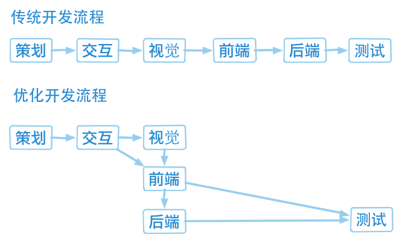

## 前端工程师概述

[TOC]

**网页发展史**

Web 1.0 -> Web 2.0（基于 Ajax） -> Web 3.0 （基于 HTML5）

**网站开发协作流程**

**前端职责**

视觉稿（配色图标距离空间） + 交互稿（用户逻辑） = UI（用户界面）

视觉稿 -> 页面制作

交互稿 -> 页面逻辑开发

**所需技能**

- DOM (操作 HTML 及 CSS 的接口)
- JavaScript (定义页面互动)
- CSS (定义页面样式)
- HTML (定义页面结果)
- Photoshop (取图)