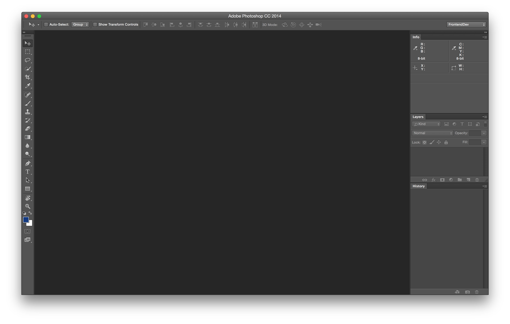
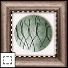
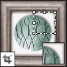
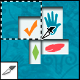
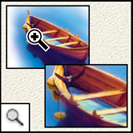
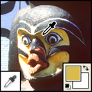
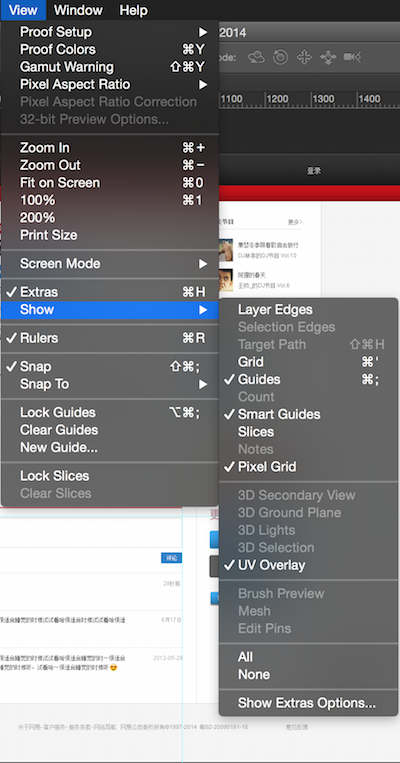
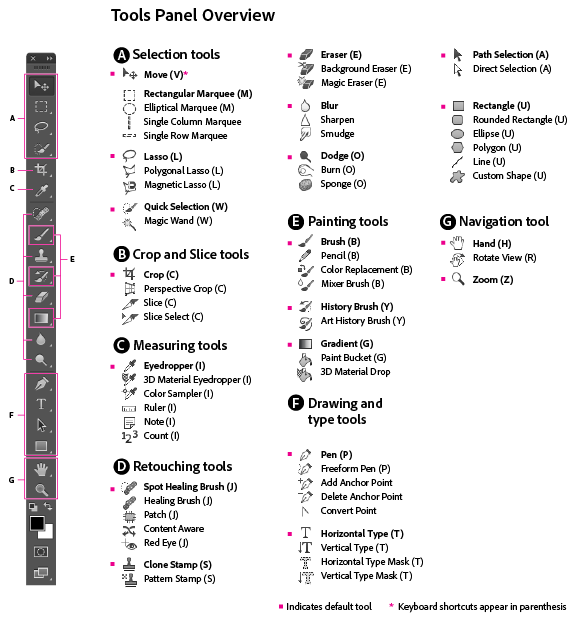

### 工具, 面板, 视图

[TOC]

在全局设置下将单位修改为像素，因其在 CSS 中运用最广 (**Preference** -> **Units & Rulers** -> **Units**) 。设置工作区布局为切图及图片编辑做准备（所需窗口为信息窗口，图层窗口以及历史记录窗口）。

打开『信息窗口』、『图层窗口』、『历史纪录窗口』、『工具面板』、『选项』面板，可以通过 Window -> Workspace -> New WorkSpaces 保存工作区，以便下次打开。

**切图常用工具**

| 工具名    |           示意图            | 注释                                     |
| ------ | :----------------------: | -------------------------------------- |
| 移动工具   |  |                                        |
| 矩形选框工具 |  | 需将自动选择调至选择图层                           |
| 魔棒工具   |  | （容差 Tolerance 越小选择的范围就越小）消除锯齿可以让选择区域光滑 |
| 剪裁工具   |  |                                        |
| 切片工具   |  | 在裁剪工具分支下                               |
| 缩放工具   |  | `Ctrl+加号`与`Ctrl+减号` 或者 `alt+鼠标滑轮`      |
| 取色器    |  |                                        |

图层（单层元素）与组（类似于文件夹）的区别。

**辅助视图**，在视图菜单下启动

- 对齐，会启动靠近吸附功能
- 标尺，<kbd>Command</kbd> + <kbd>R</kbd>
- 参考线，<kbd>Command</kbd> + <kbd>;</kbd>

NOTE: 所有工具及快捷键如下。

### 常用快捷键

**放大缩小画布**

- 放大到100%大小：<kbd>Ctrl</kbd>+<kbd>数字1</kbd>
- 放大：<kbd>ctrl</kbd> + 加号
- 缩小：<kbd>ctrl</kbd> + 减号
- <kbd>alt</kbd> + 滚轮

**合并图层**

- 合并图层：<kbd>ctrl</kbd>+<kbd>E</kbd>
- 合并可见图层：<kbd>ctrl</kbd>+<kbd>shift</kbd>+<kbd>E</kbd>