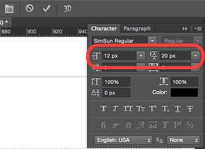

<!-- START doctoc generated TOC please keep comment here to allow auto update -->
<!-- DON'T EDIT THIS SECTION, INSTEAD RE-RUN doctoc TO UPDATE -->
**Table of Contents**  *generated with [DocToc](https://github.com/thlorenz/doctoc)*

- [测量及取色](#%E6%B5%8B%E9%87%8F%E5%8F%8A%E5%8F%96%E8%89%B2)

<!-- END doctoc generated TOC please keep comment here to allow auto update -->

### 测量及取色

所有能接受数字的属性都需要测量并尽可能百分百的还原设计稿。

#### 测量

- 宽度，高度 (width, height)
- 内外边距 (padding, margin)
- 边框 (border)
- 定位 (position)
- 文字大小 (font-size)
- 行高 (line-height)，其为第一行的底端到第二行的底端。
- 背景位置 (background-position)

NOTE: 测量时尽可能放大画布以减少误差。量取文字是为了减少误差尽量选取尺寸大的文字进行测量。

**选框工具的多用途**，增（Shift）减（Alt）以及交叉选择（Shift + Alt）。左右（或上下）使用分离选框选择可以得到整两个分离边框的距离总值。

#### 取色

所有能接受颜色的属性都需要取色。

- 边框色
- 背景色
- 文字色

NOTE：使用魔棒工具可以迅速识别背景色是否没*线性*渐变的方法。Mac OS X 推荐使用 **Sip** 可在 Mac App Store 免费下载。
NOTE+：可以使用魔棒工具来判断颜色是否为渐变。
