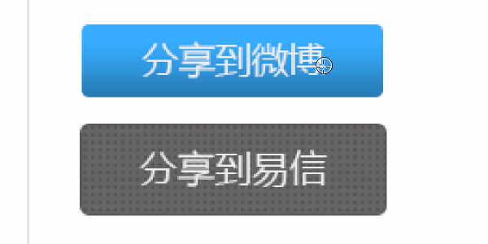
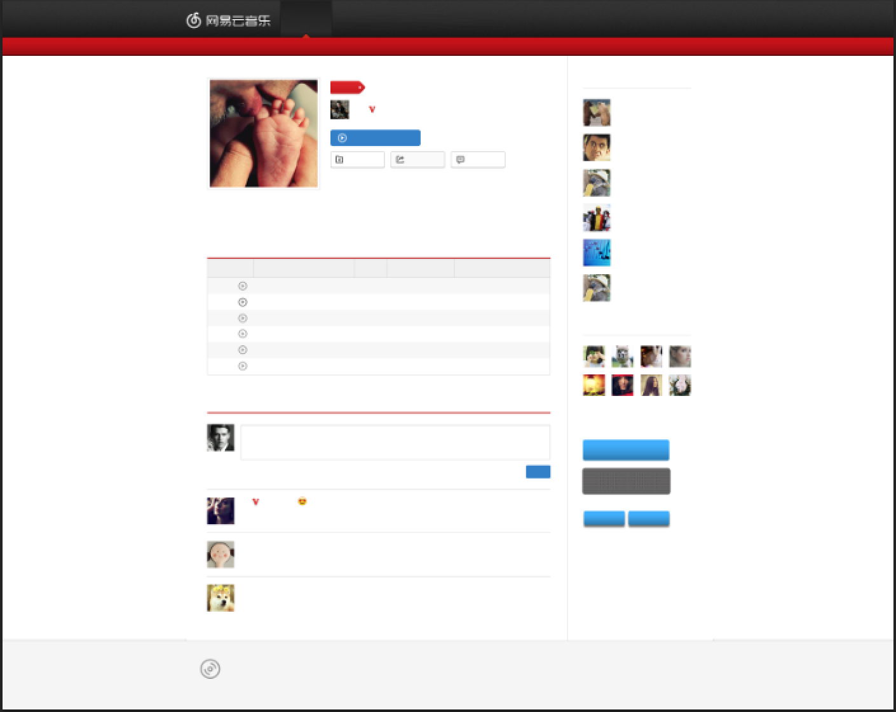
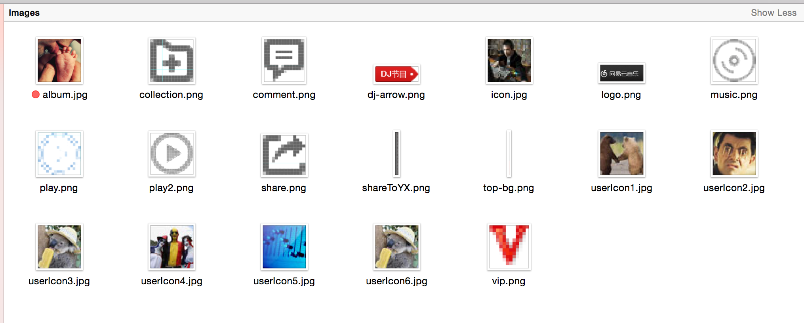

<!-- START doctoc generated TOC please keep comment here to allow auto update -->
<!-- DON'T EDIT THIS SECTION, INSTEAD RE-RUN doctoc TO UPDATE -->
**Table of Contents**  *generated with [DocToc](https://github.com/thlorenz/doctoc)*

- [切图](#%E5%88%87%E5%9B%BE)

<!-- END doctoc generated TOC please keep comment here to allow auto update -->

### 切图

- **内容性图片** 指的是图片在页面是作为内容存在，如页面中的海报。
- **修饰性图片** 指的是图片在页面中起修饰作用，如页面中的背景和图标。

修饰性图标和内容性图片需要（在 HTML 的 `` 之中，只需站位不需切图）切出。切出的内容性图片应保存为 `*.jpg` 格式，而修饰性图片因保存为 `png24`（IE6 不支持半透明，Alpha 透明） 或 `png8` 它们均支持全透明。

**隐藏文字**，方法一，直接在图层中隐藏文字图层。方法二（两种，分别应对于纯色和有背景需要隐藏文本的情况）如下图所示，使用自由变换。

**PNG24**切图方法
- 移动工具选中所需图层（<kbd>Ctrl</kbd> 多选）
- 右键合并图层（<kbd>Ctrl</kbd> + <kbd>E</kbd>）
- 复制到新图层

**PNG8**带背景切图方法
- 合并可见图层（<kbd>Shift</kbd> + <kbd>Ctrl</kbd> + <kbd>E</kbd>）
- 矩形选框选择内容
- 魔棒工具去除多余部分（<kbd>Alt</kbd> + 选取）

**可平铺**背景的切图方法
- 用矩形选择一个区域
- 复制至新图层

NOTE: X 轴平铺需要占满图片的宽，Y 轴平铺需要占满图片的高。

**切片**工具（大图化小的方法，将一大图分为多小图）
- 拉参考线
- 选择切片工具
- 点击 “基于参考线的切片” 按钮
- 选择切片选择工具
- 保存于新图层

#### 如何开始切图

##### 第一步：去掉所有文字，只留背景

打开视觉稿后，用上面说过的方法去掉所有的文字，只留背景和图片（记得备份一下PSD文件）。

##### 第二步：保存图片

将去掉文字的图片保存起来。一般情况下内容性图片保存为jpg格式，图标类型的保存为png格式。

##### 第三步：构思页面的具体实现

划分页面的结构，具体的实现方式。

##### 第四步：一边编写HTML代码，一边测量、取色

根据构思号的页面结构，开始编写HTML代码，并且开始进行测量和取色。
