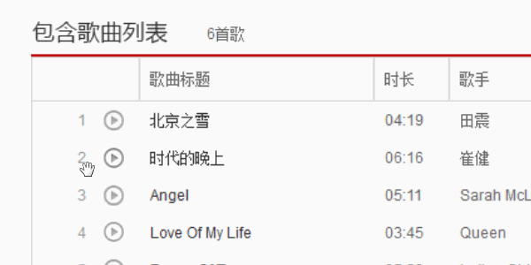
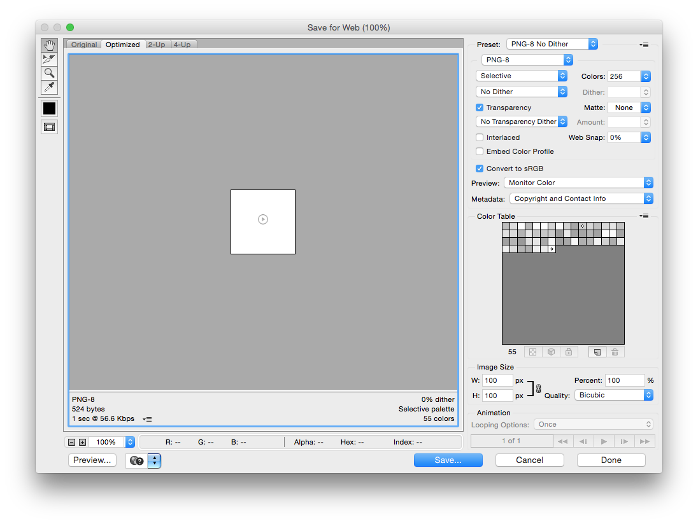
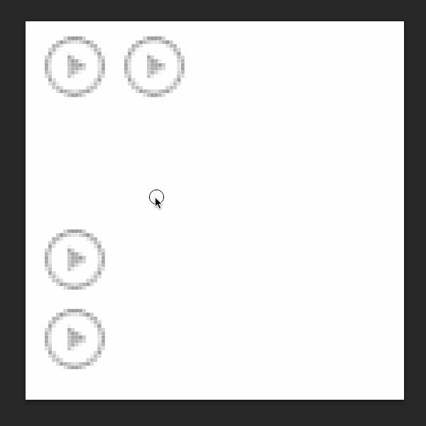
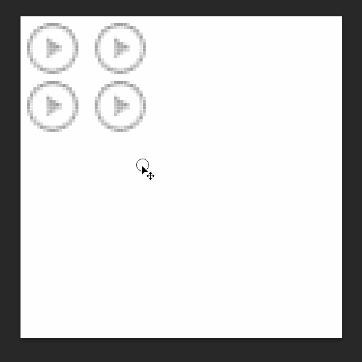
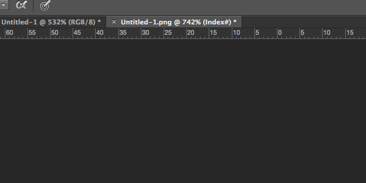

<!-- START doctoc generated TOC please keep comment here to allow auto update -->
<!-- DON'T EDIT THIS SECTION, INSTEAD RE-RUN doctoc TO UPDATE -->
**Table of Contents**  *generated with [DocToc](https://github.com/thlorenz/doctoc)*

- [图片保存](#%E5%9B%BE%E7%89%87%E4%BF%9D%E5%AD%98)
  - [保存格式的选择](#%E4%BF%9D%E5%AD%98%E6%A0%BC%E5%BC%8F%E7%9A%84%E9%80%89%E6%8B%A9)
- [图片修改与维护](#%E5%9B%BE%E7%89%87%E4%BF%AE%E6%94%B9%E4%B8%8E%E7%BB%B4%E6%8A%A4)

<!-- END doctoc generated TOC please keep comment here to allow auto update -->

### 图片保存

将需要的内容保存在独立的文件里便于之后的导出。（存储于 Web 所用格式 <kbd>Alt</kbd> + <kbd>Shift</kbd> + <kbd>Ctrl</kbd> + <kbd>S</kbd>）

如需保存**独立图层**则要把需要的图层拖到新建的透明背景的图层，或在图层上右键复制（Duplicate）图层选择地址为新文件即可。

**图片与背景合并**的切图方法如下

#### 保存格式的选择

保存类型一：色彩丰富切无透明要求时保存为 `JPG` 格式并选用时候的品质（通常使用品质 80 ）。

保存类型二：图片色彩不丰富，不伦透明与否一律保存为 `PNG8` 格式（256颜色，需特殊设置如下图，需设置`杂边：无`  `无仿色`）。

保存类型三：图片有半透明（Alpha 透明）的要求，保存为 `PNG24` 格式（不对图片进行压缩）。

保存类型四：保留 PSD 源文件，以备不时之需。

##### 如何保存

一般使用『存储于 Web 所用格式』菜单（Alt + Shift + Ctrl + S）保存

### 图片修改与维护

维护与修改之一：**更改画布**大小以便增加新素材。

维护与修改之二：移动图标分两种，独立图层（移动工具拖动），于非独立图层（选取工具选中分离后移动工具拖动）。

维护与修改之三：**裁剪画布**的方法有两种，(1)用选取工具选取后图片裁取，(2)直接用裁剪工具裁剪画布。

**注意事项**：为了可维护性的考虑因适当的留出适当的空白区域以便修改所用和提高容错性。`PNG8`需更改图片颜色模式为 RGB 颜色（默认为索引颜色模式，颜色信息会被丢失）。

