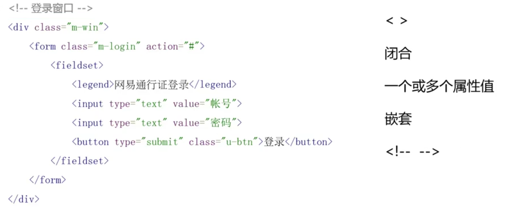

<!-- START doctoc generated TOC please keep comment here to allow auto update -->
<!-- DON'T EDIT THIS SECTION, INSTEAD RE-RUN doctoc TO UPDATE -->
**Table of Contents**  *generated with [DocToc](https://github.com/thlorenz/doctoc)*

- [HTML 语法](#html-%E8%AF%AD%E6%B3%95)
  - [全局属性](#%E5%85%A8%E5%B1%80%E5%B1%9E%E6%80%A7)

<!-- END doctoc generated TOC please keep comment here to allow auto update -->

### HTML 语法

**书写规范**：

- 小写标签和属性
- 属性值双引号
- 代码因嵌套缩进

#### 全局属性

- id, `

`，页面中唯一
- class，`<button class='btn'>Click Me</button>`，页面中可重复出现
- style，尽量避免
- title，对于元素的描述类似于 Tooltip 的效果。
