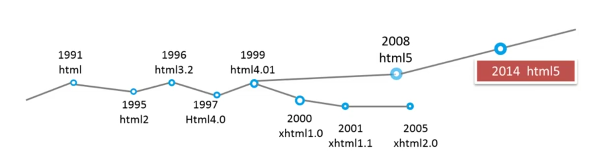

<!-- START doctoc generated TOC please keep comment here to allow auto update -->
<!-- DON'T EDIT THIS SECTION, INSTEAD RE-RUN doctoc TO UPDATE -->
**Table of Contents**  *generated with [DocToc](https://github.com/thlorenz/doctoc)*

- [HTML](#html)
  - [HTML 历史](#html-%E5%8E%86%E5%8F%B2)

<!-- END doctoc generated TOC please keep comment here to allow auto update -->

## HTML

### HTML 历史

HTML (Hyper Text Markup Language)，用于标记页面中的内容。

