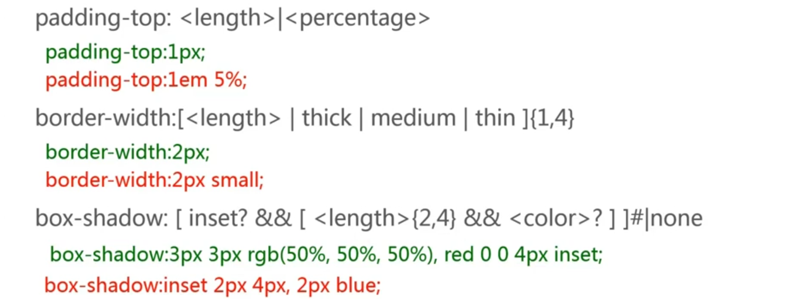

<!-- START doctoc generated TOC please keep comment here to allow auto update -->
<!-- DON'T EDIT THIS SECTION, INSTEAD RE-RUN doctoc TO UPDATE -->
**Table of Contents**  *generated with [DocToc](https://github.com/thlorenz/doctoc)*

- [语法](#%E8%AF%AD%E6%B3%95)
  - [浏览器私有属性](#%E6%B5%8F%E8%A7%88%E5%99%A8%E7%A7%81%E6%9C%89%E5%B1%9E%E6%80%A7)
  - [属性值语法](#%E5%B1%9E%E6%80%A7%E5%80%BC%E8%AF%AD%E6%B3%95)
    - [基本元素](#%E5%9F%BA%E6%9C%AC%E5%85%83%E7%B4%A0)
    - [组合符号](#%E7%BB%84%E5%90%88%E7%AC%A6%E5%8F%B7)
    - [数量符号](#%E6%95%B0%E9%87%8F%E7%AC%A6%E5%8F%B7)
  - [@规则语法](#@%E8%A7%84%E5%88%99%E8%AF%AD%E6%B3%95)
    - [@规则](#@%E8%A7%84%E5%88%99)

<!-- END doctoc generated TOC please keep comment here to allow auto update -->

### 语法

```css
/* 选择器 */
.m-userlist {
  /* 属性声明 */
  margin: 0 0 30px;
  /* 属性名:属性值; */
}
.m-userlist .list {
  position: relative;
  height: 100px;
  overflow: hidden;
}
```

#### 浏览器私有属性

- Google Chrome, Safari (`-webkit`)
- Firefox (`-moz-`)
- IE (`-ms-`)
- Opera (`-o-`)

```css
.pic {
  -webkit-transform: rotate(-3deg);
  -ms-transform: rotate(-3deg);
  transform: rotate(-3deg);
}
```

NOTE: 使用 [http://pleeease.io/play/](http://pleeease.io/play/) ，CSS 预处理器（Sass，Less，Stylus）或编辑器插件可自动添加浏览器厂商的私有属性前缀。

#### 属性值语法

```css
margin: [ <length> | <percentage> | auto ]{1,4}
/* 基本元素：<length>, <percentage>, auto*/
/* 组合符号：[], | */
/* 数量符号：{1,4} */
```

##### 基本元素

**关键字**
- auto
- solid
- bold
- ...

**类型**
- 基本类型
    - `<length>`
    - `<percentage>`
    - `<color>`
    - ...
- 其他类型
    - <'padding-width'>
    - <'color-stop'>
- 符号
    - `/`
    - ','
- inherit, initial

##### 组合符号

- `<'font-size'> <'font-family'>` （` ` 两项必存，顺序毕遵）
    - 合法：`12px arial`
    - 不合法：`2em`
    - 不合法：`arial 14px`
- `<length>&&<color>` (`&&` 两项必存，顺序无碍)
    - 合法：green 2px
    - 合法：1em orange
    - 不合法：blue
- `underline || overline || line-through || blink` (`||` 至少选一，顺序无碍)
    - 合法：underline
    - 合法：overline underline
- `<color> | transparent`（`|` 只可选一，不可共存）
    - 合法：orange
    - 合法：transparent
    - 不合法：orange transparent
- `bold [thin || <length>]`（`[]` 分组之用，视为整体）
    - 合法：bold thin
    - 合法：bold 2em

##### 数量符号

- `<length>`（无则表示仅可出现一次）
    - 合法：1px
    - 合法：10em
    - 不合法：1px 2px
- `<color-stop>[, <color-stop>]+` (`+` 可出现一次或多次)
    - 合法：#fff, red
    - 合法：blue, green 50%, gray
    - 不合法：red
- `inset?&&<color>` (`?` 表示可选)
    - 合法：inset orange
    - 合法：red
- `<length>{2,4}` (`{2,4}` 可出现次数和最少最多出现次数)
    - 合法：1px 2px
    - 合法：1px 2px 3px
    - 不合法: 1px
    - 不合法：1px 2px 3px 4px 5px
- `<time>[, <time>]*`（`*` 出现 0 次或多次）
    - 合法：1s
    - 合法：1s,4ms
- `<time>#`（`#` 出现一次或者多次，用`,`分隔）
    - 合法：2s, 4s
    - 不合法：1s 2s

**CSS 规则示例**



#### @规则语法

```
@import "subs.css";
@charset "utf-8";
@media print {
  /* property: value */
}
@keyframes fadein {
  /* property: value */
}
```

- `@标示符 内容;`
- `@标示符 内容{}`

##### @规则

**常用的规则**
- `@media` （用于响应式布局）
- `@keyframes` （CSS 动画的中间步骤）
- `@font-face` （引入外部字体）

**其他规则**（不常用）
- `@import`
- `@charset`
- `@namespace`
- `@page`
- `@supports`
- `@document`
