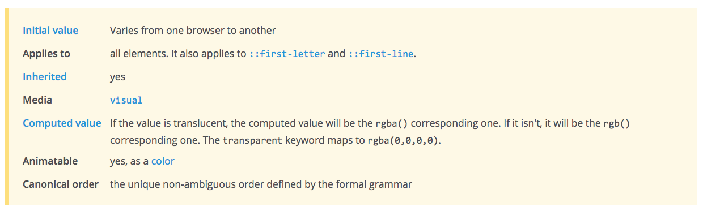

<!-- START doctoc generated TOC please keep comment here to allow auto update -->
<!-- DON'T EDIT THIS SECTION, INSTEAD RE-RUN doctoc TO UPDATE -->
**Table of Contents**  *generated with [DocToc](https://github.com/thlorenz/doctoc)*

- [选择器](#%E9%80%89%E6%8B%A9%E5%99%A8)
  - [简单选择器](#%E7%AE%80%E5%8D%95%E9%80%89%E6%8B%A9%E5%99%A8)
    - [标签选择器](#%E6%A0%87%E7%AD%BE%E9%80%89%E6%8B%A9%E5%99%A8)
    - [类选择器](#%E7%B1%BB%E9%80%89%E6%8B%A9%E5%99%A8)
    - [id 选择器](#id-%E9%80%89%E6%8B%A9%E5%99%A8)
    - [通配符选择器](#%E9%80%9A%E9%85%8D%E7%AC%A6%E9%80%89%E6%8B%A9%E5%99%A8)
    - [属性选择器](#%E5%B1%9E%E6%80%A7%E9%80%89%E6%8B%A9%E5%99%A8)
    - [伪类选择器](#%E4%BC%AA%E7%B1%BB%E9%80%89%E6%8B%A9%E5%99%A8)
  - [其他选择器](#%E5%85%B6%E4%BB%96%E9%80%89%E6%8B%A9%E5%99%A8)
    - [伪元素选择器](#%E4%BC%AA%E5%85%83%E7%B4%A0%E9%80%89%E6%8B%A9%E5%99%A8)
    - [组合选择器](#%E7%BB%84%E5%90%88%E9%80%89%E6%8B%A9%E5%99%A8)
    - [选择器分组](#%E9%80%89%E6%8B%A9%E5%99%A8%E5%88%86%E7%BB%84)
  - [继承、优先、层级](#%E7%BB%A7%E6%89%BF%E3%80%81%E4%BC%98%E5%85%88%E3%80%81%E5%B1%82%E7%BA%A7)
    - [继承](#%E7%BB%A7%E6%89%BF)
    - [优先](#%E4%BC%98%E5%85%88)
      - [改变优先级](#%E6%94%B9%E5%8F%98%E4%BC%98%E5%85%88%E7%BA%A7)
    - [层叠](#%E5%B1%82%E5%8F%A0)

<!-- END doctoc generated TOC please keep comment here to allow auto update -->

### 选择器

<p data-height="268" data-theme-id="15197" data-slug-hash="mJmwdK" data-default-tab="result" data-user="li-xinyang" class='codepen'>See the Pen <a href='http://codepen.io/li-xinyang/pen/mJmwdK/'>FEND_Selectors</a> by Li Xinyang (<a href='http://codepen.io/li-xinyang'>@li-xinyang</a>) on <a href='http://codepen.io'>CodePen</a>.</p>
<script async src="//assets.codepen.io/assets/embed/ei.js"></script>

选择器可被看做表达式，通过它可以选择相应的元素并应用不同的样式。

- 简单选择器
- 元素选择器
- 组合选择器

#### 简单选择器

简单选择器可组合使用。

##### 标签选择器

```html
<div>
  <p>Sample Paragraph</p>
  <p>Sample Paragraph</p>
  <p>Sample Paragraph</p>
</div>

<style type="text/css">
  p {
    color: blue;
  }
</style>
```

##### 类选择器

`.className` 以 `.` 开头，名称可包含字母，数字，`-`，`_`，但必须以字母开头。它区分大小写并可出现多次。

```html
<div>
  <p>Sample Paragraph</p>
  <p class="special bold">Sample Paragraph</p>
  <p>Sample Paragraph</p>
</div>

<style type="text/css">
  p {
    color: blue
  }
  .special {
    color: orange;
  }
  .bold {
    font-weight: bold;
  }
</style>
```

##### id 选择器

`#idName` 以 `#` 开头且只可出现**一次**，其命名要求于 `.className` 相同。

```html
<div>
  <p id="special">Sample Paragraph</p>
</div>

<style type="text/css">
  #special {
    color: red;
  }
</style>
```

##### 通配符选择器

```html
<div>
  <p>Sample Paragraph</p>
  <p>Sample Paragraph</p>
</div>

<style type="text/css">
  * {
    color: blue;
  }
</style>
```

##### 属性选择器

`[attr]` 或 `[attr=val]` 来选择相应的元素。`#nav{...}` 既等同于 `[id=nav]{...}`。IE7+

`[attr~=val]` 可选用与选择包含 `val` 属性值的元素，像`class="title sports"` 与 `class="sports"`。`.sports{...}` 既等同于 `[class~=sports]{...}` IE7+

`[attr|=val]` 可以选择`val`开头及开头紧接`-`的属性值。IE7+

`[attr^=val]` 可选择以`val`开头的属性值对应的元素，如果值为符号或空格则需要使用引号 `""`。IE7+

`[attr$=val]` 可选择以`val`结尾的属性值对应的元素。IE7+

`[attr*=val]` 可选择以包含`val`属性值对应的元素。IE7+

```html
<div>
  <form action="">
    <input type="text" value="Xinyang" disabled>
    <input type="password" placeholder="Password">
    <input type="button" value="Button">
  </form>
</div>
<style type="text/css">
  [disabled] {
    background-color: orange;
  }
  [type=button] {
    color: blue;
  }
</style>
```

##### 伪类选择器

**常用伪类选择器**：
- `:link` IE6+
- `:visited` IE7+
- `:hover` IE6中仅可用于链接
- `:active` IE6/7中仅可用于链接
- `:enabled` IE9+
- `:disabled` IE9+
- `:checked` IE9+
- `:first-child` IE8+
- `:last-child` IE9+
- `:nth-child(even)` 可为 `odd` `even` 或数字 IE9+
- `:nth-last-child(n)` `n`从 0 开始计算 IE9+
- `:only-child` 仅选择唯一的元素 IE9+
- `:only-of-type` IE9+
- `:first-of-type` IE9+
- `:last-of-type` IE9+
- `:nth-of-type(even)` IE9+
- `:nth-last-of-type(2n)` IE9+

**不常用伪类选择器**：
- `:empty` 选中页面中无子元素的标签 IE9+
- `:root` 选择 HTML 根标签 IE9+
- `:not()` 参数为一般选择器 IE9+
- `:target` 被锚点选中的目标元素 IE9+
- `:lang()` 选中语言值为某类特殊值的元素 IE7+

NOTE：`element:nth-of-type(n)` 指父元素下第 n 个 `element` 元素，`element:nth-child(n)` 指父元素下第 n 个元素且元素为 `element`，若不是，选择失败。具体细节请在使用时查找文档。

```html
<div>
  <a href="http://sample-site.com" title="Sample Site">Sample Site</a>
</div>
<style type="text/css">
  /* 伪类属性定义有顺序要求！ */
  a:link {
    color: gray;
  }
  a:visited {
    color:red;
  }
  a:hover {
    color: green;
    /* 鼠标悬停 */
  }
  a:active {
    color: orange;
    /* 鼠标点击 */
  }
</style>
```

#### 其他选择器

##### 伪元素选择器

注意与伪类学则器的区分。

- `::first-letter` IE6+
- `::first-line` IE6+
- `::before{content: "before"}` 需与 `content` 一同使用 IE8+
- `::after{content: "after"}` 需与 `content` 一同使用 IE8+
- `::selection` 被用户选中的内容（鼠标选择高亮属性）IE9+ Firefox需用 `-moz` 前缀

##### 组合选择器

- 后代选择器 `.main h2 {...}`，使用` `表示 IE6+
- 子选择器 `.main>h2 {...}`，使用`>`表示 IE7+
- 兄弟选择器 `h2+p {...}`，使用`+`表示 IE7+
    - `h2~p {...}`，使用`~`表示（此标签无需紧邻）IE7+

##### 选择器分组

```html
<style type="text/css">
/* 下面两组样式声明效果一致 */
h1 {color: red;}
h2 {color: red;}
h3 {color: red;}

h1, h2, h3 {color: red;}
</style>
```

#### 继承、优先、层级

##### 继承

子元素继承父元素的样式，但并不是所有属性都是默认继承的。通过文档中的 `inherited: yes` 来判断属性是否可以自动继承。



自动继承属性：
- color
- font
- text-align
- list-style
- ...

非继承属性：
- background
- border
- position
- ...

##### 优先

CSS Specificity Calculator 可以在[这里](http://specificity.keegan.st/)找到。更多关于 CSS 优先级别的信息可以在[这里](https://css-tricks.com/specifics-on-css-specificity/)找到（英文）。

计算方法：
- a = 行内样式
- b = id 选择器的数量
- c = 类、伪类的属性选择器的数量
- d = 标签选择器和伪元素选择器的数量

NOTE：从上到下优先级一次降低，且优先级高的样式会将优先级低的样式覆盖。大致公式（并不准确）如下。

```
value = a * 1000 + b * 100 + c * 10 + d
```

###### 改变优先级

- 改变样式声明先后顺序
- 提升选择器优先级
- `!important`（慎用）

##### 层叠

层叠为相同属性根据优先级覆盖，如优先级相同则后面会覆盖前面的属性，而不同属性则会合并。
