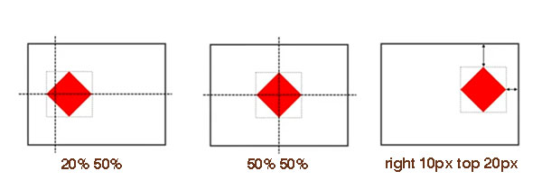
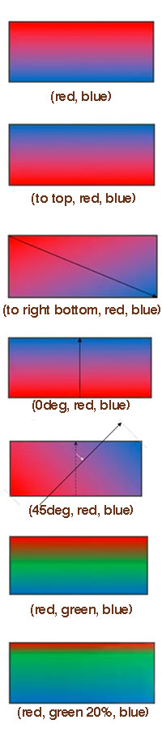
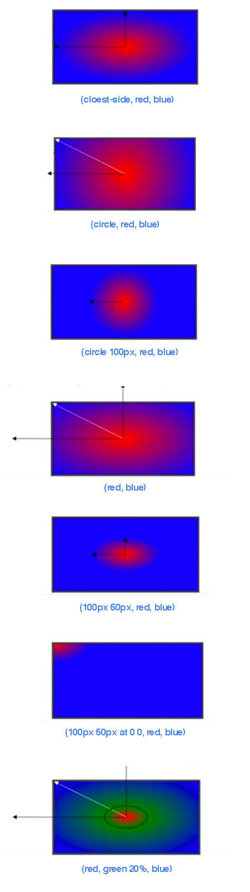
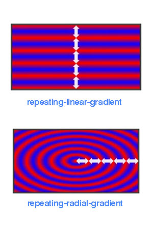
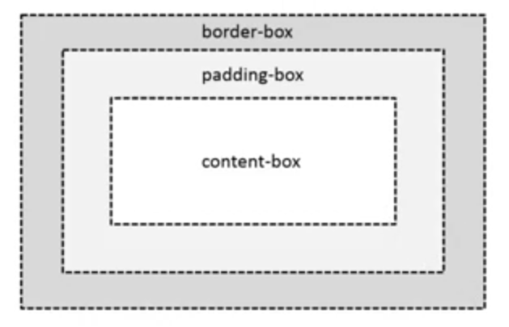
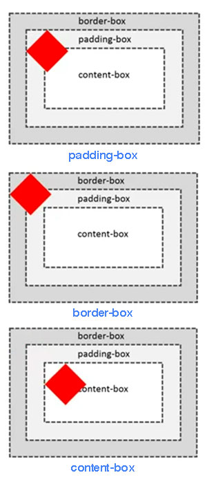
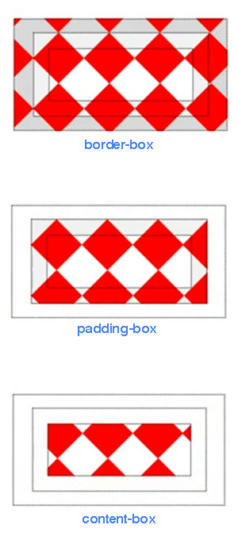
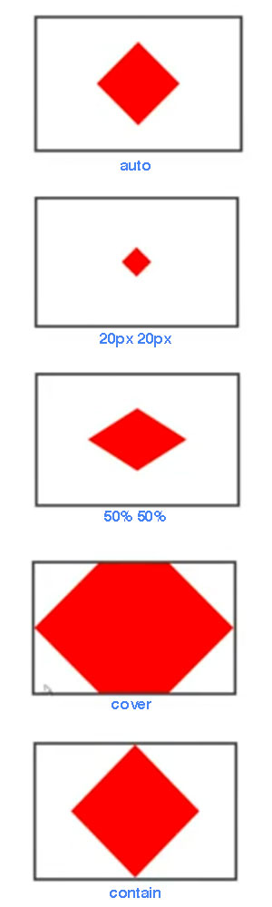
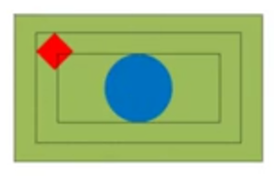

<!-- START doctoc generated TOC please keep comment here to allow auto update -->
<!-- DON'T EDIT THIS SECTION, INSTEAD RE-RUN doctoc TO UPDATE -->
**Table of Contents**  *generated with [DocToc](https://github.com/thlorenz/doctoc)*

- [背景](#%E8%83%8C%E6%99%AF)
  - [background-color](#background-color)
  - [background-image](#background-image)
  - [background-repeat](#background-repeat)
  - [background-attachment](#background-attachment)
  - [background-position](#background-position)
    - [Sprite 的使用](#sprite-%E7%9A%84%E4%BD%BF%E7%94%A8)
  - [linear-gradient](#linear-gradient)
  - [radial-gradient](#radial-gradient)
  - [repeat-*-gradient](#repeat--gradient)
  - [background-origin](#background-origin)
  - [background-clip](#background-clip)
  - [background-size](#background-size)
  - [background shorthand](#background-shorthand)

<!-- END doctoc generated TOC please keep comment here to allow auto update -->

### 背景

#### background-color

```
background-color: <color>
background-color: #f00;
background-color: rgba(255, 0, 0, 0.5);
background-color: transparent; /* 默认值 */
```

#### background-image

```
background-image: <bg-image>[, <bg-image>]*
/* <bg-image> = <image> | none */
background-image: url("../image/pic.png");
background-image: url("../image/pic.png0"), url("../image/pic1.png");
/* 多张背景图时，先引入的图片在上一层后引入则在下一层 */
```

NOTE：当`background-color` 与 `background-image` 共存时，背景颜色永远在最底层（于背景图片之下）。

#### background-repeat

`background-repeat` 需与背景图片数量一致。

```
background-repeat: <repeat-style>[, <repeat-style]*
<repeat-style> = repeat-x | repeat-y | [repeat | space | round | no-repeat]{1,2}

/*                   X 轴     Y 轴 */
background-repeat: no-repeat repeat;
```

- `space` 平铺并在水平和垂直留有空隙，空隙的大小为图片均匀分布后完整覆盖显示区域的宽高
- `round` 不留空隙平铺且覆盖显示区域，图标会被缩放以达到覆盖效果（缩放不一定等比）

#### background-attachment

当页面内容超过显示区域时，使用 `local` 使背景图片同页面内容一同滚动。

```
background-attachment: <attachment>[, <attachment>]*
<attachment> = scroll | fixed | local
```

#### background-position

```
background-position: <position>[, <position>]*
<position> = [left|center|right|top|bottom|<percentage>|<length>]|[left|center|right|top|bottom|<percentage>|<length>] [left|center|right|top|bottom|<percentage>|<length>] | [center |[left|right][<percentage>|<length>]?]&&[center |[left|right][<percentage>|<length>]?]

/* 默认位置为 */
background-position: 0 0;

/* percentage 是容器与图片的百分比重合之处*/
background-position: 20% 50%;

/* 等同效果 */
background-position: 50% 50%;
background-position: center center;

background-position: 0 0;
background-position: left top;

background-position: 100% 100%;
background-position: right bottom;

/* 四个值时方向只为参照物 */
background-position: right 10px top 20px;
```



##### Sprite 的使用

```html
background-image: url(sprite.png)
background-repeat: no-repeat;
background-positon: 0 -100px
```

使用位置为负值将图片偏移使需要的图片位置上移并显示正确的图案。

#### linear-gradient

```
linear-gradient()
[[<angle> | to <side-or-corner],]? <color-step>[, <color-stop>]+
<side-or-corner> = [left | right] || [top | bottom]
<color-stop> = <color> [<percentage> | <length>]?

background-image: linear-gradient(red, blue);
background-image: linear-gradient(to top, red, blue);
background-image: linear-gradient(to right bottom, red, blue);
background-image: linear-gradient(0deg, red, blue);
background-image: linear-gradient(45deg, red, blue);
background-image: linear-gradient(red, green, blue);
background-image: linear-gradient(red, green 20%, blue);
```



#### radial-gradient

```
radial-gradient(   [ circle || <length> ] [ at <position> ]? , | [ ellipse || [<length> | <percentage> ]{2}] [ at <position> ]? , | [ [ circle | ellipse ] || <extent-keyword> ] [ at <position> ]? , | at <position> , <color-stop> [ , <color-stop> ]+ )

<extent-keyword> = closest-corner | closest-side | farthest-corner | farthest-side
<color-stop> = <color> [ <percentage> | <length> ]?

background-image: radial-gradient(cloest-side, red, blue);
background-image: radial-gradient(circle, red, blue);
background-image: radial-gradient(circle 100px, red, blue);
background-image: radial-gradient(red, blue);
background-image: radial-gradient(100px 50px, red, blue);
background-image: radial-gradient(100px 50px at 0 0, red, blue);
background-image: radial-gradient(red, green 20%, blue);
```



#### repeat-*-gradient

```
background-image: repeating-linear-gradient(red, blue 20px, red 40px);
background-image: repeating-radial-gradient(red, blue 20px, red 40px);
```



#### background-origin

**案例模型**



决定背景 (0,0) 坐标与 100% 坐标的区域。默认值为 `padding-box`。

```
<box>[, <box>]*
<box> = border-box | padding-box | content-box

background-image: url(red.png);
background-repeat: no-repeat;

background-origin: padding-box;
background-origin: border-box;
background-origin: content-box;
```



#### background-clip

裁剪背景，默认值为`border-box`。

```
<box>[, <box>]*
<box> = border-box | padding-box | content-box

background-image: url(red.png);
background-repeat: no-repeat;

background-clip: border-box;
background-clip: padding-box;
background-clip: content-box;
```



#### background-size

```
<bg-size>[, <bg-size>]*
<bg-size> = [<length> | <percentage> | auto] {1, 2} | cover | contain

background-image: url(red.png);
background-repeat: no-repeat;
background-position: 50% 50%;

background-size: auto;
background-size: 20px 20px;
/* % 参照物为容器*/
background-size: 50% 50%;
/* 尽可能小，但宽度与高度不小过容器（充满容器） */
background-size: cover;
/* 尽可能大，但宽度与高度不超过容器（最大完全显示）*/
background-size: contain;
```



#### background shorthand

```
[<bg-layer,]* <final-bg-layer>
<bg-layer> = <bg-image> || <position> [/ <bg-size>]? || <repeat-style> || <attachment> || <box> || <box>

/* 两个 <box> 第一个为 background-origin */
/* 两个 <box> 第二个为 background-clip */
/* 只出现一个 <box> 则即是 background-origin 也是 background-clip */

<final-bg-layer> = <bg-layer> || <'background-color'>

background: url(red.png) 0 0/20px 20px no-repeat, url(blue.png) 50% 50%/contain no-repeat content-box green;
```


