<!-- START doctoc generated TOC please keep comment here to allow auto update -->
<!-- DON'T EDIT THIS SECTION, INSTEAD RE-RUN doctoc TO UPDATE -->
**Table of Contents**  *generated with [DocToc](https://github.com/thlorenz/doctoc)*

- [布局](#%E5%B8%83%E5%B1%80)
  - [display](#display)
    - [display:block](#displayblock)
    - [display:inline](#displayinline)
    - [display:inline-block](#displayinline-block)
    - [display:none](#displaynone)
  - [position](#position)
    - [position:relative](#positionrelative)
    - [position:absolute](#positionabsolute)
    - [position:fixed](#positionfixed)
    - [top/right/bottom/left](#toprightbottomleft)
    - [z-index](#z-index)
      - [z-index 栈](#z-index-%E6%A0%88)
  - [float](#float)
    - [clear](#clear)
  - [flex](#flex)
    - [flex 方向](#flex-%E6%96%B9%E5%90%91)
      - [flex-direction](#flex-direction)
      - [flex-wrap](#flex-wrap)
      - [flex-flow](#flex-flow)
      - [order](#order)
    - [flex 弹性](#flex-%E5%BC%B9%E6%80%A7)
      - [flex-basis](#flex-basis)
      - [flex-grow](#flex-grow)
      - [flex-shrink](#flex-shrink)
      - [flex](#flex-1)
    - [flex 对齐](#flex-%E5%AF%B9%E9%BD%90)
      - [justify-content](#justify-content)
      - [align-items](#align-items)
      - [align-self](#align-self)
      - [align-content](#align-content)

<!-- END doctoc generated TOC please keep comment here to allow auto update -->

### 布局

学习布局前须知道 CSS 中的定位机制。

- 标准文档流（Normal Flow）
- 浮动（Float）
- 绝对定位（Absolute Positioning)

**标准文档流**，从上到下，从左到右的输出文档内容。它由*块级*（block）元素和*行级*元素组成，且它们都是盒子模型。

下面为 Firefox 布局可视化 **Gecko Reflow Visualisation**，布局是指浏览器将元素以正确的大小摆放在正确的位置上。

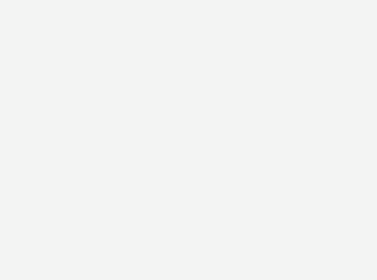

#### display

设置元素的显示方式

|display|默认宽度|可设置宽高|起始位置|
|-------|--------|----------|--------|
|block|父元素宽度|是|换行|
|inline|内容宽度|否|同行|
|inline-block|内容宽度|是|同行|

##### display:block

- 默认宽高为父元素宽高
- 可设置宽高
- 换行显示
- 默认为block的元素：`<div>`, `<p>`, `<h1>` ~ `<h6>`, `<ul>`, `<form>`

##### display:inline

- 默认宽度为内容宽度
- 不可设置宽高
- 同行显示（元素内部可换行）
- 默认为inline的元素：`<span>`, `<a>`, `<label>`, `<cite>`, `<em>`

##### display:inline-block

- 默认宽度为内容宽度
- 可设置宽高
- 同行显示
- 整块换行
- 默认为inline-block的元素：`<input>`, `<textarea>`, `<select>`, `<button>`

##### display:none

- 设置元素不显示

`display:none` 与 `visibility:hidden` 的区别为 `display:none` 不显示且不占位，但 `visibility:hidden` 不显示但占位。

#### position

`position` 用于设置定位的方式与`top` `right` `bottom` `left` `z-index` 则用于设置参照物位置（必须配合定位一同使用）。

**三种定位形式**

- 静态定位（static）
- 相对定位（relative）
- 绝对定位（absolute、fixed）

```
position: static | relative | absolute | fixed
/* 默认值为 static */
```

##### position:relative

- 相对定位的元素仍在文档流之中，并按照文档流中的顺序进行排列。
- 参照物为元素本身的位置。

NOTE：最常用的目的为改变元素层级和设置为绝对定位的参照物。

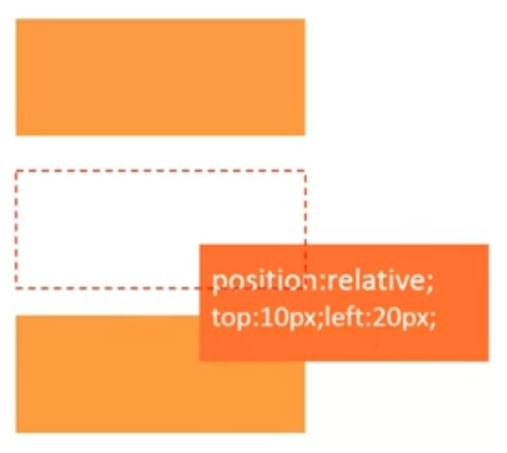

##### position:absolute

建立以包含块为基准的定位，其随即拥有偏移属性和 `z-index` 属性。

- 默认宽度为内容宽度
- 脱离文档流
- 参照物为第一个定位祖先或根元素（`<html>` 元素）

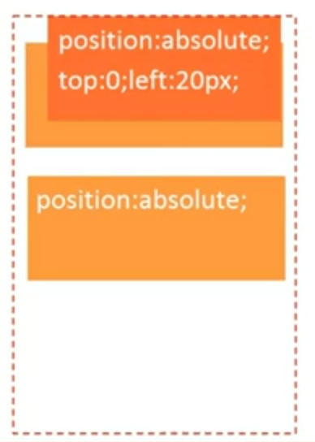

##### position:fixed

- 默认宽度为内容宽度
- 脱离文档流
- 参照物为视窗

NOTE：宽高的100%的参照依然为视窗（例：网页遮罩效果）

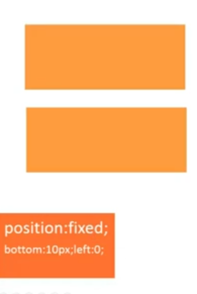

##### top/right/bottom/left

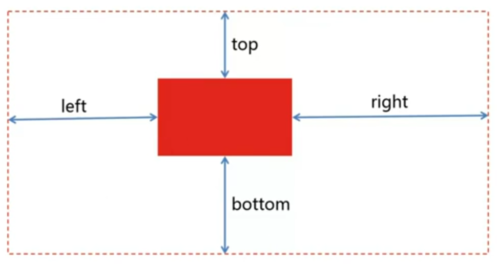

其用于设置元素边缘与参照物边缘的距离，且设置的值可为负值。在同时设置相对方向时，元素将被拉伸。

##### z-index

其用于设置 Z 轴上得排序，默认值为 0 但可设置为负值。（如不做设置，则按照文档流的顺序排列。后面的元素将置于前面的元素之上）

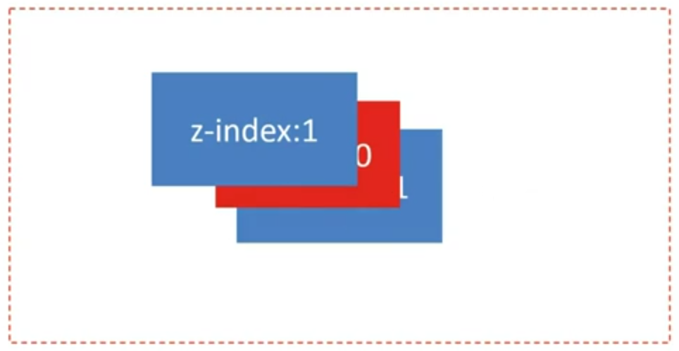

###### z-index 栈

父类容器的 `z-index` 优于子类 `z-index` 如图

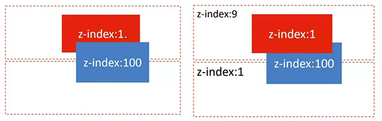

#### float

CSS 中规定的定位机制，其可实现块级元素同行显示并存在于文档流之中。浮动仅仅影响文档流中下一个紧邻的元素。

```
float: left | right | none | inherit
```

- 默认宽度为内容宽度
- 脱离文档流（会被父元素边界阻挡与`position`脱离文档流的方式不同）
- 指的方向一直移动

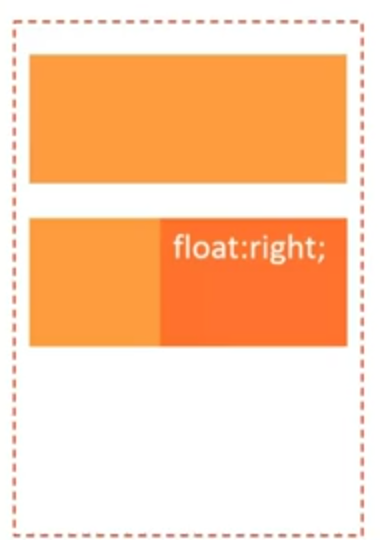

**float 元素在同一文档流中**，当同时进行 `float` 时它们会按照文档流中的顺序排列。(当所有父元素中的所有元素脱离文档流之后，父元素将失去原有默认的内容高度)

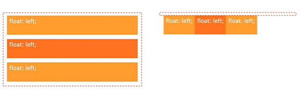

注意：**float 元素是半脱离文档流的**，对元素是脱离文档流，但对于内容则是在文档流之中的（既元素重叠但内容不重叠）。

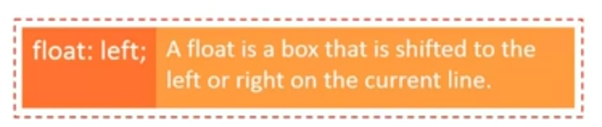

##### clear

```
clear: both | left | right | none | inherit
```

- 应用于后续元素
- 应用于块级元素（block）

**使用方法**：

优先级自上而下

1. clearfix 于父元素
1. 浮动后续空白元素 `.emptyDiv {clear: both}`
1. 为受到影响的元素设置 `width: 100% overflow: hidden` 也可
1. 块级元素可以使用 `<br>` 不建议使用，影响 HTML 结构

```
/* clearfix */
.clearfix:after {
   content: "."; /* Older browser do not support empty content */
   visibility: hidden;
   display: block;
   height: 0;
   clear: both;
}
.clearfix {zoom: 1;} /* 针对 IE 不支持 :after */
```

#### flex

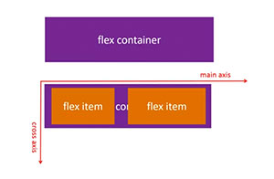

弹性布局可用于多行自适应，多列自适应，间距自适应和任意对齐。

**创建 flex container**

```
display: flex
/* 弹性容器内的均为弹性元素*/
```

**flex item**

只有弹性容器在文档流中的子元素才属于弹性元素。

```
<div style="display: flex;">
  <div>Block Element</div>
  <!-- flex item: YES-->
  <span>Inline Element</span>
  <!-- flex item: YES-->
  <div style="position:absolute;">Absolute Block Element</div>
  <!-- flex item: YES-->
</div>
```

##### flex 方向

###### flex-direction

```
<!-- 默认值为 row -->
flex-direction: row | row-reverse | column | column-reverse
```

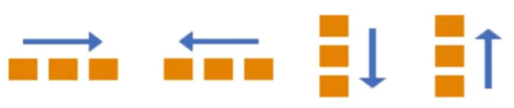

###### flex-wrap

```
<!-- 默认值为 nowrap -->
flex-wrap: nowrap | wrap | wrap-reverse
```

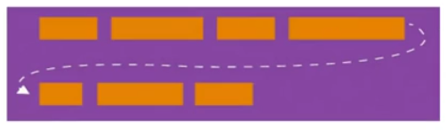

###### flex-flow

`flex-flow` 为 `flex-wrap` 与 `flex-direction` 的简写，建议使用此属性（避免同时使用两个属性来修改）。

```
flex-flow: <'flex-direction'> || <'flex-wrap'>
```

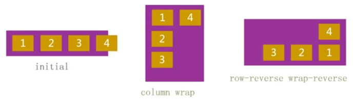

###### order

`order` 的值为相对的（同被设置和未被设置的值相比较），当均为设置时默认值为 0 则按照文档流中的顺序排列。

```
order: <integer>
<!-- 默认为 0 -->
```


##### flex 弹性

###### flex-basis

其用于设置 `flex-item` 的初始宽高（并作为弹性的基础）。如果 `flex-direction` 是以 `row` 排列则设置**宽**，如以 `column` 排列则设置**高**。

```
flex-basis: main-size | <width>
```

###### flex-grow

伸展因子，其为弹性布局中最重要的元素之一，`flex-grow` 设置元素可用空余空间的比例。`flex-container` 先安装宽度（`flex-basis`）进行布局，如果有空余空间就按照 `flex-grow` 中的比例进行分配。

**Width/Height = flex-basis + flex-grow/sum(flow-grow) * remain**

```
flex-grow: <number>
initial: 0
<!-- 默认值为 0 -->
```


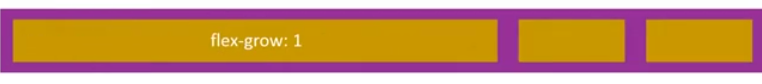


###### flex-shrink

收缩因子，用于分配超出的负空间如何从可用空间中进行缩减。

```
flex-shrink: <number>
initial: 1
<!-- 默认值为 1 -->
```

**Width/Height = flex-basis + flow-shrink/sum(flow-shrink) * remain**

remain 为负值，既超出的区域。


###### flex

其为 `flex-grow` `flex-shrink` `flex-basis` 的值缩写。

```
flex: <'flex-grow'> || <'flex-shrink'> || <'flex-basis'>
initial: 0 1 main-size
```

##### flex 对齐

###### justify-content

其用于设置主轴（main-axis）上的对其方式。弹性元素根据主轴（横向和纵向均可）定位所以不可使用 `left` 与 `right` 因为位置为相对的。（行为相似的属性有 `text-align`）

```
justify-content: flex-start | flex-end | center | space-between | space-around
<!-- 默认值为 flex-start -->
```

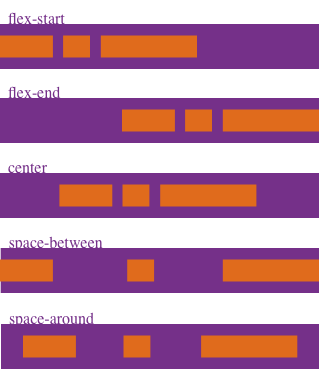

###### align-items

其用于设置副轴（cross-axis）上的对其方式。（行为相似的属性有 `vertical-align`）

```
align-items: flex-start | flex-end | center | baseline | stretch
<!-- 默认值为 stretch -->
```


###### align-self

其用于设置单个 `flex-item` 在 cross-axis 方向上的对其方式。

```
align-self: auto | flex-start | flex-end | center | baseline | stretch
<!-- 默认值为 auto -->
```


###### align-content

其用于设置 cross-axis 方向上的对其方式。

```
align-content:flex-start | flex-end | center | space-between | space-around | stretch
<!-- 默认为 stretch -->
```


