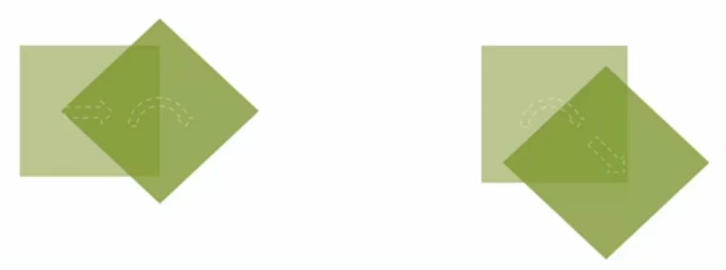
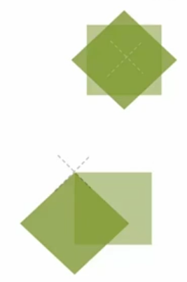
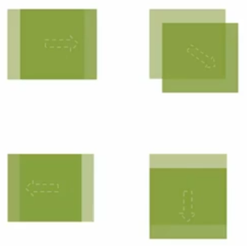
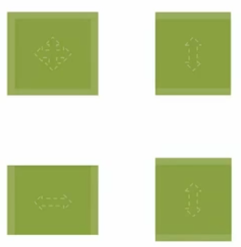
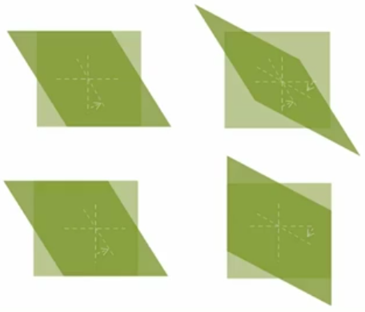
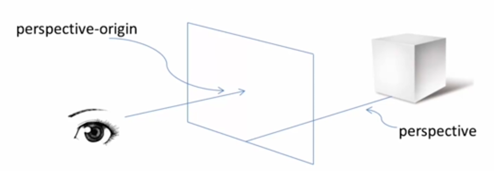
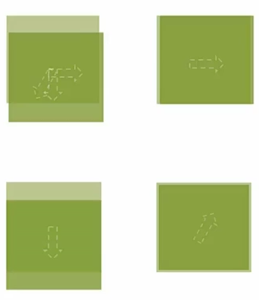
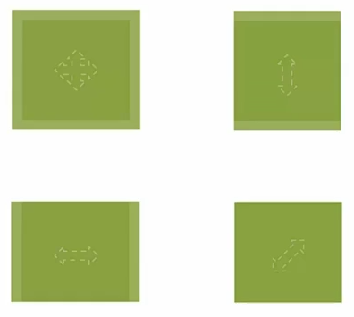
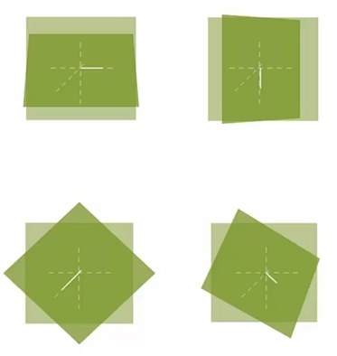

<!-- START doctoc generated TOC please keep comment here to allow auto update -->
<!-- DON'T EDIT THIS SECTION, INSTEAD RE-RUN doctoc TO UPDATE -->
**Table of Contents**  *generated with [DocToc](https://github.com/thlorenz/doctoc)*

- [变形](#%E5%8F%98%E5%BD%A2)
  - [2D 变形](#2d-%E5%8F%98%E5%BD%A2)
    - [transform](#transform)
      - [rotate()](#rotate)
      - [transform-origin](#transform-origin)
      - [translate()](#translate)
      - [scale()](#scale)
      - [skew()](#skew)
  - [3D 变形](#3d-%E5%8F%98%E5%BD%A2)
    - [rotateY()](#rotatey)
    - [perspective](#perspective)
    - [perspective-origin](#perspective-origin)
    - [translate3d()](#translate3d)
    - [scale3d()](#scale3d)
    - [rotate3d()](#rotate3d)
    - [transform-style](#transform-style)
    - [backface-visibility](#backface-visibility)

<!-- END doctoc generated TOC please keep comment here to allow auto update -->

### 变形

#### 2D 变形

[2D 变形示例代码](../SampleCode/CSS/Transform2D.html)

##### transform

`transform` 中可以写一个或多个方法。

```
transform: none | <transform-function>+
transform: none
<!-- 默认值为 none -->
transform: <transform-function>+

transform: translate(50%) rotate(45deg);
transform: rotate(45deg) transform(50%)
<!-- 变形函数顺序普通结果不同，原因是坐标位置发生了改变 -->
```



###### rotate()

```
rotate(<angle>)

rotate(45deg);
<!-- 右边旋转，顺时针 -->
rotate(-60deg);
<!-- 左边旋转，逆时针 -->
```


###### transform-origin

其用于设置原点的位置（默认位置为元素中心）第一值为 X 方向，第二值为 Y 方向， 第三值为 Z 方向。（当值空出未写的情况下默认为 50%）

```
transform-origin: [ <percentage> | <length> | left | center | right | top | bottom] | [ [ <percentage> | <length> | left | center | right ] && [ <percentage> | <length> | top | center | bottom ] ] <length>?

<!-- 默认值为 50% 50% -->

transform-origin: 50% 50%;
transform-origin: 0 0;
transform-origin: right 50px 20px;
transform-origin: top right 20px;
```



###### translate()

移动方法，参数分别代表 X 与 Y 轴的移动（偏移值均可为负值）。

```
translate(<translation-value>[, <translation-value>]?)

<!-- 也可单独设置 X 与 Y 轴的偏移 -->
translationX(<translation-value>)
translationY(<translation-value>)

transform: translate(50px);
transform: translate(50px, 20%);
<!-- Y 轴偏移为偏移对象的高度，X 轴为宽度 -->
transform: translate(-50px);
transform: translate(20%);
```



###### scale()

缩放方法，参数分别代表 X 与 Y 轴的缩放（缩放值均可为小数）。当第二值忽略时，默认设置为等同第一值。

```
scale(<number> [, <number>]?)

scaleX(<number>)
scaleY(<number>)

<!-- 整体放大 1.2 倍 -->
transform: scale(1.2);
<!-- 高度拉伸 -->
transform: scale(1, 1.2);
<!-- 宽度拉伸 -->
transform: scaleX(1.2);
<!-- 高度拉伸 -->
transform: scaleY(1.2);
```



###### skew()

其为倾斜的方法。第一值为 Y 轴往 X 方向倾斜（逆时针），第二值为 X 轴往 Y 方向倾斜（顺时针）。（倾斜值可为负值）

```
skew(<angle>[, <angle>]?)

skewX(<angle>)
skewY(<angle>)

transform: skew(30deg);
transform: skew(30deg, 30deg);
transform: skewX(30deg);
transform: skewY(30deg);
```



#### 3D 变形

[3D 变形示例代码](../SampleCode/CSS/Transform3D.html)

##### rotateY()

3D 空间旋转。

```
transform: rotateY(<angle>)
```

##### perspective



其用于设置图片 Y 轴旋转后的透视效果。`<length>` 可以理解为人眼与元素之间的距离，越紧则效果越明显。

```
perspective: none | <length>

perspective: none;
perspective: 2000px;
perspective: 500px;
```


##### perspective-origin

其为设定透视的角度（透视位置均可设定为负值）。

```
perspective-origin: [ <percentage> | <length> | left | center | right | top | bottom] | [ [ <percentage> | <length> | left | center | right ] && [ <percentage> | <length> | top | center | bottom ] ]

perspective-origin: 50% 50%
<!-- 默认值为 50% 50% 正中间的位置进行透视-->
perspective-origin: left bottom;
perspective-origin: 50% -800px;
perspective-origin: right;
```


##### translate3d()

```
translate3d(<translate-value>, <translate-value>, <length>)

translateX(<translate-value>)
translateY(<translate-value>)
translateZ(<length>)

transform: translate3d(10px, 20%, 50px);
<!-- %的参照物为自身元素 -->
transform: translateX(10px);
transform: translateY(20%);
transform: translateZ(-100px);
```



##### scale3d()

```
scale3d(<number>, <number>, <number>)

scaleX(<number>)
scaleY(<number>)
scaleZ(<number>)

transform: scale3d(1.2, 1.2, 1);
transform: scale3d(1, 1.2, 1);
transform: scale3d(1.2, 1, 1);
transform: scaleZ(5);
<!-- Z 轴的缩放扩大并不影响盒子大小 -->
```



##### rotate3d()

取 X Y Z 三轴上的一点并于坐标原点连线，以连线为轴进行旋转（逆时针）。

```
rotate3d(<number>, <number>, <number>, <angle>)

rotateX(<angle>)
rotateY(<angle>)
rotateZ(<angle>)

transform: rotate3d(1, 0, 0, 45deg);
<!-- 上面等同于 X 轴旋转 -->
transform: rotate3d(0, 1, 0, 45deg);
<!-- 上面等同于 Y 轴旋转 -->
transform: rotate3d(0, 0, 1, 45deg);
<!-- 上面等同于 2D 旋转 -->
transform: rotate3d(1, 1, 1, 45deg);
```



##### transform-style

其用于设置保留内部的 3D 空间，原因是一个元素进行`transform`之后内部默认为`flat`。

```
transform-style: flat | perserve-3d

<!-- 默认为 flat -->

transform-style: flat;
transform-style: preserve-3d;
```


##### backface-visibility

其用于设置背面不可见。

```
backface-visibility: visible | hidden

backface-visibility: visible;
backface-visibility: hidden;
```


