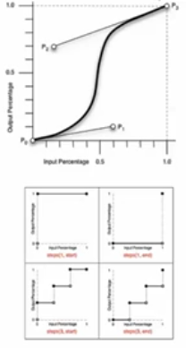
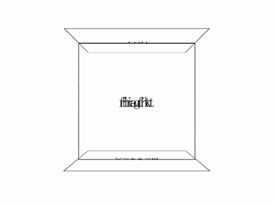

<!-- START doctoc generated TOC please keep comment here to allow auto update -->
<!-- DON'T EDIT THIS SECTION, INSTEAD RE-RUN doctoc TO UPDATE -->
**Table of Contents**  *generated with [DocToc](https://github.com/thlorenz/doctoc)*

- [动画](#%E5%8A%A8%E7%94%BB)
  - [transition](#transition)
    - [transition-property](#transition-property)
    - [transition-duration](#transition-duration)
    - [transition-delay](#transition-delay)
    - [transition-timing-function](#transition-timing-function)
  - [animation](#animation)
    - [animation-name](#animation-name)
    - [animation-duration](#animation-duration)
    - [animation-timing-function](#animation-timing-function)
    - [animation-iteration-count](#animation-iteration-count)
    - [animation-direction](#animation-direction)
    - [animation-play-state](#animation-play-state)
    - [animation-delay](#animation-delay)
    - [animation-fill-mode](#animation-fill-mode)
    - [@keyframes](#@keyframes)

<!-- END doctoc generated TOC please keep comment here to allow auto update -->


### 动画

[动画示例代码](../SampleCode/CSS/Animation.html)

#### transition

[过度动画](../SampleCode/CSS/Transition.html)

其为众多 `<single-transition>` 的值缩写。（当两个时间同时出现是，第一个时间为动画长度，第二个时间为动画延时）

```
transition: <single-transition> [',' <single-transition>]*

<single-transition> = [none | <single-transition-property>] || <time> || <single-transition-timing-function> || <time>


transition: none;
transition: left 2s ease 1s, color 2s;
transition: 2s;
```

##### transition-property

```
transition-property: none | <single-traisition-property> [ ',' <single-transition-property>]*

<single-transition-property> = all | <IDENT>

transition-property: none;
<!-- 默认值为 none -->
transition-property: all;
transition-property: left;
transition-property: left, color;
```

##### transition-duration

```
transition-duration: <time>[, <time>]*

transition-duration: 0s;
transition-duration: 1s;
transition-duration: 1s, 2s, 3s;
```

##### transition-delay

```
transition-delay: <time>[,<time>]*

transition-delay: 0s;
transition-delay: 1s;
transition-delay: 1s, 2s, 3s;
```

##### transition-timing-function

```
transition-timing-function: <single-transition-timing-function>[',' <single-transition-timing-function>]*

<!-- 默认函数为 ease -->
<single-transition-timing-function> = ease | linear | ease-in | ease-out | ease-in-out | cubic-bezier(<number>,<number>,<number>,<number>) | step-start | step-end | steps(<integer>)[, [start | end]]?)

<!-- 对于 cubic-bezier 的曲线，前两个值为 P1 的坐标，后两值为 P2 的坐标 -->

transition-timing-function: ease;
transition-timing-function: cubic-bezier(0.25, 0.1, 0.25, 1);
transition-timing-function: linear;
transition-timing-function: cubic-bezier(0, 0, 1, 1);
```



#### animation

```
animation: <single-animation> [',' <single-animation>]*

<single-animation> = <single-animation-name> || <time> || <single-animation-timing-function> || <time> || <single-animation-iteration-count> || <single-animation-direction> || <single-animation-fill-mode> || single-animation-play-state>

animation: none;
animation: abc 2s ease 0s 1 normal none running;
animation: abc 2s;
animation: abc 1s 2s both, abcd 2s both;
<!-- 调用多个动画 -->
```

动画可自动运行，但`transition`需要触发。

##### animation-name

`animation-name` 的名字可自由定义。

```
animation-name: <single-animation-name>#

<single-animation-name> = none | <IDENT>

animation-name: none;
animation-name: abc;
animation-name: abc, abcd;
```

##### animation-duration

与 `transition-duration` 属性值类似。

```
animation-duration: <time>[, <time>]*

animation-duration: 0s;
animation-duration: 1s;
animation-duration: 1s, 2s, 3s;
```

##### animation-timing-function

其与之前的 `transition-timing-function` 完全一模一样。

```
animation-timing-function: <timing-function>#

<single-timing-function> = <single-transition-timing-function>

animation-timing-function: ease;
animation-timing-function: cubic-bezier(0.25, 0.1, 0.25, 1);
animation-timing-function: linear;
animation-timing-function: cubic-bezier(0, 0, 1, 1);
animation-timing-function: ease, linear;
```

##### animation-iteration-count

其用于动画执行的次数（其默认值为 1）。

```
animation-iteration-count: <single-animation-iteration-count>#

<single-animation-iteration-count> = infinite | <number>

animation-iteration-count: 1;
animation-iteration-count: infinite;
animation-iteration-count: 1, 2, infinite;
```

##### animation-direction

其用于定义动画的运动方向。

```
animation-direction:<single-animation-direction>#

<single-animation-direction> = normal | reverse | alternate | alternate-revers

animation-direction: reverse
<!-- 动画相反帧的播放 -->
animation-direction: alternate
<!-- 往返执行动画 -->
animation-direction: alternate-revers
<!-- 相反的往返动画 -->
```

##### animation-play-state

其用于设定动画的播放状态。

```
animation-play-state: <single-animation-play-state>#

<single-animation-play-state> = running | paused

animation-play-state: running;
animation-play-state: pasued;
animation-play-state: running, paused;
```

##### animation-delay

其用于设置动画的延时，同 `transition-delay` 值相同。

```
animation-delay: <time>[, <time>]*
anim
animation-delay: 0s;
animation-delay: 1s;
animation-delay: 1s, 2s, 3s;
```

##### animation-fill-mode

其用于设置动画开始时，是否保持第一帧的动画和动画在结束时时候保持最后的状态。

```
animation-fill-mode: <single-animation-fill-mode>[',' <single-animation-fill-mode>]*

<single-animation-fill-mode> = none | backwards | forwards | both

animation-fill-mode: none;
<!-- 不做设置 -->
animation-fill-mode: backwards;
<!-- 动画开始时出现在第一帧的状态 -->
animation-fill-mode: forwards;
<!-- 动画结束时保留动画结束时的状态 -->
animation-fill-mode: both;
<!-- 开始和结束时都应保留关键帧定义的状态（通常设定） -->
animation-fill-mode: forwards, backwards;
```

##### @keyframes

其用于定义关键帧。

```
<!-- 写法一 -->
@keyframes abc {
  from {opacity: 1; height: 100px;}
  to {opacity: 0.5; height: 200px;}
}

<!-- 写法二 -->
@keyframes abcd {
  0% {opacity: 1; height: 100px;}
  100% {opacity: 0.5; height: 200px}
}

@keyframes flash {
  0%, 50%, 100% {opacity: 1;}
  25%, 75% {opacity: 0;}
}

<!-- 例子 -->
animation: abc 0.5s both;
animation: flash 0.5s both;
animaiton: abc 0.5s both, flash 0.5s both;
```

