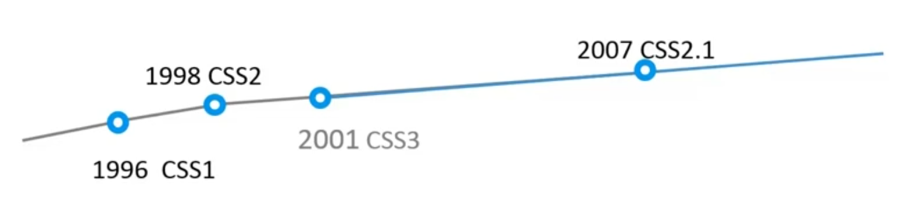

<!-- START doctoc generated TOC please keep comment here to allow auto update -->
<!-- DON'T EDIT THIS SECTION, INSTEAD RE-RUN doctoc TO UPDATE -->
**Table of Contents**  *generated with [DocToc](https://github.com/thlorenz/doctoc)*

- [CSS](#css)
  - [简介](#%E7%AE%80%E4%BB%8B)

<!-- END doctoc generated TOC please keep comment here to allow auto update -->

## CSS

### 简介

CSS (Cascading Stylesheet) 它用于设置页面的表现。CSS3 并不是一个完整的独立版本而是将不同的功能拆分成独立模块（例如，选择器模块，盒模型模块），这有利于不同功能的及时更新与发布也利于浏览器厂商的实习。



**CSS 引入方法**
```html
// 外部样式表
<head>
  <link rel="stylesheet" type="text/css" href="style.css">
</head>

// 内部样式表
<head>
  <style type="text/css">
    p {
      margin: 10px;
    }
  </style>
</head>

// 内嵌样式(可在动态效果中同 JavaScript 一同使用)
<p style="color: red">Sample Text</p>
```
