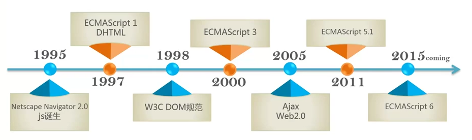

## JavaScript 介绍

前端开发三要素，`HTML`（描述网页内容），`CSS`（描述样式），`JavaScript`（控制网页行为）。JavaScript 为解释型编程语（程序不需要编译，程序在运行时才翻译成机器语言，每执 行一次都要翻译一次)，运行环境也很广泛（浏览器或操作系统中 NodeJS）。

JavaScript 又分为两部分，ECMAScript 和 DOM。其中 JavaScript 的基本的语言属性（例如，变量，作用域等）都在 ECMAScript 中有详细的定义好比汉子在字典中的定义。DOM 中则定义如何修改文档结构（HTML 或 XML 等）。

**JavaScript**的引入方法如下：

```javascript
<!DOCTYPE html>
<html>
<head>
  <title>Demo Page</title>
</head>
<body>
  <!-- 以上代码忽略 -->

  <!-- 为性能优化需将 javascript 代码放置在 body 标签的最末端 -->
  <!-- 外联文件 -->
  <script src="/javascripts/application.js" type="text/javascript" charset="utf-8" async defer></script>
  <!-- 内嵌代码 -->
  <script>
    document.write('>>> Hello, world!');
  </script>
</body>
</html>
```




