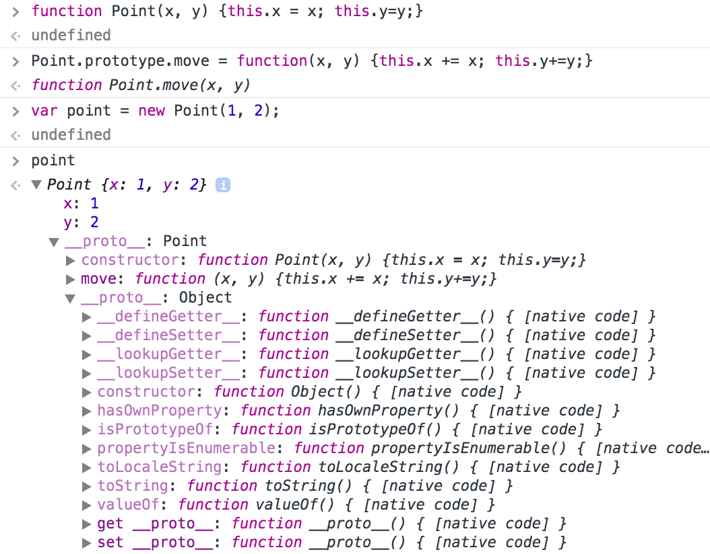
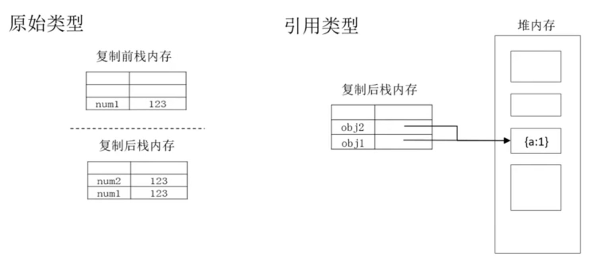

<!-- START doctoc generated TOC please keep comment here to allow auto update -->
<!-- DON'T EDIT THIS SECTION, INSTEAD RE-RUN doctoc TO UPDATE -->
**Table of Contents**  *generated with [DocToc](https://github.com/thlorenz/doctoc)*

- [内置对象](#%E5%86%85%E7%BD%AE%E5%AF%B9%E8%B1%A1)
  - [标准内置对象](#%E6%A0%87%E5%87%86%E5%86%85%E7%BD%AE%E5%AF%B9%E8%B1%A1)
  - [Object](#object)
    - [Object.create](#objectcreate)
    - [Object.prototype.toString](#objectprototypetostring)
    - [Object.prototype.hasOwnProperty](#objectprototypehasownproperty)
  - [Boolean](#boolean)
  - [String](#string)
    - [String.prototype.indexOf](#stringprototypeindexof)
    - [String.prototype.replace](#stringprototypereplace)
    - [String.prototype.split](#stringprototypesplit)
  - [Number](#number)
    - [Number.prototype.toFixed](#numberprototypetofixed)
  - [Array](#array)
    - [Array.prototype.splice](#arrayprototypesplice)
    - [Array.prototype.forEach](#arrayprototypeforeach)
  - [Function](#function)
    - [自定义对象构造器](#%E8%87%AA%E5%AE%9A%E4%B9%89%E5%AF%B9%E8%B1%A1%E6%9E%84%E9%80%A0%E5%99%A8)
    - [Function.prototype.apply](#functionprototypeapply)
    - [Function.prototype.bind](#functionprototypebind)
    - [子类构造器](#%E5%AD%90%E7%B1%BB%E6%9E%84%E9%80%A0%E5%99%A8)
    - [函数调用](#%E5%87%BD%E6%95%B0%E8%B0%83%E7%94%A8)
    - [函数参数](#%E5%87%BD%E6%95%B0%E5%8F%82%E6%95%B0)
      - [arguments](#arguments)
      - [值专递](#%E5%80%BC%E4%B8%93%E9%80%92)
      - [函数重载](#%E5%87%BD%E6%95%B0%E9%87%8D%E8%BD%BD)
  - [RegExp](#regexp)
    - [RegExp.prototype.test](#regexpprototypetest)
  - [Date](#date)
  - [标准内置对象](#%E6%A0%87%E5%87%86%E5%86%85%E7%BD%AE%E5%AF%B9%E8%B1%A1-1)
    - [Math](#math)
      - [Math.floor](#mathfloor)
      - [Math.random](#mathrandom)
    - [JSON](#json)
      - [JSON.stringify](#jsonstringify)
      - [JSON.parse](#jsonparse)
    - [全局对象](#%E5%85%A8%E5%B1%80%E5%AF%B9%E8%B1%A1)
      - [NaA](#naa)
      - [parseInt](#parseint)
      - [eval](#eval)
      - [encodedURIComponent](#encodeduricomponent)

<!-- END doctoc generated TOC please keep comment here to allow auto update -->

## 内置对象

通常情况下只有对象才存在方法，但 JavaScript 不同它具有12种内置对象。内置对象又分为两类，普通对象（属性和方法）与构造器对象（可用于实例化普通对象，它还包含原型对象属性和方法，及实例对象属性和方法）。

**JavaScript 对象原型链的简要说明**

```javascript
function Point(x, y) {
  this.x = x;
  this.y = y;
}
Point.prototype.move = function(x, y) {
  this.x += x;
  this.y += y;
}
var p = new Point(1, 1);
p.move(2,2);
```

`__proto__` 称之为原型链，有如下特点：

1. `__proto__` 为对象内部的隐藏属性
1. `__proto__` 为实例化该对象的构造器的 `prototype` 对象的引用，因此可以直接方法 `prototype` 的所有属性和方法
1. 除了 `Object` 每个对象都有一个 `__proto__` 属性且逐级增长形成一个链，原型链顶端是一个 `Object` 对象。
1. 在调用属性或方法时，引擎会查找自身的属性如果没有则会继续沿着原型链逐级向上查找，直到找到该方法并调用。
1. `__proto__` 跟浏览器引擎实现相关，不同的引擎中名字和实现不尽相同(chrome、firefox中名称是 `__proto__` ，并且可以被访问到，IE中无法访问)。基于代码兼容性、可读性等方面的考虑，不建议开发者显式访问 `__proto__` 属性或通过 `__proto__`更改原型链上的属性和方法，可以通过更改构造器` prototype` 对象来更改对象的 `__proto__` 属性。

**构造器对象与普通对象的区别**



1. 构造器对象原型链中的 `__proto__` 是一个 `Function.prototype` 对象的引用，因此可以调用 `Function.prototype`的属性及方法
1. 构造器对象本身有一个 `prototype` 属性，用该构造器实例化对象时该 `prototype` 会被实例对象的 `__proto__` 所引用
1. 构造器对象本身是一个 `function` 对象，因此也会有自身属性

### 标准内置对象


**构造器对象**

- Object
- Boolean
- String
- Number
- Function
- Array
- RegExp
- Date
- Error

**其他对象**

- Math
- JSON
- 全局对象

内置对象，其实也叫内置构造器，它们可以通过 `new` 的方式创建一个新的实例对象。内置对象所属的类型就叫内置对象类型。其声明方式如下：

```javascript
var i = new String("str");          // String Object
var h = new Number(1);              // Number Object
var g = new Boolean(true);          // Boolean Object
var j = new Object({name : "Tom"}); // Object Object
var k = new Array([1, 2, 3, 4]);    // Array Object
var l = new Date();                 // Date Object
var m = new Error();
var n = new Function();
var o = new RegExp("\\d");
```

注意：虽然标准类型中有`Boolean` `String` `Number` `Object`，内置对象类型中也有`Boolean` `String` `Number` `Object`，但它们其实是通过不同的声明方式来进行区别的。标准类型通过直接赋值，而对象类型则是通过构造器实现初始化。

### Object

> 构造器的原型对象在对象实例化时将会被添加到实例对象的原型链当中。
> `__proto__` 为原型链属性，编码时不可被显像调用。但是实例化对象可以调用原型链上的方法。

用 String/Number 等构造器创建的对象原型链顶端对象始终是一个Object对象，因此这些对象可以调用Object的原型对象属性和方法。所以 String/Number 等构造器是 Object 的子类。

更多关于 Object 的内容可以在[这里](https://developer.mozilla.org/en-US/docs/Web/JavaScript/Reference/Global_Objects/Object)找到。

**构造器说明**：
- Object 是属性和方法的集合
- String/Number/Boolean/Array/Date/Error 构造器均为 Object 的子类并集成 Object 原型对象的属性及方法。

**实例化方法**
```
var obj0 = new Object({name: 'X', age: 13});
// 常用方法
var obj1 = {name: 'Q', age: 14};
```

**属性及方法**
- prototype
- create
- keys
- ...

**原型对象属性及其方法
- constructor
- toString
- valueOf
- hasOwnProperty
- ...

**实例对象属性及方法**

无

#### Object.create

功能：基于原型对象创造新对象

```javascript
// Object.create(prototype[, propertiesObject])
var prototype = {name: 'X', age: 13};
var obj = Object.create(proto);
```

#### Object.prototype.toString

功能：获取方法调用者的标准类型

```javascript
// objectInstance.toString()
var obj = {};
obj.toString(); // Object
```

#### Object.prototype.hasOwnProperty

功能：判断一个属性是否是一个对象的自身属性

```javascript
// objectInstance.hasOwnProperty("propertyName")
var obj = Object.create({a: 1, b: 2});
obj.c = 3;
obj.hasOwnProperty('a'); // false
obj.hasOwnProperty('c'); // true
```

### Boolean

**构造器说明**：值为 true 与 false

**属性及方法**
- prototype

**原型对象属性及其方法
- constructor, toString, valueOf

### String

**构造器说明**：单双引号内的字符串

**实例化方法**
```javascript
'Hello, world!'
var str0 = 'Xinyang';
var str1 = new String('Xinyang');
```

**属性及方法**
- prototype
- fromCharCode（转换 ASCII 代码为字符）

**原型对象属性及其方法**
- constructor
- indexOf
- replace
- slice
- split
- charCodeAt
- toLowerCase
- ...

#### String.prototype.indexOf

功能：获取子字符串在字符串中的索引

```javascript
// stringObject.indexOf(searchValue, fromIndex)
var str = "I am X. From China!";
var index = str.indexOf('a'); // 2
str.indexOf('a', index + 1); // 16
str.indexOf('Stupid'); // -1 字符串不存在
```

#### String.prototype.replace

功能：查找字符串替换成目标文字

```javascript
// stringObject.replace(regexp/substr, replacement)
var str = "apple is bad";
str = str.replace('bad', 'awesome');
```

#### String.prototype.split

功能：按分隔符将分隔符分成字符串数组

```javascript
// stringObject.split(separator, arrayLength)
var str = '1 2 3 4';
str.split(' '); // ['1', '2', '3', '4'];
str.split(' ', 3); // ['1', '2', '3'];
str.split(/\d+/); // ["", " ", " ", " ", ""]
```

### Number

**构造器说明**：整型直接量，八进制直接量（0-），十六进制直接量（0x-)，浮点型直接量

**实例化方法**

```javascript
10
1.2e5
var count = 0x10;
var pi = new Number(3.1415);
```

**属性及方法**
- prototype
- MAX_VALUE
- MIN_VALUE
- NaN
- NEGATIVE_INFINITY
- POSITIVE_INFINITY

**原型对象属性及其方法**
- constructor
- toFixed
- toExponential
- ...

#### Number.prototype.toFixed

功能：四舍五入至指定小数位

```javascript
// numberObject.toFixed(num)
var num0 = 3.14;
num0.toFixed(1); // 3.1
var num1 = 3.35;
num1.toFixed(1); // 3.4
```

### Array

**构造器说明**：定义数组对象

**实例化方法**

```javascript
var a0 = [1, 'abc', true, function(){}];
var a1 = new Array();
var a2 = new Array(1, 'abc', true);
```

**属性及方法**
- prototype
- isArray

**原型对象属性及其方法**
- constructor
- splice
- forEach
- find
- concat
- pop
- push
- reverse
- shift
- slice
- ...

#### Array.prototype.splice

功能：从数组中删除或添加元素，返回被删除的元素列表（作用域原有数组）

```javascript
// arrayObject.splice(start, deleteCount[, item1[, item2[, ...]]])
var arr = ['1', '2', 'a', 'b', '6'];
var ret = arr.splice(2, 2, '3', '4', '5'); // ['a', 'b']
arr; // ['1', '2', '3', '4', 5', '6']
```

#### Array.prototype.forEach

功能：遍历元素组并调用回调函数

```javascript
// arrayObject.forEach(callback[, thisArg])
// 回调函数
// function callback(value, index, arrayObject) {...}
// value - 当前值 index - 当前索引 arrayObject - 数组本身
function logArray(value, index, arrayObject) {
  console.log(value);
  console.log(value === array[index]);
}
[2, 5, 6, 9].forEach(logArray);
```

### Function

**构造器说明**：定义函数或新增对象构造器

**实例化方法**

```javascript
// 对象实例化
var f0 = new Function('i', 'j', 'return (i + j)');
// 函数关键字语句
function f1(i, j){return i + j;}
// 函数表达式
var f3 = function(i, j){return i + j;};
```

**属性及方法**
- prototype

**原型对象属性及其方法**
- constructor
- apply
- call
- bind

**实例对象属性和方法**
- length
- prototype
- arguments
- caller

#### 自定义对象构造器

下面的代码声明一个 Point 增加了一个move方法，最后创建了一个 Point 的实例对象。

```javascript
function Point(x, y) {
  this.x = x;
  this.y = y;
}

Point.prototype.move = function(x, y) {
  this.x += x;
  this.y += y;
}

var p = new Point(1, 2);
```

#### Function.prototype.apply

功能：通过参数指定调用者和函数参数并执行该函数

```javascript
// functionObj.apply(thisArg[, argsArray])
function Point(x, y) {
  this.x = x;
  this.y = y;
}

Point.prototype.move = function(x, y) {
  this.x += x;
  this.y += y;
}

var p = new Point(1, 1);
var circle = {x: 1, y: 1, r: 1};
p.move.apply(circle, [2, 1]); // {x: 3, y: 2, r: 1}
```

#### Function.prototype.bind

功能：通过参数指定函数调用者和函数参数并返回该函数的引用

```javascript
// functionObj.bind(thisArg[, arg1[, arg2[, ...]]])
function Point(x, y) {
  this.x = x;
  this.y = y;
}

Point.prototype.move = function(x, y) {
  this.x += x;
  this.y += y;
}

var p = new Point(1, 1);
var circle = {x: 1, y: 1, r: 1};
var circleMoveRef = p.move.bind(circle, 2, 1);
setTimeout(circleMoveRef, 1000); // {x: 3, y: 2, r: 1}

// 之间使用 circleMoveRef() 效果等同于 apply()
circleMoveRef();
```

#### 子类构造器

```javascript
function Circle(x, y, r) {
  Point.apply(this, [x, y]);
  this.radius = r;
}
Circle.prototype = Object.create(Point.prototype);
Circle.prototype.constructor = Circle;
Circle.prototype.area = function(){
  return Math.PI * this.radius * this.radius;
}

var c = new Circle(1, 2, 3);
c.move(2, 2);
c.area();
```

#### 函数调用

- `()`
- `apply`
- `call`

#### 函数参数

- 形参个数不一定等于实参个数
- 值专递
- 通过参数类型检查实现函数重载

##### arguments

arguments 的常用属性
- length 实参个数
- 0...arguments.length-1 实参属性名称（key）
- callee 函数本身

```javascript
function max(a, b) {
  if (max.length === arguments.length) {
    return a>b?a:b;
  } else {
    var _max = arguments[0];
    for(var i = 0; i < arguments.length; i++) {
      if (_max < arguments[i]) {
        _max = arguments[i];
      }
    }
    return _max;
  }
}
```

##### 值专递

函数参数的值专递是参数复制都是栈内存中的复制。



```javascript
// 原始类型
function plusplus(num) {
  return num++;
}
var count = 0;
var result = plusplus(count); // result = 1; count = 0;

// 引用类型
function setName(obj) {
  obj.name = 'obama';
}
var president = {name: 'bush'};
setName(president); // {name: 'obama'};
```

##### 函数重载

以 `Require.JS` 中的 `define()` 为例：

```javascript
define(function(){
  var add = function(x, y) {
    return x + y;
  };
  return {
    add: add
  };
})

define(['lib'], function(){
  var add = function(x, y) {
    return x + y;
  };
  return {
    add: add
  };
})

define('math', ['lib'], function(){
  var add = function(x, y) {
    return x + y;
  };
  return {
    add: add
  };
})

// define 的实现代码
/**
 * The function that handles definitions of modules. Differs from
 * require() in that a string for the module should be the first argument,
 * and the function to execute after dependencies are loaded should
 * return a value to define the module corresponding to the first argument's
 * name.
 */
define = function (name, deps, callback) {
    var node, context;

    //Allow for anonymous modules
    if (typeof name !== 'string') {
        //Adjust args appropriately
        callback = deps;
        deps = name;
        name = null;
    }

    //This module may not have dependencies
    if (!isArray(deps)) {
        callback = deps;
        deps = null;
    }

    // 省略以下代码
    // ...
};
```

### RegExp

**构造器说明**：用于定义正则表达式，一个 RegExp 对象包含一个正则表达式和关联的标志

**定义方法**
- `/pattern/flags`
- `new RegExp(pattern[, flags]);`

**属性及方法**
- prototype

**原型对象属性及其方法**
- constructor
- test
- exec
- ...

#### RegExp.prototype.test

功能：使用正则表达式对字符串进行测试，并返回测试结果

```javascript
// regexObj.text(str)
var reg = /^abc/i;
reg.test('Abc123'); // true
reg.test('1Abc1234'); // false
```

### Date

**构造器说明**：用于定义日期对象

**定义方法**
```javascript
var date0 = new Date();
var date1 = new Date(2014, 3, 1, 7, 1, 1, 100);
```

**属性及方法**
- prototype
- parse
- now
- ...

**原型对象属性及其方法**
- constructor
- Date
- getDate
- getHours
- setDate
- setHours
- ...

### 标准内置对象

#### Math

**对象说明**：拥有属性和方法的单一对象主要用于数字计算

**对象属性**：
- E
- PI
- SQRT2
- ...

**对象方法**：
- floor
- random
- abs
- max
- cos
- ceil

##### Math.floor

功能：向下取整

```javascript
// Math.floor(num)
Math.floor(0.97); // 0
Math.floor(5.1); // 5
Math.floor(-5.1); //6
```

相似方法：`ceil`，`round`

##### Math.random

功能：返回 0~1 之间的浮点数

```javascript
// Math.random()
Math.random(); // 0.14523562323461
```

#### JSON

**对象说明**：用于存储和交换文本信息

**对象方法**：
- parse
- stringify

##### JSON.stringify

功能：将 JSON 对象转换为字符转

```javascript
// JSON.stringify(value[, replacer[, space]])
var json = {'name': 'X'};
JSON.stringify(json); // "{"name":"X"}"
```

##### JSON.parse

功能：将 JSON 字符转转换为对象

```
// JSON.parse(text[, reviver])
var jsonStr = '{"name":"X"}';
JSON.parse(jsonStr); // {name: 'X'}
```

#### 全局对象

全局对象定义了一系列的属性和方法在编程过程中可以被之间调用。

属性：NaN，Infinity，undefined

方法：
- parseInt
- parseFloat
- isNaN
- isFinite
- eval

处理 URI 方法：
- encodedURIComponent
- decodeURIComponent
- encodedURI
- decodeURI

构造器属性：
- Boolean
- String
- Number
- Object
- Function
- Array
- Date
- Error
- ...

对象属性：
- Math
- JSON

##### NaA

非数字值：表示错误或无意义的运算结果，NaN 参与运算仍会返回 NaA，且 NaN 不等于任何值，包括它本身。可以使用 `isNaN()` 判断运算结果的类型是否为 NaN。

```javascript
isNaN(NaN); // true
isNaN(4 - '2a'); // true;
```

##### parseInt

功能：转换字符串成数字

```javascript
// parseInt(string[, radix])
// radix - 为进制数
parseInt('010'); // 10
parseInt('010', 8) // 8
parseInt('010', 16) // 16

parseInt('0x1f'); // 31
parseInt('0x1f', 16); // 31
parseInt('1f'); // 1
parseInt('1f', 16); // 31
```

##### eval

功能：计算字符串并执行其中的 JavaScript 代码（会带来安全性和代码逻辑问题，通常不建议使用）

```javascript
// eval(string)
var res = '{"error": "0", "msg": "OK"};
var obj;
if (!JSON) {
  obj = eval('(' + res + ')');
} else {
  obj = JSON.parse(res);
}
```

##### encodedURIComponent

功能：将 URI 参数中的特殊字符，中文等作为 URI 的一部分进行编码

```javascript
var uri = "http://w3schools.com/my test.asp?name=ståle&car=saab";
var res = encodeURIComponent(uri);

// 结果
// http%3A%2F%2Fw3schools.com%2Fmy%20test.asp%3Fname%3Dst%C3%A5le%26car%3Dsaab
```