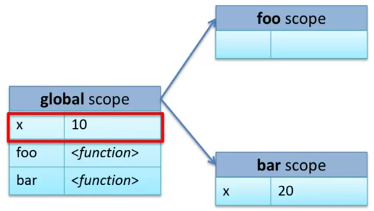
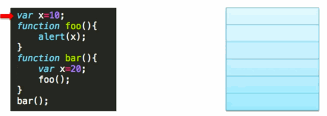
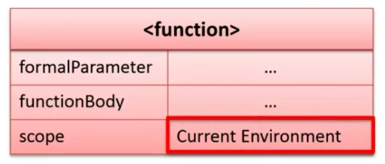
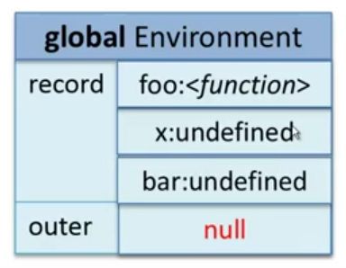
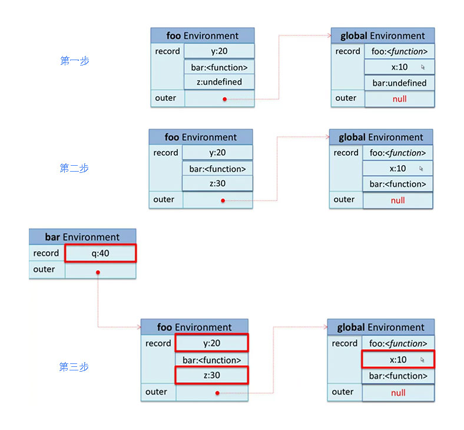
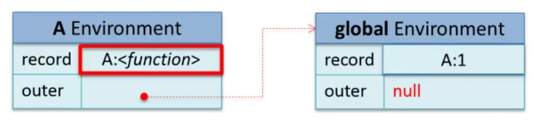

<!-- START doctoc generated TOC please keep comment here to allow auto update -->
<!-- DON'T EDIT THIS SECTION, INSTEAD RE-RUN doctoc TO UPDATE -->
**Table of Contents**  *generated with [DocToc](https://github.com/thlorenz/doctoc)*

- [变量作用域](#%E5%8F%98%E9%87%8F%E4%BD%9C%E7%94%A8%E5%9F%9F)
  - [作用域介绍](#%E4%BD%9C%E7%94%A8%E5%9F%9F%E4%BB%8B%E7%BB%8D)
    - [静态作用域](#%E9%9D%99%E6%80%81%E4%BD%9C%E7%94%A8%E5%9F%9F)
    - [动态作用域](#%E5%8A%A8%E6%80%81%E4%BD%9C%E7%94%A8%E5%9F%9F)
  - [JavaScript 变量作用域](#javascript-%E5%8F%98%E9%87%8F%E4%BD%9C%E7%94%A8%E5%9F%9F)
    - [词法环境](#%E8%AF%8D%E6%B3%95%E7%8E%AF%E5%A2%83)
      - [组成](#%E7%BB%84%E6%88%90)
      - [创建](#%E5%88%9B%E5%BB%BA)
      - [结构](#%E7%BB%93%E6%9E%84)
    - [关于词法环境的问题](#%E5%85%B3%E4%BA%8E%E8%AF%8D%E6%B3%95%E7%8E%AF%E5%A2%83%E7%9A%84%E9%97%AE%E9%A2%98)
    - [with 语句](#with-%E8%AF%AD%E5%8F%A5)
    - [try-catch 句法](#try-catch-%E5%8F%A5%E6%B3%95)
    - [带名称的函数表达式](#%E5%B8%A6%E5%90%8D%E7%A7%B0%E7%9A%84%E5%87%BD%E6%95%B0%E8%A1%A8%E8%BE%BE%E5%BC%8F)

<!-- END doctoc generated TOC please keep comment here to allow auto update -->

## 变量作用域

变量的作用域值的是变量的生命周期和作用范围（全局与局部作用域的区别）。

### 作用域介绍

#### 静态作用域

静态作用域有称为词法作用域，即指其在编译的阶段就可以决定变量的引用。**静态作用域**只更变量定义的位置有关与代码执行的顺序无关。

```javascript
var x = 0;
function foo() {
  alert(x);
}

function bar() {
  var x = 20;
  foo();
}

foo();
```



#### 动态作用域

动态作用域的变量引用只可在程序运行时刻决定（其通常通过动态栈来进行管理）。

```javascript
var x = 0;
function foo() {
  alert(x);
}

function bar() {
  var x = 20;
  foo();
}

foo();
```



### JavaScript 变量作用域

JavaScript （1）使用静态作用域，（2）其没有块级作用域（只有函数作用域，就是只有 function 用于可以定义作用域），（3）在 ES5 之作使用词法环境来管理作用域。

#### 词法环境

##### 组成

词法环境用来描述静态作用域的数据结构。它由`环节记录`和`外部词法环境的引用`组成。

- 环境记录（record）（指形参，变量，函数等）
- 外部词法环境的引用（outer）

##### 创建

在一段代码执行之前，先初始化词法环境。会被初始化的有：

- 形参
- 函数定义（创建函数对象，会保存当前作用域。见下图）
- 变量定义（所有初始化值均为 `undefined`）



##### 结构

```javascript
var x = 10;
function foo(y) {
  var z = 30;
  function bar(q) {
    return x + y + z + q;
  }
  return bar;
}
var bar = foo(20);
bar(40);
```

**全局词法作用域（初始化状态）**



**函数词法作用域**



#### 关于词法环境的问题

**命名冲突**

形参，函数定义，变量名称命名冲突。其中的优先级的排序如下：

```
函数定义 > 形参 > 变量
```

**`arguments` 的使用**

 为函数中定义好的变量。

**函数表达式与函数定义的区别**

- 函数表达式是在执行时才创建函数对象。
- 函数定义为在代码执行之前就进行创建的。

#### with 语句

`with` 会创造一个临时作用域。

```javascript
var foo = 'abc';
with({
  foo: 'bar';
}) {
  function f() {
    alert(foo);
  };
  (function() {
    alert(foo);
  })();
  f();
}
```

#### try-catch 句法

```
try {
  var e = 10;
  throw new Error();
} catch (e) {
  function f() {
    alert(e);
  }
  (function() {
    alert(e);
  })();
  f();
}
```

#### 带名称的函数表达式

当一个函数表达式有了名称之后，JavaScript 会创建一个新的词法环境。并在这个词法环境中用有一个属性 A 指向这个函数，同时这个属性 A 指向的函数是不可被修改的。

**下面例子为不常规的写法**

```
(function A(){
  A = 1;
  alert(A);
})();
```


