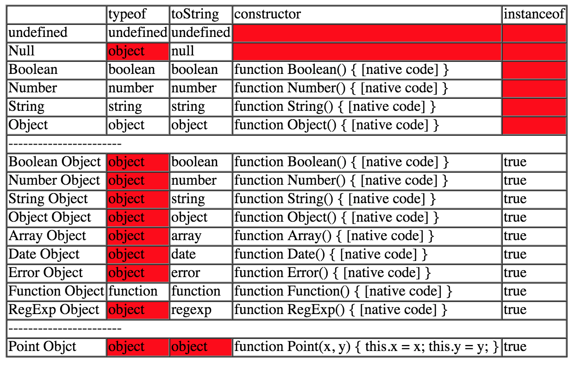

<!-- START doctoc generated TOC please keep comment here to allow auto update -->
<!-- DON'T EDIT THIS SECTION, INSTEAD RE-RUN doctoc TO UPDATE -->
**Table of Contents**  *generated with [DocToc](https://github.com/thlorenz/doctoc)*

- [类型识别](#%E7%B1%BB%E5%9E%8B%E8%AF%86%E5%88%AB)

<!-- END doctoc generated TOC please keep comment here to allow auto update -->


### 类型识别

- `typeof`
- `Object.prototype.toString`
- `constructor`
- `instanceof`

**typeof**：
- 可以是标准类型（Null 除外）
- 不可识别具体的对象类型（Function 除外）

**Object.prototype.toString**：
- 可是识别标准类型及内置对象类型（例如，Object, Date, Array）
- 不能识别自定义对象类型

**constructor**：
- 可以识别标准类型（Undefined/Null 除外）
- 可识别内置对象类型
- 可识别自定义对象类型

```javascript
function getConstructiorName(obj) {
  return obj && obj.constructor && obj.constructor.toString().match(/function\s*([^(]*)/)[1];
}
getConstructiorName([]) === "Array"; // true
```

**instanceof**：
- 不可判别原始类型
- 可判别内置对象类型
- 可判别自定义对象类型

JavaScript的数据类型可以分为：标准类型和对象类型。

`标准类型有`：undefined Null Boolean Date Number Object

`对象类型（构造器类型）`：Boolean Date Number Object Array Date Error Function RegExp

用来判断数据类型的一般有四种方式，分别是：

- `typeof `
- `Prototype.toString()`
- `constructor`
- `instanceof`

**下面我们写一个HTML来检验一下：**

```html
<html>
<head>
    <title>JavaScript类型判断</title>
    <meta charset="utf-8">
    <style type="text/css">
        .red{
            background-color:red;
        }
    </style>
</head>
<body>
    <script type="text/javascript">
        /* Standard Type */
        var a;    //undefined
        var b = document.getElementById("no_exist_element"); //null
        var c = true;    //Boolean
        var d = 1;    //Number
        var e = "str";     //String
        var f = {name : "Tom"};    //Object

        /* Object Type */
        var g = new Boolean(true);    //Boolean Object
        var h = new Number(1);    //Number Object
        var i = new String("str");    //String Object
        var j = new Object({name : "Tom"}); //Object Object
        var k = new Array([1, 2, 3, 4]);    //Array Object
        var l = new Date();    //Date Object
        var m = new Error();
        var n = new Function();
        var o = new RegExp("\\d");

        /* Self-Defined Object Type */
        function Point(x, y) {
          this.x = x;
          this.y = y;
        }

        Point.prototype.move = function(x, y) {
          this.x += x;
          this.y += y;
        }

        var p = new Point(1, 2);

        /* Use the Prototype.toString() to judge the type */
        function type(obj){
            return Object.prototype.toString.call(obj).slice(8, -1).toLowerCase();
        }
    </script>
    <table border="1" cellspacing="0">
        <tr>
            <td></td>
            <td>typeof</td>
            <td>toString</td>
            <td>constructor</td>
            <td>instanceof</td>
        </tr>
        <tr>
            <td>undefined</td>
            <td><script type="text/javascript">document.write(typeof a)</script></td>
            <td><script type="text/javascript">document.write(type(a))</script></td>
            <td class="red"><script type="text/javascript">document.write(a.constructor)</script></td>
            <td class="red"><script type="text/javascript">document.write(a instanceof "undefined")</script></td>
        </tr>
        <tr>
            <td>Null</td>
            <td class="red"><script type="text/javascript">document.write(typeof b);</script></td>
            <td><script type="text/javascript">document.write(type(b));</script></td>
            <td class="red"><script type="text/javascript">document.write(b.constructor);</script></td>
            <td class="red"><script type="text/javascript">document.write(b instanceof "null");</script></td>
        </tr>
        <tr>
            <td>Boolean</td>
            <td><script type="text/javascript">document.write(typeof c);</script></td>
            <td><script type="text/javascript">document.write(type(c));</script></td>
            <td><script type="text/javascript">document.write(c.constructor);</script></td>
            <td class="red"><script type="text/javascript">document.write(c instanceof "boolean");</script></td>
        </tr>
        <tr>
            <td>Number</td>
            <td><script type="text/javascript">document.write(typeof d);</script></td>
            <td><script type="text/javascript">document.write(type(d));</script></td>
            <td><script type="text/javascript">document.write(d.constructor);</script></td>
            <td class="red"><script type="text/javascript">document.write(d instanceof "number");</script></td>
        </tr>
        <tr>
            <td>String</td>
            <td><script type="text/javascript">document.write(typeof e);</script></td>
            <td><script type="text/javascript">document.write(type(e));</script></td>
            <td><script type="text/javascript">document.write(e.constructor);</script></td>
            <td class="red"><script type="text/javascript">document.write(e instanceof "string");</script></td>
        </tr>
        <tr>
            <td>Object</td>
            <td><script type="text/javascript">document.write(typeof f);</script></td>
            <td><script type="text/javascript">document.write(type(f));</script></td>
            <td><script type="text/javascript">document.write(f.constructor);</script></td>
            <td class="red"><script type="text/javascript">document.write(f instanceof "object");</script></td>
        </tr>
        <tr><td colspan="5">-----------------------</td></tr>
        <tr>
            <td>Boolean Object</td>
            <td class="red"><script type="text/javascript">document.write(typeof g);</script></td>
            <td><script type="text/javascript">document.write(type(g));</script></td>
            <td><script type="text/javascript">document.write(g.constructor);</script></td>
            <td><script type="text/javascript">document.write(g instanceof Boolean);</script></td>
        </tr>
        <tr>
            <td>Number Object</td>
            <td class="red"><script type="text/javascript">document.write(typeof h);</script></td>
            <td><script type="text/javascript">document.write(type(h));</script></td>
            <td><script type="text/javascript">document.write(h.constructor);</script></td>
            <td><script type="text/javascript">document.write(h instanceof Number);</script></td>
        </tr>
        <tr>
            <td>String Object</td>
            <td class="red"><script type="text/javascript">document.write(typeof i);</script></td>
            <td><script type="text/javascript">document.write(type(i));</script></td>
            <td><script type="text/javascript">document.write(i.constructor);</script></td>
            <td><script type="text/javascript">document.write(i instanceof String);</script></td>
        </tr>
        <tr>
            <td>Object Object</td>
            <td class="red"><script type="text/javascript">document.write(typeof j);</script></td>
            <td><script type="text/javascript">document.write(type(j));</script></td>
            <td><script type="text/javascript">document.write(j.constructor);</script></td>
            <td><script type="text/javascript">document.write(j instanceof Object);</script></td>
        </tr>
        <tr>
            <td>Array Object</td>
            <td class="red"><script type="text/javascript">document.write(typeof k);</script></td>
            <td><script type="text/javascript">document.write(type(k));</script></td>
            <td><script type="text/javascript">document.write(k.constructor);</script></td>
            <td><script type="text/javascript">document.write(k instanceof Array);</script></td>
        </tr>
        <tr>
            <td>Date Object</td>
            <td class="red"><script type="text/javascript">document.write(typeof l);</script></td>
            <td><script type="text/javascript">document.write(type(l));</script></td>
            <td><script type="text/javascript">document.write(l.constructor);</script></td>
            <td><script type="text/javascript">document.write(l instanceof Date);</script></td>
        </tr>
        <tr>
            <td>Error Object</td>
            <td class="red"><script type="text/javascript">document.write(typeof m);</script></td>
            <td><script type="text/javascript">document.write(type(m));</script></td>
            <td><script type="text/javascript">document.write(m.constructor);</script></td>
            <td><script type="text/javascript">document.write(m instanceof Error);</script></td>
        </tr>
        <tr>
            <td>Function Object</td>
            <td><script type="text/javascript">document.write(typeof n);</script></td>
            <td><script type="text/javascript">document.write(type(n));</script></td>
            <td><script type="text/javascript">document.write(n.constructor);</script></td>
            <td><script type="text/javascript">document.write(n instanceof Function);</script></td>
        </tr>
        <tr>
            <td>RegExp Object</td>
            <td class="red"><script type="text/javascript">document.write(typeof o);</script></td>
            <td><script type="text/javascript">document.write(type(o));</script></td>
            <td><script type="text/javascript">document.write(o.constructor);</script></td>
            <td><script type="text/javascript">document.write(o instanceof RegExp);</script></td>
        </tr>
        <tr><td colspan="5">-----------------------</td></tr>
        <tr>
            <td>Point Objct</td>
            <td class="red"><script type="text/javascript">document.write(typeof p);</script></td>
            <td class="red"><script type="text/javascript">document.write(type(p));</script></td>
            <td><script type="text/javascript">document.write(p.constructor);</script></td>
            <td><script type="text/javascript">document.write(p instanceof Point);</script></td>
        </tr>
    </table>
</body>
</html>
```

执行的结果如下：



其中红色的单元格表示该判断方式不支持的类型。