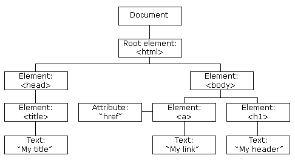

<!-- START doctoc generated TOC please keep comment here to allow auto update -->
<!-- DON'T EDIT THIS SECTION, INSTEAD RE-RUN doctoc TO UPDATE -->
**Table of Contents**  *generated with [DocToc](https://github.com/thlorenz/doctoc)*

  - [文档树](#%E6%96%87%E6%A1%A3%E6%A0%91)
    - [HTML 转换 DOM 树](#html-%E8%BD%AC%E6%8D%A2-dom-%E6%A0%91)
    - [节点遍历](#%E8%8A%82%E7%82%B9%E9%81%8D%E5%8E%86)
    - [节点类型](#%E8%8A%82%E7%82%B9%E7%B1%BB%E5%9E%8B)
    - [元素遍历](#%E5%85%83%E7%B4%A0%E9%81%8D%E5%8E%86)

<!-- END doctoc generated TOC please keep comment here to allow auto update -->

## 文档树

Document Object Model (DOM) 为文档**对象**模型，
它使用对象的表示方式来表示对应的文档结构及其中的内容。

下面为一个样例 `p` 元素在文档中的对象所包含的所有属性。

```html
<p id="target">Hello, World!</p>
```

```
p#targetaccessKey: ""
align: ""
attributes: Named
NodeMapbaseURI: ""
childElementCount: 0
childNodes: NodeList[1]
children: HTMLCollection[0]
classList: DOMTokenList[0]
className: ""
clientHeight: 0
clientLeft: 0
clientTop: 0
clientWidth: 0
contentEditable: "inherit"
dataset: DOM
StringMapdir: ""
draggable: false
firstChild: text
firstElementChild: null
hidden: false
id: "target"
innerHTML: "Hello, World!"
innerText: "Hello, World!"
isContentEditable: false
lang: ""
lastChild: text
lastElementChild: null
localName: "p"
namespaceURI: "http://www.w3.org/1999/xhtml"
nextElementSibling: null
nextSibling: null
nodeName: "P"
nodeType: 1
nodeValue: null
offsetHeight: 0
offsetLeft: 0
offsetParent: null
offsetTop: 0
offsetWidth: 0
onabort: null
onautocomplete: null
onautocompleteerror: null
onbeforecopy: null
onbeforecut: null
onbeforepaste: null
onblur: null
oncancel: null
oncanplay: null
oncanplaythrough: null
onchange: null
onclick: null
onclose: null
oncontextmenu: null
oncopy: null
oncuechange: null
oncut: null
ondblclick: null
ondrag: null
ondragend: null
ondragenter: null
ondragleave: null
ondragover: null
ondragstart: null
ondrop: null
ondurationchange: null
onemptied: null
onended: null
onerror: null
onfocus: null
oninput: null
oninvalid: null
onkeydown: null
onkeypress: null
onkeyup: null
onload: null
onloadeddata: null
onloadedmetadata: null
onloadstart: null
onmousedown: null
onmouseenter: null
onmouseleave: null
onmousemove: null
onmouseout: null
onmouseover: null
onmouseup: null
onmousewheel: null
onpaste: null
onpause: null
onplay: null
onplaying: null
onprogress: null
onratechange: null
onreset: null
onresize: null
onscroll: null
onsearch: null
onseeked: null
onseeking: null
onselect: null
onselectstart: null
onshow: null
onstalled: null
onsubmit: null
onsuspend: null
ontimeupdate: null
ontoggle: null
onvolumechange: null
onwaiting: null
onwebkitfullscreenchange: null
onwebkitfullscreenerror: null
onwheel: null
outerHTML: "<p id="target">Hello, World!</p>"
outerText: "Hello, World!"
ownerDocument: document
parentElement: null
parentNode: null
prefix: null
previousElementSibling: null
previousSibling: null
scrollHeight: 0
scrollLeft: 0
scrollTop: 0
scrollWidth: 0
shadowRoot: null
spellcheck: true
style: CSSStyle
DeclarationtabIndex: -1
tagName: "P"
textContent: "Hello, World!"
title: ""
translate: true
webkitdropzone: ""
__proto__: HTMLParagraphElement
```

通过使用 DOM 提供的 API (Application Program Interface)
可以动态的修改节点（node），也就是对 DOM 树的直接操作。
浏览器中通过使用 JavaScript 来实现对于 DOM 树的改动。

**DOM 包含**

- DOM Core
- DOM HTML
- DOM Style
- DOM Event

### HTML 转换 DOM 树

```html
<!DOCTYPE html>
<html lang="en">
  <head>
    <title>My title</title>
  </head>
  <body>
    <a href="">My Link</a>
    <h1>My header</h1>
  </body>
</html>
```



### 节点遍历

在元素节点中提取自己所需的节点，并予以操作。

```Javascript
// Document.getElementsByTagName()
// 更具标签名找到目标节点的集合，此例中为 <h1>My header</h1>
var node = document.getElementsByTagName('h1')[0];

// Node.parentNode;
// 获得目标节点的父节点，此例中为 body 元素
node.parentNode;

// Node.firstChild
// 获得目标节点的第一个子节点，此例中为 "My header"
node.firstChild;

// Node.lastChild
// 获得目标节点的最后一个子节点，此例中为 "My header"
node.lastChild;

// Node.previousSibling;
// 获得目标节点的前一个相邻节点
node.previousSibling;

// Node.nextSibling;
// 获得目标节点的下一个相邻节点
node.nextSibling;
```

### 节点类型

**常用节点类型**

- ELEMENT_NODE 可使用 `Document.createElement('elementName');` 创建
- TEXT_NODE 可使用 `Document.createTextNode('Text Value');` 创建

**不常用节点类型**

- COMMENT_NODE
- DOCUMENT_TYPE_NODE

**不同节点对应的NodeType类型**

此值可以通过 `Node.nodeType` 来获取。

|节点编号|节点名称|
|--------|--------|
|1|Element|
|2|Attribute|
|3|Text|
|4|CDATA Section|
|5|Entity Reference|
|6|Entity|
|7|Processing Instrucion|
|8|Comment|
|9|Document|
|10|Document Type|
|11|Document Fragment|
|12|Notation|

NOTE：此处需要清楚`节点`和`元素`的区别。我们平常说的`元素`
其实指的是节点中得`元素节点`，所以说`节点`包含`元素`，节点还包括文本节点、实体节点等。

### 元素遍历

元素节点符合 HTML DOM 树规则，所以它与 DOM 中存在的节点相似。

```
<p>
  Hello,
    <em>Xinyang</em>!
  回到
    <a href="http://li-xinyang.com">
      主页
    </a>
  。
</p>
```

```
// 在选取元素节点后

p.firstElementChild;       // <em>Xinyang</em>
p.lastElementChild;        // <a href="http://li-xinyang.com">主页</a>

em.nextElementSibling;     // <a href="http://li-xinyang.com">主页</a>
em.previousElementSibling; // "Hello,"
```
