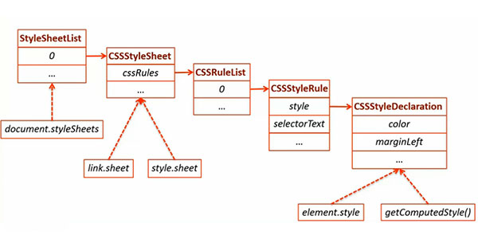

<!-- START doctoc generated TOC please keep comment here to allow auto update -->
<!-- DON'T EDIT THIS SECTION, INSTEAD RE-RUN doctoc TO UPDATE -->
**Table of Contents**  *generated with [DocToc](https://github.com/thlorenz/doctoc)*

- [样式操作](#%E6%A0%B7%E5%BC%8F%E6%93%8D%E4%BD%9C)
  - [CSS 对应 DOM 对象](#css-%E5%AF%B9%E5%BA%94-dom-%E5%AF%B9%E8%B1%A1)
    - [内部样式表](#%E5%86%85%E9%83%A8%E6%A0%B7%E5%BC%8F%E8%A1%A8)
    - [行内样式](#%E8%A1%8C%E5%86%85%E6%A0%B7%E5%BC%8F)
  - [更新样式](#%E6%9B%B4%E6%96%B0%E6%A0%B7%E5%BC%8F)
    - [element.style](#elementstyle)
    - [element.style.cssText](#elementstylecsstext)
    - [更新 class](#%E6%9B%B4%E6%96%B0-class)
    - [统一更新多个元素样式](#%E7%BB%9F%E4%B8%80%E6%9B%B4%E6%96%B0%E5%A4%9A%E4%B8%AA%E5%85%83%E7%B4%A0%E6%A0%B7%E5%BC%8F)
  - [获取样式](#%E8%8E%B7%E5%8F%96%E6%A0%B7%E5%BC%8F)
    - [element.style](#elementstyle-1)
    - [window.getComputedStyle()](#windowgetcomputedstyle)

<!-- END doctoc generated TOC please keep comment here to allow auto update -->

## 样式操作

通过 JavaScript 动态修改页面样式。

### CSS 对应 DOM 对象



```html
<link rel="stylesheet" type="text/css" href="sample.css">
// var element = document.querySelector('link');
// 对应于 element.sheet

<style type="text/css" media="screen">
  body {
    margin: 30px
  }
</style>
// var element = document.querySelector('style');
// 对应于 element.sheet

// 整个页面的全部样式（不包括行内样式）
document.styleSheets

<p style="color:red">Text Color</p>
// var element = document.querySelector('p');
// 对应于 element.style
```

#### 内部样式表

```html
<style>
  body{margin:30;}
  p{color: #aaa; line-height:20px}
</style>

// 1.对应所有样式的列表
// body{margin:30;}
// p{color: #aaa; line-height:20px}
element.sheet.cssRules;

// 2.对应相应的 CSS 选择器
// p
element.sheet.cssRules[1].selectorText;

// 3.对应一个样式
// p{color: #aaa; line-height:20px}
element.sheet.cssRules[1]

// 4.对应所有样式的键值对
// color: #aaa; line-height:20px
element.sheet.cssRules[1].style;

// 5.对应的属性值
// #aaa
element.sheet.cssRules[1].stlye.color;
element.sheet.cssRules[1].lineHeight;
```

#### 行内样式

其对应于 `CSSStyleDeclaration` 的对象。

```html
element.style.color;
// 获取行内样式的键值对

```

### 更新样式

#### element.style

```javascript
element.style.color = 'red';
element.style.background = 'black';
```

增加样式后得到的结果

```html
<div style="color: red; background: black;"></div>
```

**缺点**

- 每个属性的更新都需要一个命令
- 命名异常（以驼峰命名法命名属性）

#### element.style.cssText

一次同时设置多个行内样式，其结果同 `element.style` 单独设置相同。

```javascript
element.style.cssText = 'color: red; background: black';
```

增加样式后得到的结果

```html
<div style="color: red; background: black;"></div>
```

**以上两种方式均将样式混合在逻辑当中。**

#### 更新 class

首先需要创建对应样式的 CSS 样式。

```html
.angry {
  color: red;
  background: black;
}
```

然后再在 JavaScript 中，在对应的事件中给元素添加需要的类即可。

```javascript
element.className += ' angry';
```

增加样式后得到的结果

```html
<div class="angry"></div>
```

#### 统一更新多个元素样式

以上方法均不适合同时更新多个样式，通过更换样式表的方式则可同时更改多个页面中的样式。将需要的大量样式也在一个**皮肤样式**表中，通过 JavaScript 来直接更换样式表来进行样式改变。（此方法也可用于批量删除样式）

```html
<link rel="stylesheet" type="text/css" href="base.css">
<link rel="stylesheet" type="text/css" href="style1.css">
```

```javascript
element.setAttribute('href', 'style2.css');
```

### 获取样式

#### element.style

其对应的为元素的**行内样式表**而不是实际样式表。

```html
<input type="checkbox" name="" value="">
```

```javascript
element.style.color; // ""
```
line-height: 200px

#### window.getComputedStyle()

将需要取出样式的目标元素传入 `window.getComputedStyle()` 函数中，即可得到对应元素的实际样式。注意的是这里获取到的样式值为**只读**属性不可修改！

NOTE：获取的实际为 `CSSStyleDeclaration` 的实例对象。
NOTE+：此方法不支持 IE9 以下版本，IE9 中需使用 `element.currentStyle` 来做兼容。

```javascript
var style = window.getComputedStyle(element[, pseudoEle]);
```

```html
<input type="checkbox" name="" value="">
```

```javascript
window.getComputedStyle(element).color; // 'rgb(0,0,0)'
```
