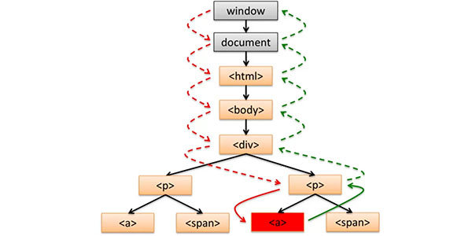
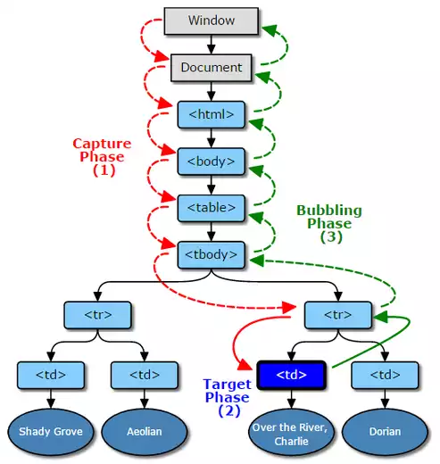
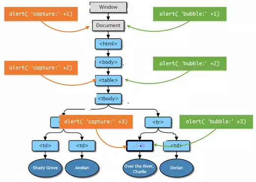
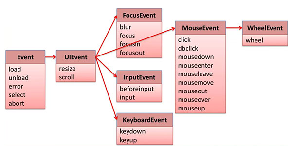
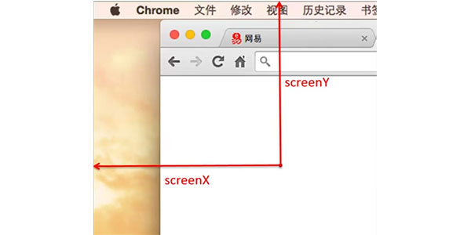

<!-- START doctoc generated TOC please keep comment here to allow auto update -->
<!-- DON'T EDIT THIS SECTION, INSTEAD RE-RUN doctoc TO UPDATE -->
**Table of Contents**  *generated with [DocToc](https://github.com/thlorenz/doctoc)*

- [DOM 事件](#dom-%E4%BA%8B%E4%BB%B6)
  - [事件流](#%E4%BA%8B%E4%BB%B6%E6%B5%81)
  - [事件注册](#%E4%BA%8B%E4%BB%B6%E6%B3%A8%E5%86%8C)
    - [注册事件](#%E6%B3%A8%E5%86%8C%E4%BA%8B%E4%BB%B6)
    - [取消事件](#%E5%8F%96%E6%B6%88%E4%BA%8B%E4%BB%B6)
    - [触发事件](#%E8%A7%A6%E5%8F%91%E4%BA%8B%E4%BB%B6)
    - [浏览器兼容型](#%E6%B5%8F%E8%A7%88%E5%99%A8%E5%85%BC%E5%AE%B9%E5%9E%8B)
      - [兼容低版本代码实现](#%E5%85%BC%E5%AE%B9%E4%BD%8E%E7%89%88%E6%9C%AC%E4%BB%A3%E7%A0%81%E5%AE%9E%E7%8E%B0)
  - [事件对象](#%E4%BA%8B%E4%BB%B6%E5%AF%B9%E8%B1%A1)
    - [属性和方法](#%E5%B1%9E%E6%80%A7%E5%92%8C%E6%96%B9%E6%B3%95)
      - [通用属性和方法](#%E9%80%9A%E7%94%A8%E5%B1%9E%E6%80%A7%E5%92%8C%E6%96%B9%E6%B3%95)
        - [阻止事件传播](#%E9%98%BB%E6%AD%A2%E4%BA%8B%E4%BB%B6%E4%BC%A0%E6%92%AD)
        - [阻止默认行为](#%E9%98%BB%E6%AD%A2%E9%BB%98%E8%AE%A4%E8%A1%8C%E4%B8%BA)
  - [事件分类](#%E4%BA%8B%E4%BB%B6%E5%88%86%E7%B1%BB)
    - [Event](#event)
      - [window](#window)
      - [image](#image)
    - [UIEvent](#uievent)
    - [MouseEvent](#mouseevent)
      - [属性](#%E5%B1%9E%E6%80%A7)
      - [MouseEvent 顺序](#mouseevent-%E9%A1%BA%E5%BA%8F)
        - [实例：拖动元素](#%E5%AE%9E%E4%BE%8B%EF%BC%9A%E6%8B%96%E5%8A%A8%E5%85%83%E7%B4%A0)
    - [滚轮事件（Wheel）](#%E6%BB%9A%E8%BD%AE%E4%BA%8B%E4%BB%B6%EF%BC%88wheel%EF%BC%89)
    - [FocusEvent](#focusevent)
    - [InputEvent](#inputevent)
    - [KeyboardEvent](#keyboardevent)
  - [事件代理](#%E4%BA%8B%E4%BB%B6%E4%BB%A3%E7%90%86)

<!-- END doctoc generated TOC please keep comment here to allow auto update -->

## DOM 事件

何为 DOM 事件，HTML DOM 使JavaScript 有能力对 HTML 事件做出反应。（例如，点击 DOM 元素，键盘被按，输入框输入内容以及页面加载完毕等）

### 事件流

一个 DOM 事件可以分为`捕获过程`、`触发过程`、`冒泡过程`。
DOM 事件流为 DOM 事件的处理及执行的过程。下面以一个`<a>`元素被点击为例。



1. [红虚线]Capture Phase（事件捕获过程）当 DOM 事件发生时，它会从window节点一路跑下去直到触发事件元素的父节点为止，去捕获触发事件的元素。
2. [红绿实线]Target Phase（事件触发过程）当事件被捕获之后就开始执行事件绑定的代码
3. [绿虚线]Bubble Phase（冒泡过程）当事件代码执行完毕后，浏览器会从触发事件元素的父节点开始一直冒泡到window元素（**即元素的祖先元素也会触发这个元素所触发的事件**）

**关于捕获过程的补充**

如果有一个支持三个阶段的事件，它一定在触发时遵循下面的顺序：

```
Capture -> Target -> Bubbling
```



使用下面的代码来举例：

```JavaScript
// 添加Capture阶段事件
docuemnt.addEventListener('click',function(){
    alert('capture：'+1);
},true);
tableNode.addEventListener('click',function(){
    alert('capture：'+2);
},true);
tdNode.addEventListener('click',function(){
    alert('capture：'+3);
},true);

// 添加Bubbling阶段事件
docuemnt.addEventListener('click',function(){
    alert('bubble：'+1);
});
tableNode.addEventListener('click',function(){
    alert('bubble：'+2);
});
tdNode.addEventListener('click',function(){
    alert('bubble：'+3);
});
```

输出结果为：

```
capture：1
capture：2
capture：3
bubble：3
bubble：2
bubble：1
```



```javascript
// 对document添加了三个bubbling阶段的事件
document.addEventListener('click',function(){
    alert(1);
});
document.addEventListener('click',function(){
    alert(2);
});
document.addEventListener('click',function(){
    alert(3);
});
```

如上面的代码所示，其为同一节点添加了同一阶段的多个事件，那执行顺序如何呢？
早期并没有规范定义，DOM 3 中规范已经明确规定
同一节点同一阶段的事件应按照注册函数的顺序执行。

> 在实际项目过程中，某些情况下比如若干的组件或者模块都需要监听某个节点的某个事件，但是组件或者模块的生成（即添加事件的时机）是不一定保证顺序的，所以这个情况下如果某个组件对这个节点的这个事件的优先级特别高（需要保证必须先触发这个组件里的这个事件）而这个平台又支持这个阶段事件的话可以添加 capture 阶段事件，用三阶段的顺序来保证，比如移动平台模拟手势的实现会添加 document 上 touchXXX 的 capture 阶段事件，以优先识别手势操作
> 当然实践过程中考虑到不同浏览器对三阶段支持的情况的差异，大部分情况下都采用的是 bubbling 阶段的事件
>
> —— 蔡剑飞 网易前端工程师

NOTE：低版本 IE 中并未实现捕获过程。也不是所有事件均存在这三个完整的过程（例如 `load` 没有冒泡事件）

NOTE+：在这三个阶段中无论将**事件捕获**和**事件处理**注册到任意一个父或祖父节点上都会被触发事件。

### 事件注册

事件注册，取消以及触发其作用对象均为一个 DOM 元素。

#### 注册事件

```javascript
eventTarget.addEventListener(type, listener[,useCapture])
```

- evenTarget 表示要绑定事件的DOM元素
- type    表示要绑定的事件，如："click"
- listener  表示要绑定的函数
- useCapture  可选参数，表示是否捕获过程

NOTE：`useCapture` 为设定是否为捕获过程，默认事件均为冒泡过程，只有 `useCapture` 为 `true` 时才会启用捕获过程。

```javascript
// 获取元素
var elem = document.getElemenyById('id');

// 事件处理函数
var clickHandler = function(event) {
  // statements
};

// 注册事件
elem.addEventListener('click', clickHandler, false);

// 第二种方式，不建议使用
elem.onclick = clickHandler;
// 或者来弥补只可触发一个处理函数的缺陷
elem.onclick = function(){
  clickHandler();
  func();
  // 其他处理函数
};
```

#### 取消事件

```javascript
eventTarget.removeEventListener(type, listener[,useCapture]);
```

- evenTarget 表示要绑定事件的DOM元素
- type    表示要绑定的事件，如："click"
- listener  表示要绑定的函数
- useCapture  可选参数，表示是否捕获过程

```javascript
// 获取元素
var elem = document.getElemenyById('id');

// 取消事件
elem.removeEventListener('click', clickHandler, false);

// 第二种方式。不建议使用
elem.onclick = null;
```

#### 触发事件

点击元素，按下按键均会触发 DOM 事件，当然也可以以通过代码来触发事件。

```javascript
eventTarget.dispatchEvent(type);

// 获取元素
var elem = document.getElemenyById('id');

// 触发事件
elem.dispatchEvent('click');
```

#### 浏览器兼容型

以上均为 **W3C**定义的标准定义，但早期浏览器 IE8 及其以下版本，均没有采用标准的实现方式。不过这些低版本浏览器也提供了对于 DOM 事件的注册、取消以及触发的实现。

**事件注册与取消**，`attchEvent/detachEvent`。**事件触发**，`fireEvent(e)`，其也**不存在**捕获阶段（Capture Phase）。


##### 兼容低版本代码实现

**注册事件**

```javascript
var addEvent = document.addEventListener ?
  function(elem, type, listener, useCapture) {
    elem.addEventListener(type, listener, useCapture);
  } :
  function(elem, type, listener, useCapture) {
    elem.attachEvent('on' + type, listener);
  }
```

**取消事件**

```javascript
var addEvent = document.removeElementListener ?
  function(elem, type, listener, useCapture) {
    elem.removeElementListener(type, listener, useCapture);
  } :
  function(elem, type, listener, useCapture) {
    elem.detachEvent('on' + type, listener);
  }
```

### 事件对象

调用事件处理函数时传入的信息对象，这个对象中含有关于这个事件的详细状态和信息，它就是事件对象 `event`。其中可能包含鼠标的位置，键盘信息等。

```javascript
// 获取元素
var elem = document.getElemenyById('id');

// 事件处理函数
var clickHandler = function(event) {
  // statements
};

// 注册事件
elem.addEventListener('click', clickHandler, false);
```

NOTE：在低版本 IE 中事件对象是被注册在 `window` 之上而非目标对象上。使用下面的兼容代码既可解决。

```javascript
var elem = document.getElemenyById('id');

// 事件处理函数
var clickHandler = function(event) {
  event = event || window.event;
  // statements
};
```

#### 属性和方法

##### 通用属性和方法

**属性**

- type 事件类型
- target(srcElement IE 低版本) 事件触发节点
- currentTarget 处理事件的节点

**方法**

- stopPropagation 阻止事件冒泡传播
- preventDefault 阻止默认行为
- stopImmediatePropagation 阻止冒泡传播

###### 阻止事件传播

`event.stopPropagation()`（W3C规范方法），如果在当前节点已经处理了事件，则可以阻止事件被冒泡传播至 DOM 树最顶端即 `window` 对象。

`event.stopImmediatePropagation()` 此方法同上面的方法类似，除了阻止将事件冒泡传播值最高的 DOM 元素外，还会阻止在此事件后的事件的触发。

`event.cancelBubble=true` 为 IE 低版本中中对于阻止冒泡传播的实现。

###### 阻止默认行为

默认行为是指浏览器定义的默认行为（点击一个链接的时候，链接默认就会打开。当我们双击文字的时候，文字就会被选中），比如单击链接可以打开新窗口。

`Event.preventDefault()` 为 W3C 规范方法，在 IE 中的实现方法为 `Event.returnValue=false`。

### 事件分类

#### Event



|事件类型|是否冒泡|元素|默认事件|元素例子|
|--------|--------|----|--------|--------|
|load|NO|Window, Document, Element|None|window, image, iframe|
|unload|NO|Window, Document, Element|None|window|
|error|NO|Window, Element|None|window, image|
|select|NO|Element|None|input, textarea|
|abort|NO|Window, Element|None|window, image|

##### window

- load 页面全部加载完毕
- unload 离开本页之前的卸载
- error 页面异常
- abort 取消加载

##### image

- load 图片加载完毕
- error 图标加载错误
- abort 取消图标加载

在目标图标不能正常载入时，载入备份替代图来提供用户体验。

```javascript

```

#### UIEvent

|事件类型|是否冒泡|元素|默认事件|元素例子|
|--------|--------|----|--------|--------|
|resize|NO|Window, Element|None|window, iframe|
|scroll|NO/YES|Document, Element|None|document, div|

NOTE：`resize` 为改变浏览器或`iframe`的窗体大小时会触发事件，`scroll` 则会在滑动内容时触发，作用于 `Document` 则不会冒泡，作用于内部元素则会冒泡。

#### MouseEvent

DOM 事件中最常见的事件之一。

|事件类型|是否冒泡|元素|默认事件|元素例子|
|--------|--------|----|--------|--------|
|click|YES|Element|focus/activation|div|
|dbclick|YES|Element|focus/activation/select|div|
|mousedown|YES|Element|drag/scroll/text selection|div|
|mosuemove|YES|Element|None|div|
|mouseout|YES|Element|None|div|
|mouseover|YES|Element|None|div|
|mouseup|YES|Element|context menu|div|
|mouseenter|NO|Element|None|div|
|mouseleave|NO|Element|None|div|

NOTE：`mouseenter` 与 `mouseover` 的区别为前者在鼠标在子元素直接移动不会触发事件，而后者会触发。
`mouseleave` 与 `mouseout` 同上相似。

##### 属性

- clientX, clientX
- screenX, screenY
- ctrlKey, shiftKey, altKey, metaKey 如果被按下则为真（true）
- button(0, 1, 2) 鼠标的间位



##### MouseEvent 顺序

鼠标的移动过程中会产生很多事件。事件的监察频率又浏览器决定。

**例子：从元素 A 上方移动过**

mousemove -> mouseover(A) -> mouseenter(A) -> mousemove(A) -> mouseout(A) -> mouseleave(A)

**例子：点击元素**

mousedown -> [mousemove] -> mouseup -> click

###### 实例：拖动元素

```html
<div id="div0"></div>
<style media="screen">
  #div0 {
    position: absolute;
    top: 0;
    left: 0;
    width: 100px;
    height: 100px;
    border: 1px solid black;
  }
</style>
```

```javascript
var elem = document.getElemenyById('div0');
var clientX, clientY, isMoving;
var mouseDownHandler = function(event) {
  event = event || window.event;
  clientX = event.clientX;
  clientY = event.clientY;
  isMoving = true;
}

var mouseMoveHandler = function(event) {
  if (!isMoving) return;
  event = event || window.event;
  var newClientX = event.clientX,
      newClientY = event.clientY;
  var left = parseInt(elem.style.left) || 0,
      top = parseInt(elem.style.top) || 0;
  elem.style.left = left + (newClientX - clientX) + 'px';
  elem.style.top = top + (newClientY - clientY) + 'px';
  clientX = newClientX;
  clientY = newClientY;
}

var mouseUpHandler = function() {
  isMoving = false;
}

addEvent(elem, 'mousedown', mouseDownHandler);
addEvent(elem, 'mouseup', mouseUpHandler);
addEvent(elem, 'mousemove', mouseMoveHandler);
```

#### 滚轮事件（Wheel）

|事件类型|是否冒泡|元素|默认事件|元素例子|
|--------|--------|----|--------|--------|
|wheel|YES|Element|scroll or zoom document|div|

**属性**

- deltaMode 鼠标滚轮偏移量的单位
- deltaX
- deltaY
- deltaZ

#### FocusEvent

其用于处理元素获得或失去焦点的事件。（例如输入框的可输入状态则为获得焦点，点击外部则失去焦点）

|事件类型|是否冒泡|元素|默认事件|元素例子|
|--------|--------|----|--------|--------|
|blur|NO|Window, Element|None|window, input|
|focus|NO|Window, Element|None|window, input|
|focusin|NO|window, Element|None|window, input|
|focusout|NO|window, Element|None|window, input|

NOTE：`blur` 失去焦点时，`focus` 获得焦点时，`focusin` 即将获得焦点，`focusout`即将失去焦点。

**属性**

一个元素失去，既另一个元素获得焦点。这里的 `relatedTarget` 则为相对的那个元素。

- relatedTarget

#### InputEvent

输入框输入内容则会触发输入事件。

|事件类型|是否冒泡|元素|默认事件|元素例子|
|--------|--------|----|--------|--------|
|beforeInput|YES|Element|update DOM Element|input|
|input|YES|Element|None|input|

NOTE：`beforeInput` 为在按键按下后即将将输入字符显示之前生成的事件。

NOTE+：IE 并没有 `InputEvent` 则需使用 `onpropertychange(IE)` 来代替。

#### KeyboardEvent

其用于处理键盘事件。

|事件类型|是否冒泡|元素|默认事件|元素例子|
|--------|--------|----|--------|--------|
|keydown|YES|Element|beforeInput/input/focus/blur/activation|div, input|
|keyup|YES|Element|None|div, input|

**属性**

- key 按下的键字符串
- code
- ctrlKey, shiftKey, altKey, metaKey
- repeat 代表按键不松开为 true
- keyCode
- charCode
- which

### 事件代理

事件代理是指在父节点上（可为元素最近的父节点也可为上层的其他节点）处理子元素上触发的事件，其原理是通过事件流机制而完成的。可以通过**事件对象**中获取到触发事件的对象（如下所示）。

```javascript
var elem = document.getElemenyById('id');
elem.addEventListener('click', function(event) {
  var e = event || window.event;
  var target = e.target || e.srcElement;
  // statements
});
```

**优点**

- 需要管理的事件处理函数更少
- 内存分配更少，更高效
- 增加与删除子节点可以不额外处理事件

**缺点**

- 事件管理的逻辑变的复杂（因为冒泡机制）
