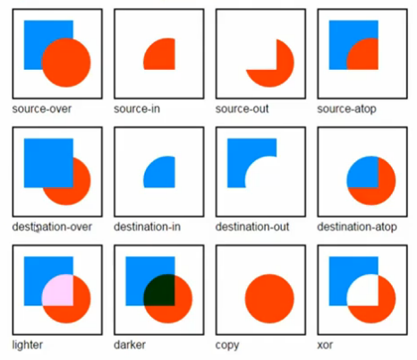
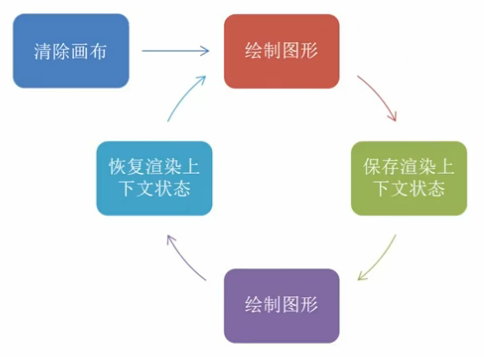

<!-- START doctoc generated TOC please keep comment here to allow auto update -->
<!-- DON'T EDIT THIS SECTION, INSTEAD RE-RUN doctoc TO UPDATE -->
**Table of Contents**  *generated with [DocToc](https://github.com/thlorenz/doctoc)*

- [Canvas](#canvas)
  - [渲染上下文对象](#%E6%B8%B2%E6%9F%93%E4%B8%8A%E4%B8%8B%E6%96%87%E5%AF%B9%E8%B1%A1)
  - [绘图步骤](#%E7%BB%98%E5%9B%BE%E6%AD%A5%E9%AA%A4)

<!-- END doctoc generated TOC please keep comment here to allow auto update -->

## Canvas

**Mozilla** 官方 `<canvas>` 教程在[这里](https://developer.mozilla.org/en-US/docs/Web/API/Canvas_API/Tutorial)。

画布 `<canvas>` 的默认宽高为 300 与 150 ，但是同样可以使用 CSS 设定宽高。但因为 CSS 与 JavaScript 在渲染工程中有速度的差异，所以**不建议使用** CSS 对 `<canvas>` 的宽高做设定。

```html
<canvas id="canvasId" width="300" height="150">
</canvas>
```

### 渲染上下文对象

下面的 `ctx` 即为渲染上下文对象。`globalCompositeOperation` 为对于 `canvas` 绘画时的渲染属性设置，具体表现如下图所示。

```Javascript
var canvas = document.getElementById('canvasId');
var ctx = canvas.getContext('2d');


// 绘画 canvas 的属性
ctx.globalCompositeOperation = 'destination-over';
```



### 绘图步骤



一个周期就是完整的一帧的绘画过程。


```javascript
var sun = new Image();
var moon = new Image();
var earth = new Image();

function init() {
  sun.src = 'Canvas_sun.png';
  moon.src = 'Canvas_moon.png';
  earth.src = 'Canvas_earth.png';
  window.requestAnimationFrame(draw);
}

function draw(){
  var ctx = document.getElementById('canvas').getContext('2d');

  ctx.globalCompositeOperation = 'destination-over';
  // 清空画布内容
  ctx.clearRect(0, 0, 300, 300);

  ctx.fillStyle = 'rgba(0, 0, 0, 0.4)';
  ctx.strokeStyle = 'rgba(0, 153, 255, 0.4)';

  // 保存画布状态
  ctx.save();
  ctx.translate(150, 150);

  // 开始绘制图形

  // 地球
  var time = new Date();
  ctx.rotate(((2*Math.PI)/60)* time.getSeconds() + ((2*Math.PI)/60000)*time.getMilliseconds());
  ctx.translate(105, 0);
  // 阴影
  ctx.fillRect(0, -12, 50, 24);
  ctx.drawImage(earth, -12, -12);

  // 月亮
  ctx.rotate(((2*Math.PI)/6)*time.getSeconds() + ((2*Math.PI)/6000)*time.getMilliseconds());
  ctx.translate(0, 28.5);
  ctx.drawInmage(moon, -3.5, -3.5);

  // 恢复画布状态
  ctx.restore();

  ctx.beginPath();
  ctx.arc(150, 150, 105, 0, Math.PI*2, false);

  ctx.stroke();

  ctx.drawImage(sun, 0, 0, 300, 300);

  window.requestAnimationFrame(draw);
}

init();
```