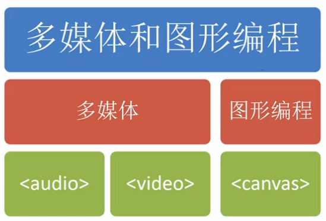

<!-- START doctoc generated TOC please keep comment here to allow auto update -->
<!-- DON'T EDIT THIS SECTION, INSTEAD RE-RUN doctoc TO UPDATE -->
**Table of Contents**  *generated with [DocToc](https://github.com/thlorenz/doctoc)*

- [多媒体](#%E5%A4%9A%E5%AA%92%E4%BD%93)
  - [基本用法](#%E5%9F%BA%E6%9C%AC%E7%94%A8%E6%B3%95)
  - [多媒体支持类型](#%E5%A4%9A%E5%AA%92%E4%BD%93%E6%94%AF%E6%8C%81%E7%B1%BB%E5%9E%8B)
  - [多媒体格式兼容](#%E5%A4%9A%E5%AA%92%E4%BD%93%E6%A0%BC%E5%BC%8F%E5%85%BC%E5%AE%B9)
  - [HTML 属性](#html-%E5%B1%9E%E6%80%A7)
  - [控制多媒体](#%E6%8E%A7%E5%88%B6%E5%A4%9A%E5%AA%92%E4%BD%93)
  - [多媒体相关事件](#%E5%A4%9A%E5%AA%92%E4%BD%93%E7%9B%B8%E5%85%B3%E4%BA%8B%E4%BB%B6)
  - [Web Audio API](#web-audio-api)

<!-- END doctoc generated TOC please keep comment here to allow auto update -->

## 多媒体

HTML5 前的多媒体需要借助第三方插件，例如 Flash，但是 HTML5 将网页中的多媒体带入了新的一章。



### 基本用法

```html
// 音频
// 指定资源类型可以帮助浏览器更快的定位解码
<audio autobuffer autoloop loop controls>
  <source src="/media/audio.mp3" type="audio/mpeg">
  <source src="/media/audio.oga">
  <source src="/media/audio.wav">
  <object type="audio/x-wav" data="/media/audio.wav" width="290" height="45">
    <param name="src" value="/media/audio.wav">
    <param name="autoplay" value="false">
    <param name="autoStart" value="0">
    <p><a href="/media/audio.wav">Download this audio file.</a></p>
  </object>
</audio>

// 视频
<video autobuffer autoloop loop controls width=320 height=240>
  <source src="/media/video.oga">
  <source src="/media/video.m4v">
  <object type="video/ogg" data="/media/video.oga" width="320" height="240">
  <param name="src" value="/media/video.oga">
  <param name="autoplay" value="false">
  <param name="autoStart" value="0">
  <p><a href="/media/video.oga">Download this video file.</a></p>
  </object>
</video>
```

### 多媒体支持类型

HTML5 支持音频[列表](http://en.wikipedia.org/wiki/HTML5_Audio#Supported_audio_coding_formats)

HTML5 支持视频[列表](http://en.wikipedia.org/wiki/HTML5_video#Browser_support)

### 多媒体格式兼容

测试音频兼容性。

```javascript
var a = new Audio();
// 检测媒体类型返回
// 支持 - 'maybe' 或 'probably'
// 不支持 - ''
a.canPlayType('audio/nav');
```

### HTML 属性

视频与音频的大部分属性和方法几乎相同。

|属性|是否必须|默认值|备注|
|----|--------|------|----|
|src|是||音频文件地址 URL|
|controls|否|false|显示控件|
|autoplay|否|false|音频就绪后自动播放|
|preload|否|none|可取值为 none、metadata、auto。音频在页面加载是进行加载，并预备播放。如果使用 autoplay 则忽略该属性（该属性失效）|
|loop|否|false|是否循环播放|

### 控制多媒体

**方法**

- `load()` 加载资源
- `play()` 播放
- `pause()` 暂停播放

**属性**

- `playbackRate` 1为正常速度播放，大于1为快速播放最高20。
- `currentTime` 调准播放时间，以秒为单位。
- `volume` 取值范围0到1
- `muted` 真假值


- `paused` 布尔值暂停
- `seeking` 布尔值跳转
- `ended` 布尔值播放完成
- `duration` 媒体时长数值
- `initialTime` 媒体开始时间

### 多媒体相关事件

- `loadstart` 开始请求媒体内容
- `loadmetadata` 媒体元数据以加载完成（时长，编码格式等）
- `canplay` 加载一些内容但可播放
- `play` 调用`play()`或设置 `autoplay`
- `waiting` 缓冲数据不够，暂停播放
- `playing` 正在进行播放

**全部事件列表**

事件[列表](http://www.w3.org/wiki/HTML/Elements/audio#Media_Events)

### Web Audio API

音频 W3C 官网定义在[这里](http://webaudio.github.io/web-audio-api/)

Mozilla 官方音频教程在[这](https://developer.mozilla.org/en-US/docs/Web/API/Web_Audio_API)，以及第三方[教程 1](http://www.html5rocks.com/en/tutorials/webaudio/intro/)和[教程 2](http://webaudioapi.com/)。