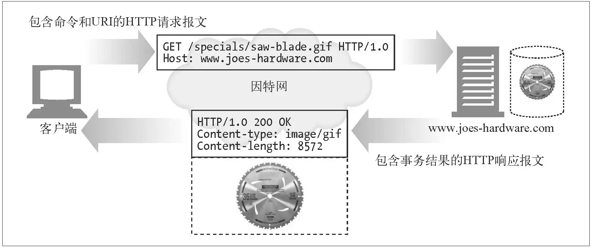
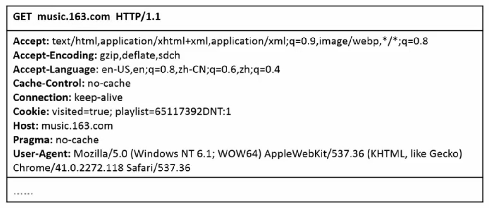
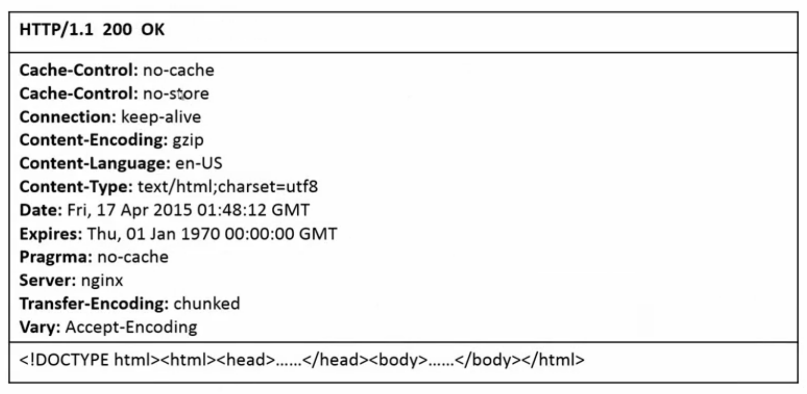
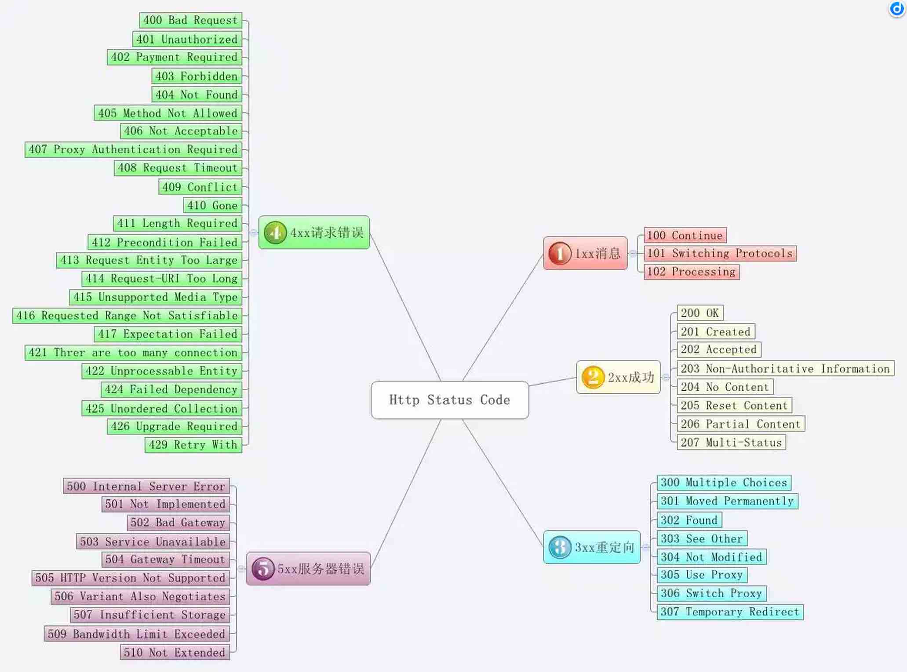
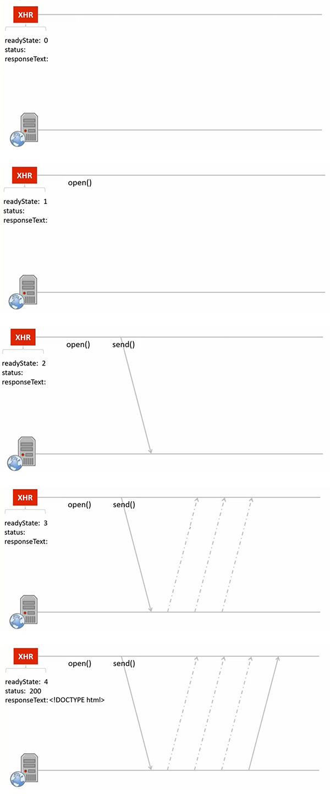
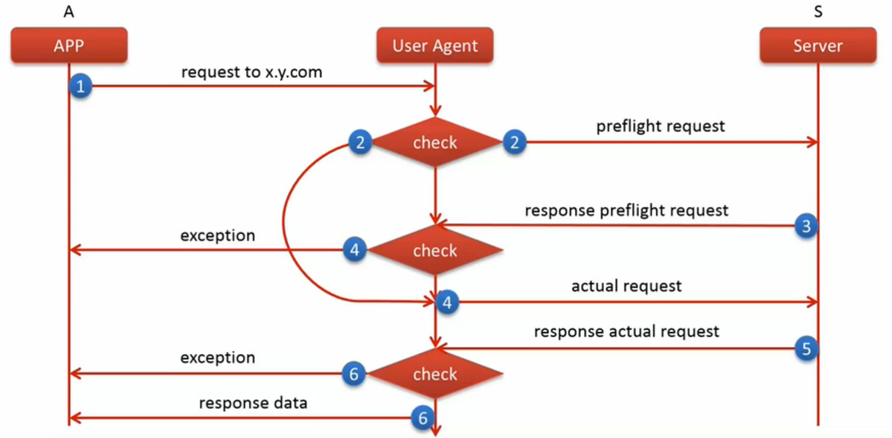
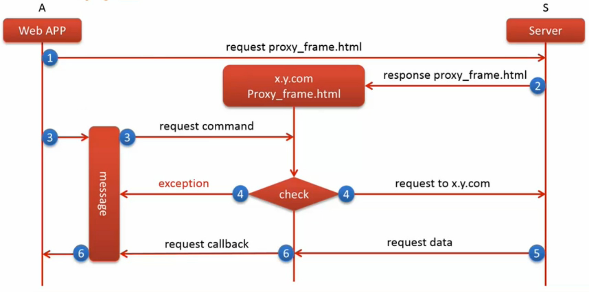

<!-- START doctoc generated TOC please keep comment here to allow auto update -->
<!-- DON'T EDIT THIS SECTION, INSTEAD RE-RUN doctoc TO UPDATE -->
**Table of Contents**  *generated with [DocToc](https://github.com/thlorenz/doctoc)*

- [数据通信](#%E6%95%B0%E6%8D%AE%E9%80%9A%E4%BF%A1)
  - [HTTP](#http)
    - [HTTP 事务](#http-%E4%BA%8B%E5%8A%A1)
      - [HTTP 请求报文](#http-%E8%AF%B7%E6%B1%82%E6%8A%A5%E6%96%87)
      - [HTTP 回复报文](#http-%E5%9B%9E%E5%A4%8D%E6%8A%A5%E6%96%87)
    - [常用 HTTP 方法](#%E5%B8%B8%E7%94%A8-http-%E6%96%B9%E6%B3%95)
    - [URL 构成](#url-%E6%9E%84%E6%88%90)
    - [HTTP 版本](#http-%E7%89%88%E6%9C%AC)
    - [常见 HTTP 状态码](#%E5%B8%B8%E8%A7%81-http-%E7%8A%B6%E6%80%81%E7%A0%81)
  - [AJAX](#ajax)
    - [AJAX 调用](#ajax-%E8%B0%83%E7%94%A8)
      - [open](#open)
      - [setRequestHeader](#setrequestheader)
      - [send](#send)
    - [请求参数序列化](#%E8%AF%B7%E6%B1%82%E5%8F%82%E6%95%B0%E5%BA%8F%E5%88%97%E5%8C%96)
    - [同源策略](#%E5%90%8C%E6%BA%90%E7%AD%96%E7%95%A5)
    - [跨域资源访问](#%E8%B7%A8%E5%9F%9F%E8%B5%84%E6%BA%90%E8%AE%BF%E9%97%AE)
      - [其他跨域技术](#%E5%85%B6%E4%BB%96%E8%B7%A8%E5%9F%9F%E6%8A%80%E6%9C%AF)

<!-- END doctoc generated TOC please keep comment here to allow auto update -->

## 数据通信

### HTTP

HTTP 为一个通信协议。HTTP 客户端发起请求并创建端口。HTTP 服务器在端口监听客户端的请求。
HTTP 服务器在收到请求后则返回状态和所请求的内容。

**网页浏览全过程** （粗浅流程）

1. 域名解析
  1. 搜索浏览器自身 DNS 缓存
  1. 搜索操作系统自身 DNS 缓存（如上一级未找到或已失效）
  1. 读取本地 HOST 文件 （如上一级未找到或已失效，`/etc/hosts`）
  1. 浏览器发起 DNS 系统调用请求
    1. ISP 服务器查找自身缓存
    1. ISP 服务器发起迭代（逐域寻找需要的地址）请求
1. 得到请求资源的 IP 地址
1. 发起 HTTP “三次握手”（下面为一个超级简化版）
  1. 建立连接，等待服务器确认
  1. 服务器接受请求，回复客户
  1. 客户端与服务器连接成功（TCP/IP 连接成功）
1. 客户根据协议发送请求
1. 服务器更具请求返回客户需求资源
1. 客户获得资源

#### HTTP 事务



##### HTTP 请求报文



其中包括主机地址，HTTP 协议版本号。头部由键值对组成。因为此请求为 GET 方法所以请求体为空。

##### HTTP 回复报文



其中包括 HTTP 版本号，状态码及状态码描述。头部依然为键值对组成。主体则为 HTML 文件。

#### 常用 HTTP 方法

**常用方法**

|方法|描述|是否包含主题|
|----|----|------------|
|GET|从服务器获取一份文档|否|
|POST|向服务器发送需要处理的数据|是|
|PUT|将请求的主题部分储存在服务器上|是|
|DELETE|从服务器删除一份文档|否|

**不常用方法**

|方法|描述|是否包含主题|
|----|----|------------|
|HEAD|只从服务器获取头文档的首部|否|
|TRACE|对可能经过代理服务器传送到服务器上的报文进行追踪|否|
|OPTIONS|决定可以在服务器上执行的方法|否|

#### URL 构成

```html
http://www.github.com:8080/index.html?user=li-xinyang&lang=zh-CN#home
  |          |          |       |                  |              |
protocol     |          |       |                  |              |
          hostname     port     |                  |              |
              \        /    pathname             search          hash
                 host
```

**可选部分包括**：

- port
- pathname
- search
- hash

NOTE：上面提供的 URL 地址仅为参考所用。

#### HTTP 版本

- HTTP/0.9 1991年 HTTP 原型，存在设计缺陷
- HTTP/1.0 第一个广泛应用版本
- HTTP/1.0+ 添加持久的 keep-alive 链接，虚拟主机支持，代理连接支持，成为非官方的事实版本
- HTTP/1.1 校正结构性缺陷，明确语义，引入重要的新能优化措施，删除不好的特性（**当前使用版本**）

NOTE：此文写于2015年6月。

#### 常见 HTTP 状态码

|状态码|描述|代码描述|
|------|----|--------|
|200|请求成功，一般用于 GET 和 POST 方法|OK|
|301|资源移动。所请求资源自动到新的 URL，浏览器自动跳转至新的 URL | Moved Permanently|
|304|未修改。所请求资源未修改，浏览器读取缓存数据|Not Modified|
|400|请求语法错误，服务器无法解析|Bad Request|
|404|未找到资源，可以设置个性“404页面”|Not Found|
|500|服务器内部错误|Internal Server Error|



### AJAX

AJAX（Asynchronous JavaScript and HTML）异步获取数据的概念，由 Jesse James Garrett 在2005年提出。

**AJAX 请求全过程**



#### AJAX 调用

三部完成 AJAX 调用

1. 创建 XHR 对象
2. 处理返回数据及错误处理
3. 发送请求

```javascript
var xhr = new XMLHttpRequest();

xhr.onreadystatechange = function(callback) {
  if (xhr.readyState === 4) {
    if ((xhr.status >== 200 && xhr.status < 300) || xhr.status === 304) {
      callback(xhr.responseText);
    } else {
      console.error('Request was unsuccessful: ' + xhr.status);
    }
  }
}

xhr.open('get', 'exmaple.json', true);
xhr.setRequestHeader('myHeader', 'myValue');
xhr.send(null);
```

NOTE：`xhr.onload` 只针对当 `readyState === 4` 和 `status === 200` 时的事件。

##### open

```javascript
xhr.open(method, url[, async = true]);
```

- `method` 为上面说过的 HTTP 方法（例如，GET、POST）
- `url` 为资源地址
- `async` 默认为真，用于设置异步请求

##### setRequestHeader

```javascript
xhr.setRequestHeader('myHeader', 'myValue');

xhr.setRequestHeader('Content-Type', 'application/x-www-form-urlencoded');
```

用于设置头部的键值对。

##### send

```javascript
xhr.send([data=null]);

xhr.send()
```

数据可包含字符串或表单数控，但需要提前为 RequestHeader 做设置。

#### 请求参数序列化

将查询参数使用字符串，跟入资源地址中。

```javascript
xhr.open('get', 'example.json?' + 'name=value&age=value', true);
```

**对象转换字符串的函数实现**

```javascript
function serialize(data) {
  if (!data) return '';
  var pairs = [];
  for (var name in data) {
    if (!data.hasOwnProperty(name)) continue;
    if (typeof data[name] === 'function') continue;
    var value = data[name].toString();
    name = encodeURIComponent(name);
    value = encodeURIComponent(value);
    pairs.push(name + '=' + value);
  }
  return pairs.join('&');
}
```

**GET 请求**

```javascript
var url = 'example.json?' + serialize(formData);
xhr.open('get', url, true);
xhr.send(null);
```

**POST 请求**

查询参数需要作为 `send()` 的存数传入。

```javascript
xhr.open('get', 'example.json', true);
xhr.send(serialize(formData));
```

#### 同源策略

两个页面拥有相同的协议（Protocol）、端口（Port）、和主机（host）那么这两个页面就是属于同一个源（Origin）。

```html
http://www.github.com:8080/index.html?user=li-xinyang&lang=zh-CN#home
  |          |          |       |                  |              |
protocol     |          |       |                  |              |
          hostname     port     |                  |              |
              \        /    pathname             search          hash
                 host
|-----完全一致则同源------|
```

#### 跨域资源访问

不满足同源策略的资源访问均属于跨域资源访问，W3C 定义了 [**CORS**](http://www.w3.org/TR/cors/)。现代浏览器已经实现了 CORS 的支持。

**CORS 原理实现图**



##### 其他跨域技术

- Frame 代理
- JSONP
- Comet
- Web Sockets
- ...

**Frame 代理**

关于 Frame 代理的更多内容在[这里](https://github.com/genify/nej/blob/master/doc/AJAX.md)。



优点：

- 参照 CORS 标准
- 支持各种请求方法 GET POST PUT DELETE

缺点：

- 需要在目标服务器防止代理文件（造成延时）
- 低版本在大并发消息通信机制会产生延时

**JSONP**

全程为 JSON with Padding（填充式 JSON），它利用 `<script>` 可以跨域的原理。请求一段 JavaScript 代码，然后执行 JavaScript 代码来实现跨域。

```javascript
function handleResponse(response) {
  alert(response.name);
}

var script = document.createElement('script');
script.src = 'http://localhost:3000/json?callback=handleResponse';
document.body.insertBefore(script, document.body.firstChild);
```
