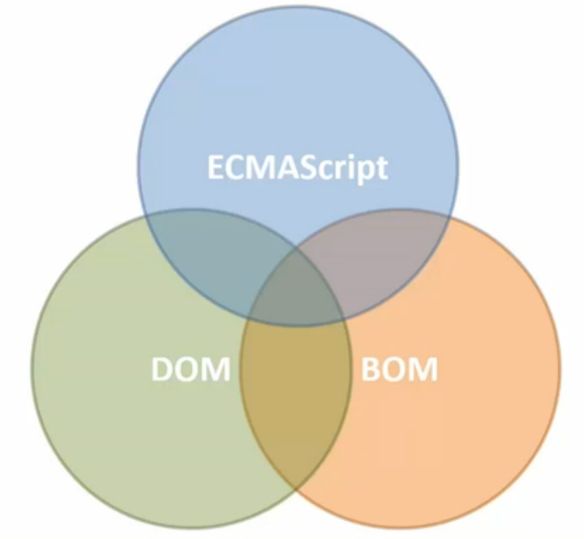
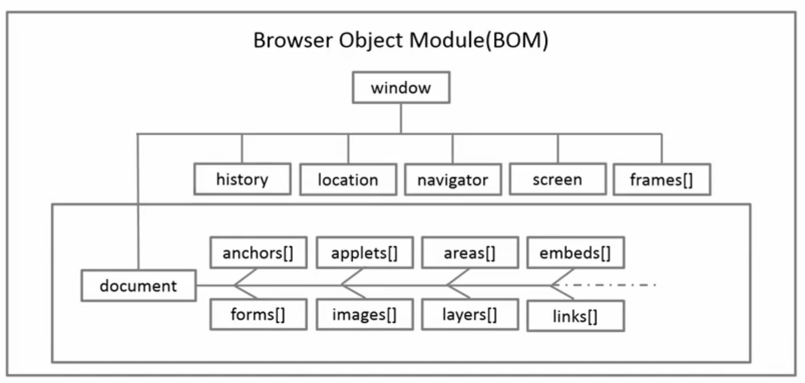

<!-- START doctoc generated TOC please keep comment here to allow auto update -->
<!-- DON'T EDIT THIS SECTION, INSTEAD RE-RUN doctoc TO UPDATE -->
**Table of Contents**  *generated with [DocToc](https://github.com/thlorenz/doctoc)*

- [BOM](#bom)
  - [属性](#%E5%B1%9E%E6%80%A7)
    - [navigator](#navigator)
    - [location](#location)
      - [方法](#%E6%96%B9%E6%B3%95)
    - [history](#history)
      - [方法](#%E6%96%B9%E6%B3%95-1)
    - [screen](#screen)
  - [Window 方法](#window-%E6%96%B9%E6%B3%95)
  - [Window 事件](#window-%E4%BA%8B%E4%BB%B6)

<!-- END doctoc generated TOC please keep comment here to allow auto update -->

## BOM



BOM 为浏览器窗口对象的一组 API。

**BOM 结构图**



### 属性

|属性名|描述|
|------|----|
|navigator|浏览器信息|
|location|浏览器定位和导航|
|history|窗口浏览器历史|
|screen|屏幕信息|

#### navigator

`navigator.userAgent`

- Chrome, Mozilla/5.0(Windows NT 6.1; WOW64) Apple WebKit/37.36 (KHTML, like Gecko) Chrome/40.0.2214.115 Safari/537.36
- Firefox, Mozilla/5.0(Windows NT 6.1; WOW64; rv:36.0) Gecko/20100101 Firefox/36.0
- IE, Mozilla/5.0 (Windows NT 6.1; WOW64; Trident/7.0; SLCC2; .NET CLR 2.0.50727; .NET CLR 3.5.30729; .NET CLR 3.0.30729; Media Center PC 6.0; .NET4.0C; .NET4.0E; InfoPath.3; rv:11.0) like Gecko

```html
appCodeName: "Mozilla"appName: "Netscape"appVersion: "5.0 (Macintosh; Intel Mac OS X 10_10_3) AppleWebKit/537.36 (KHTML, like Gecko) Chrome/43.0.2357.124 Safari/537.36"cookieEnabled: truedoNotTrack: "1"geolocation: GeolocationhardwareConcurrency: 8language: "en-US"languages: Array[4]maxTouchPoints: 0mimeTypes: MimeTypeArrayonLine: truepermissions: Permissionsplatform: "MacIntel"plugins: PluginArrayproduct: "Gecko"productSub: "20030107"serviceWorker: ServiceWorkerContaineruserAgent: "Mozilla/5.0 (Macintosh; Intel Mac OS X 10_10_3) AppleWebKit/537.36 (KHTML, like Gecko) Chrome/43.0.2357.124 Safari/537.36"vendor: "Google Inc."vendorSub: ""webkitPersistentStorage: DeprecatedStorageQuotawebkitTemporaryStorage: DeprecatedStorageQuota__proto__: Navigator
```

NOTE：可以通过 `userAgent` 判断浏览器。

#### location

代表浏览器的定位和导航。可以使用 `location` 来操作 URL 中的各个部分。最常用的有 `href` 属性，当前访问资源的完整路径。

```html
http://www.github.com:8080/index.html?user=li-xinyang&lang=zh-CN#home
  |          |          |       |                  |              |
protocol     |          |       |                  |              |
          hostname     port     |                  |              |
              \        /    pathname             search          hash
                 host
```

##### 方法

- `assign(url)` 载入新的 url，记录浏览记录
- `replace(url)` 载入新的 url 不记录浏览记录
- `reload()` 重新载入当前页

#### history

浏览器当前窗口的浏览历史。

```html
length: 9state: null __proto__: History
```

##### 方法

- `back(int)` 后退
- `forward(int)` 前进
- `go(int)` 正数向前，附属向后

#### screen

其中包含屏幕信息。其中 `avil-` 开头的属性为可用属性，其余则为显示器设备属性。

### Window 方法

|方法|描述|
|----|----|
|`alert()`, `confirm()` 返回真假, `prompt()` 返回用户输入值| 三种对话框|
|`setTimeout()`, `setInterval()`| 计时器|
|`open()`, `close()`| 开启窗口，关闭窗口|

NOTE：对话框会阻塞线程。

**打开或关闭窗口**

```javascript
var w = window.open('subwindow.html', 'subwin', 'width=300, height=300, status=yes, resizable=yes');

// 既可关闭窗口
w.close();
```

NOTE：无需记忆，更多属性在使用时查询文档。

### Window 事件

|事件名|描述|
|------|----|
|load|文档和所有图片完成加载时|
|unload|离开当前文档时|
|beforeunload|和 unload 类似，但是它提供询问用户是否确认离开的机会|
|resize|拖动改变浏览器窗口大小时|
|scroll|拖动浏览器时|
