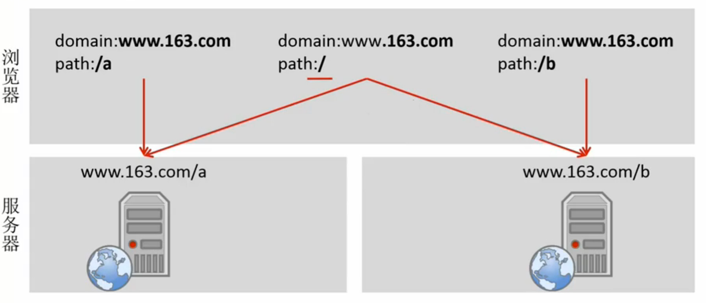
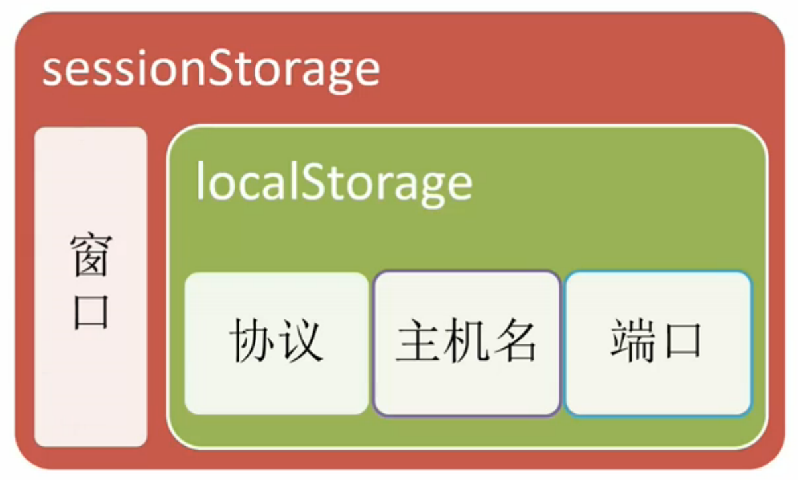

<!-- START doctoc generated TOC please keep comment here to allow auto update -->
<!-- DON'T EDIT THIS SECTION, INSTEAD RE-RUN doctoc TO UPDATE -->
**Table of Contents**  *generated with [DocToc](https://github.com/thlorenz/doctoc)*

- [数据存储](#%E6%95%B0%E6%8D%AE%E5%AD%98%E5%82%A8)
  - [Cookie](#cookie)
    - [属性](#%E5%B1%9E%E6%80%A7)
    - [作用域](#%E4%BD%9C%E7%94%A8%E5%9F%9F)
    - [读取](#%E8%AF%BB%E5%8F%96)
    - [设置与修改](#%E8%AE%BE%E7%BD%AE%E4%B8%8E%E4%BF%AE%E6%94%B9)
    - [Cookie 缺陷](#cookie-%E7%BC%BA%E9%99%B7)
  - [Storage](#storage)
    - [对象](#%E5%AF%B9%E8%B1%A1)
    - [API](#api)

<!-- END doctoc generated TOC please keep comment here to allow auto update -->

## 数据存储

### Cookie

浏览器中的 Cookie 是指小型文本文件，通常在 4KB 大小左右。（由键值对构成用 `;` 隔开）大部分时候是在服务器端对 Cookie 进行设置，在头文件中 `Set-Cookie` 来对 Cookie 进行设置。

页面可以访问当前页的 Cookie 也可以访问父域的 Cookie。

#### 属性

|属性|默认值|作用|
|----|------|----|
|Name（必填）||名|
|Value（必填）||值|
|Domain|当前文档域|作用域|
|Path|当前文档路径|作用路径|
|Expires（时间戳）/Max-Age（毫秒数值）|浏览器会话时间|失效事件|
|Secure|false|https 协议时生效|

#### 作用域

**设置作用域**


**设置作用路径**



#### 读取

下面转换 Cookie 至 JavaScript 对象的函数。

```javascript
function getcookie() {
  var cookie = {};
  var all = document.cookie;
  if (all === '') return cookie;
  var list = all.split('; ');
  for (var i = 0, len = list.length; i < len; i++) {
    var item = list[i];
    var p = item.indexOf('=');
    var name = item.substring(0, p);
    name = decodeURIComponent(name);
    var value = item.substring(p + 1);
    value = decodeURIComponent(value);
    cookie[name] = value;
  }
  return cookie;
}
```

#### 设置与修改

```javascript
document.cookie = 'name=value';
```

下面为**设置** Cookie 值的封装函数。

```javascript
function setCookie(name, value, expires, path, domain, secure) {
  var cookie = encodeURIComponent(name) + '=' + encodeURIComponent(value);
  if (expires)
    cookie += '; expires=' + expires.toGMTString();
  if (path)
    cookie += '; path=' + path;
  if (domain)
    cookie += '; domain=' + domain;
  if (secure)
    cookie += '; secure=' + secure;
  document.cookie = cookie;
}
```

**下面为**删除** Cookie 值的函数

```javascript
function removeCookie(name, path, domain) {
  document.cookie = 'name=' + name + '; path=' + path + '; domain=' + domain + '; max-age=0';
}
```

#### Cookie 缺陷

- 流量代价
- 安全性（明文传递）
- 大小限制

### Storage

因为 Cookie 弊端的存在，所以在 HTML5 中提供了 Storage 的替代方案。

作用域的不同 Storage 分为 Local Storage 和 Session Storage，前者在用户不清理的情况下默认时间为永久，后者默认事件则为浏览器的会话时间（浏览器不同窗口直接不共享 Session Storage）。



不同浏览器对其实现的不同导致支持大小也不太，通常在 5MB 作用。

#### 对象

**读取**

`localStorage.name`

**添加或修改**

`localStorage.name = 'Value';`

浏览器只支持字符串在 Storage 中的存储。

**删除**

`delete localStorage.name`

#### API

使用 API 操作 Storage 可以进行向下兼容的功能，在不支持的情况下可以用 Cookie 来代替。

- `localStorage.length` 获取键值对数量
- `localStorage.getItem('name')` 获取对应值
- `localStorage.key(i)` 对应值的索引获取
- `localStorage.setItem('name', 'value')` 设置键值对
- `localStorage.removeItem('name')` 删除一个值
- `localStorage.clear()` 删除所有数据
