## 列表操作

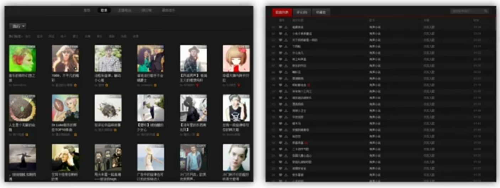

列表的常用形式有图片形式与信息形式的，常见的有如下的操作：

- 显示列表
- 选择列表项
- 新增列表项
- 删除列表项
- 更新列表项

### 范例代码

**数据结构**

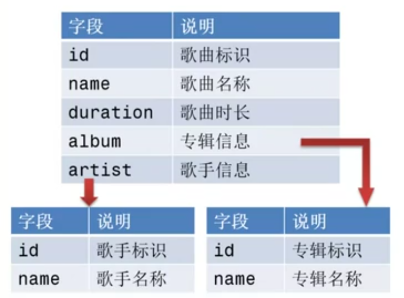

```javascript
[
  {
    "id": 22341234,
    "name": "Good Song",
    "album": {
      "id": 213512,
      "name": "Good Album"
    },
    "artist":{
      "id": 1234512,
      "name": "Evil Artist"
    }
  }
]
```

**显示列表**

*列表容器*

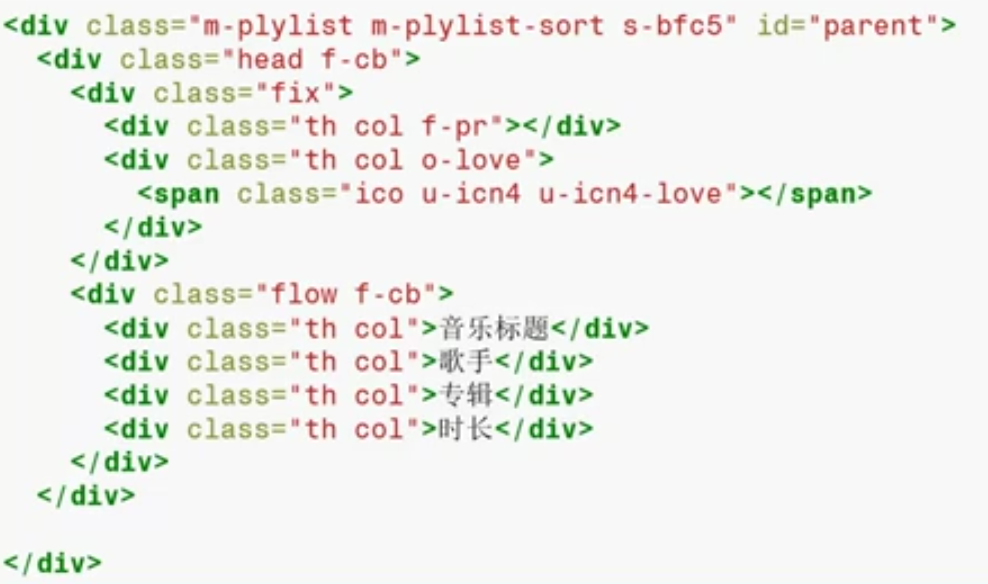

*列表模板* 分离数据和视图

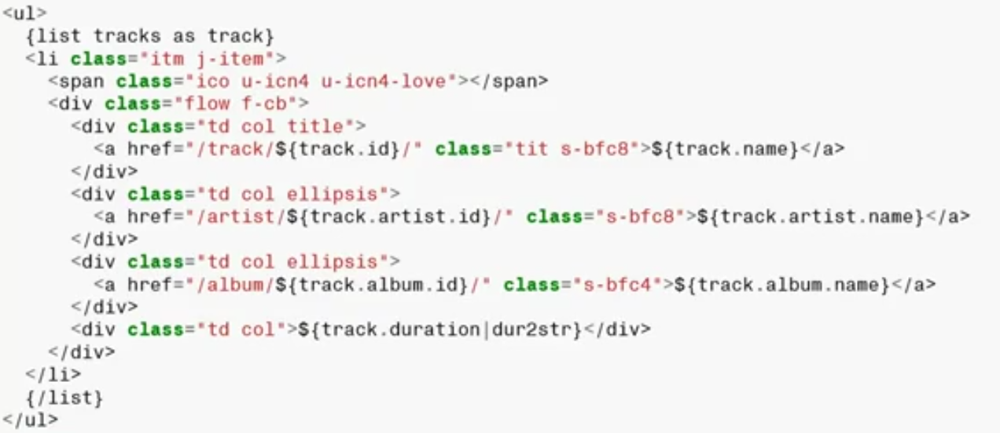

**绘制列表**

*准备数据并整合模板与数据*

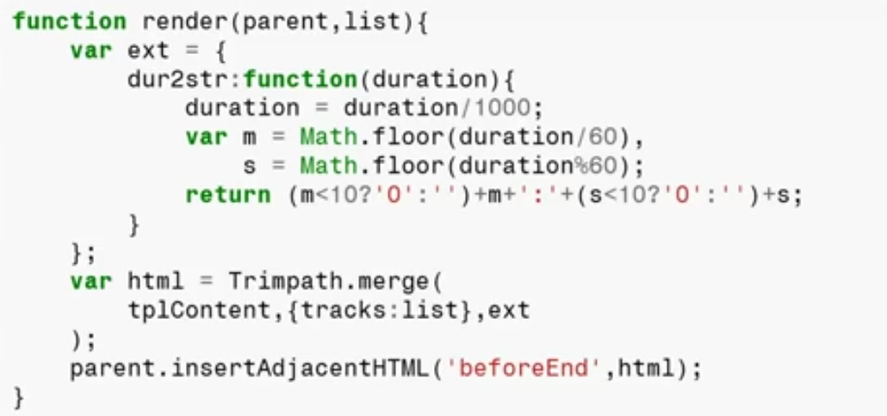

*通过 AJAX 获取数据*

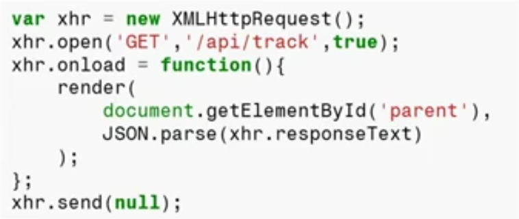

*列表单选操作*

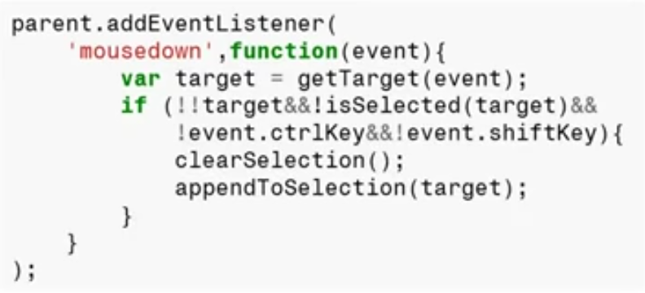

*列表多选操作（Control 与 Shift 操作）*

```javascript
parent.addEventListener(
  'mouseup', function(event) {
    var target = getTarget(event),
        selected = isSelected(target);
    // right click
    if (event.button == 2&&selected) {
      return;
    }
    // with control click
    if (event.ctrlKey) {
      !selected?appendToSelection(target):removeFromSelection(target);
    }
    // with shift key
    if (event.shiftKey) {
      var list = Array.prototype.slice.call(
        parent.getElementsByTagName('li'), 0
      );
      if (!last) {
        last = getLastElection() || target;
      }
      selectWithRangeFromTo(list, last, target);
    } else {
      last = null;
    }
  }
);
```

*右键菜单*

`contextmenu` 事件为右键菜单弹出事件。

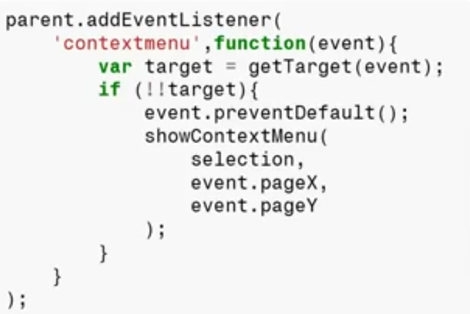

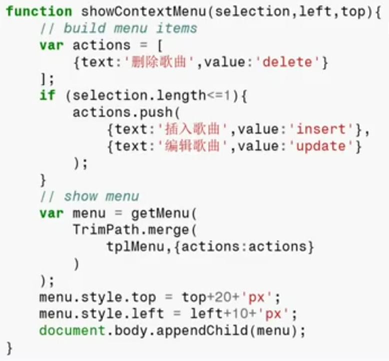

*增加列表*

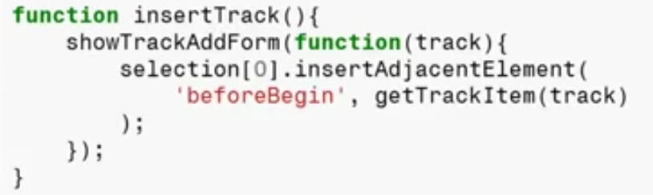

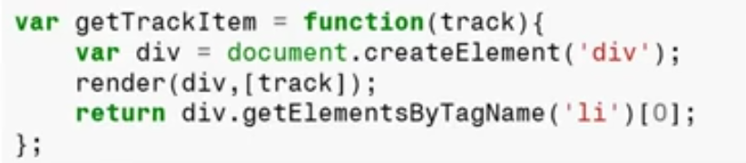

*删除列表*

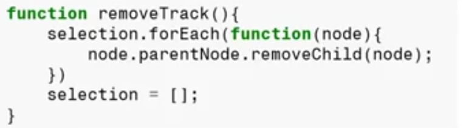

*更新列表*


*更新状态*

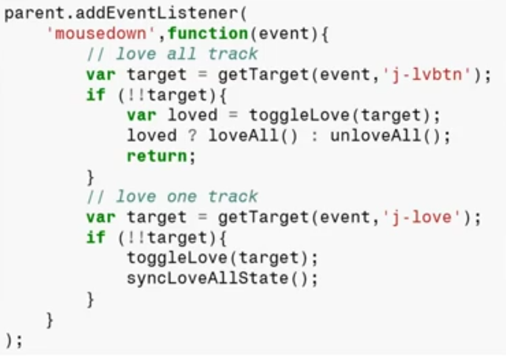

### 编程方式

**面向视图** 的操作方式，即为针对视图的直接编程（对 DOM 树进行直接的操作）。

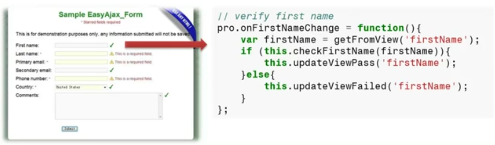

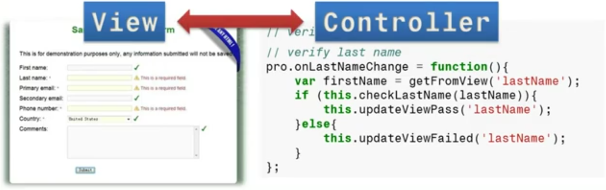

这样的方式代理了许多的弊端，例如无法进行完全的自动化测试以及极高的视图层和控制层耦合的紧密性。

**面向数据** 的操作方式，视图则被抽象为若干的数据以及状态（后续所有的操作都会更加数据模型而操作），从而做到视图模型层完全自动化的测试。


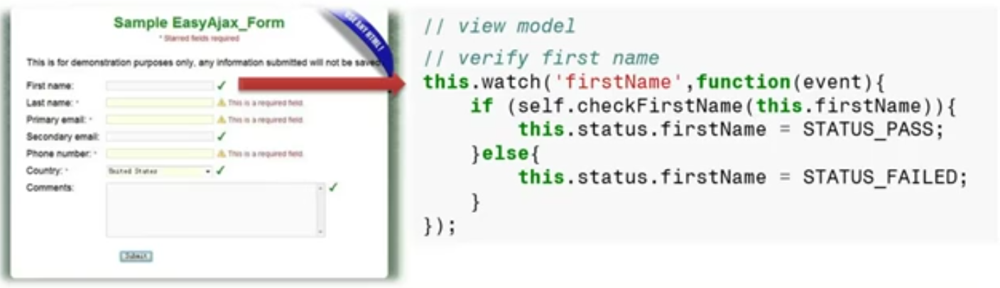

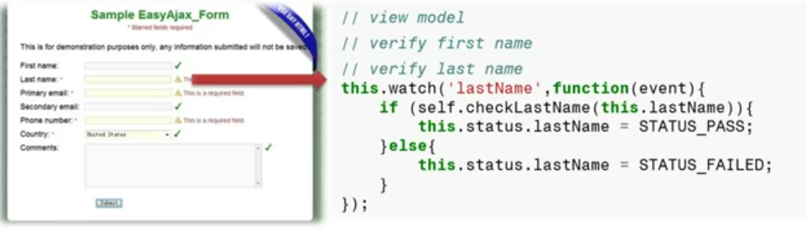

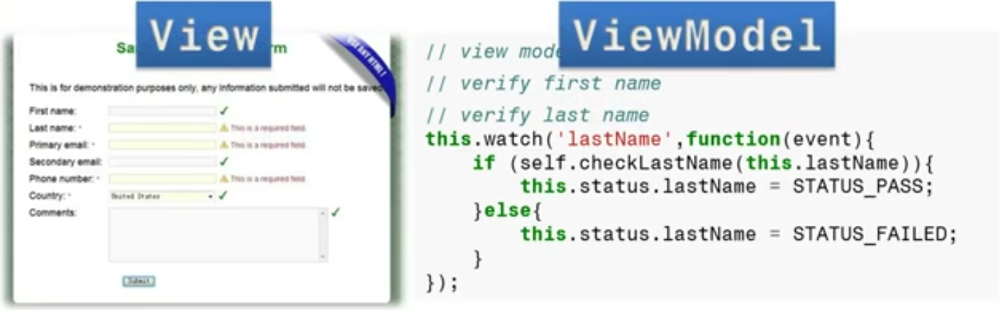

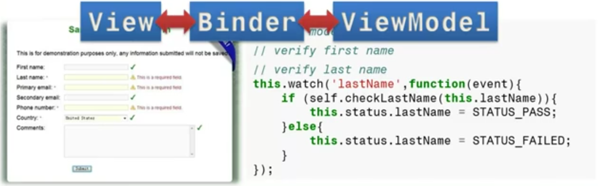
