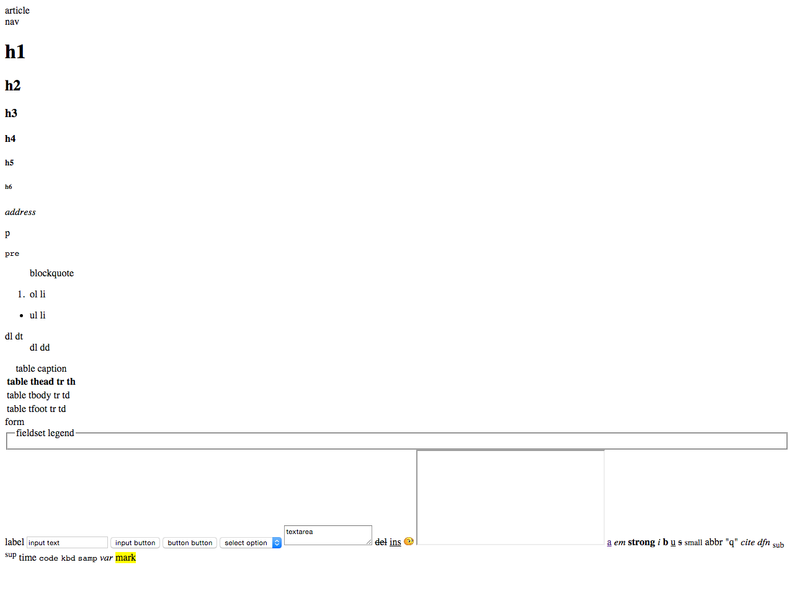
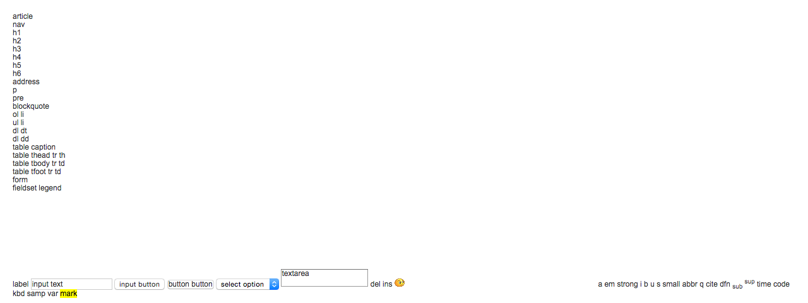

## CSS Reset

所有的 HTML 标签在**没有设置**样式时均被浏览器默认的样式列表所装饰
（不同浏览器默认样式有所**不同**）。**CSS** 的样式重置就是清楚浏览器的默认样式
，可以理解为**对于全局的样式定义**。
对于开发者来言，如不重置每一个浏览器特定的默认样式，则会在开发造成诸多的不便。

> 在前端开发过程中做加法，远远比做减法简单。将所有浏览器的默认样式统一，
> 可以使它们有一个相同起点。
>
> — Li Xinyang 资深前端工程师

NOTE：一份 CSS Reset 文件并不一定适用于所有场景，需要更具需求做出变通
（需符合产品需求为主）。

NOTE+：浏览器对于控件的样式和功能的特性支持也可以重置
（例如日历，清楚输入框内容按键等）。

NOTE++：Reset 文件需比页面其他样式文件的引入顺序优先（优先级需最高）。

#### 样式重置前后对比

**样式重置前**

**样式重置后**

