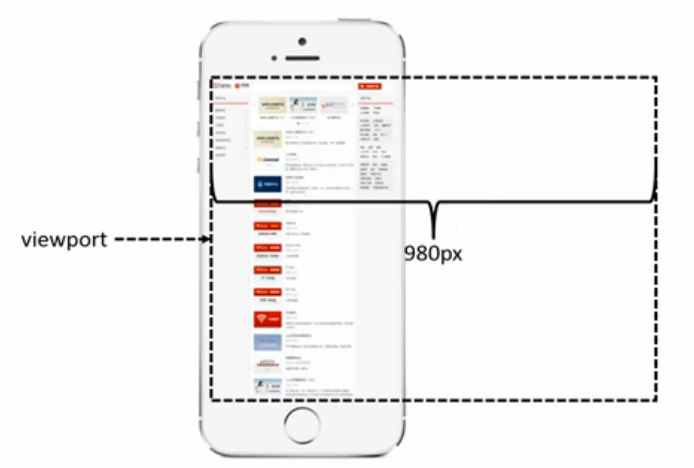
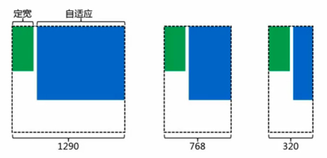

## 响应式布局

多屏的环境让我们不得不考虑网络内容在各个尺寸中的表现，
均可正常访问和极佳的用户体验。

响应式布局可以更具屏幕尺子的大小对内容和布局做出适当的调成，
从而提供更好的用户感受。也是因为响应式布局的出现，
开发者也无需对不同尺寸设备而特殊定制不同的页面，
这大大降低了开发成本和缩短了开发时间。


这样的方法也同样存在着缺点。
缺点是同样的资源被加载，但因为展示平台所限并不能全部显示。

**View Port**



```html
<meta name="viewport" content="width=device-width, initial-scale=1.0, user-scalable=no">
```

**针对不同尺寸的屏幕进行开发，因少使用定宽而使用自适应单位。**



**需求会更具具体设备而产生变化。**（例如布局方式发生了变化）

```html
@media screen and (max-width: 320px) {
  /* 视窗宽度小于等于 320px */
}
@media screen and (min-width: 320px) {
  /* 视窗宽度大于等于 320px */
}
@media screen and (min-width: 320px) and (max-width: 1000px){
  /* 视窗宽度大于等于 320px 且小于等于 1000px */
}
```
