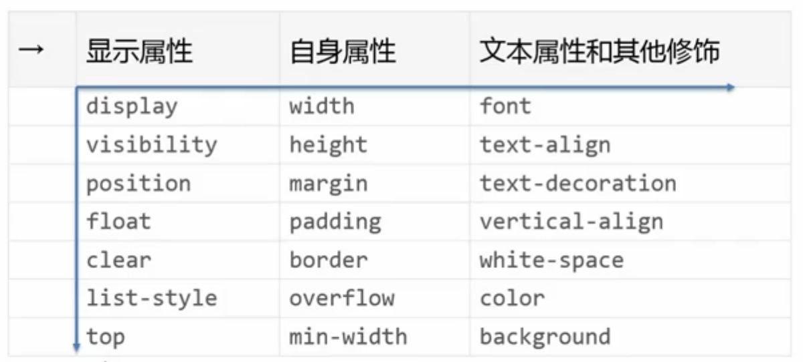
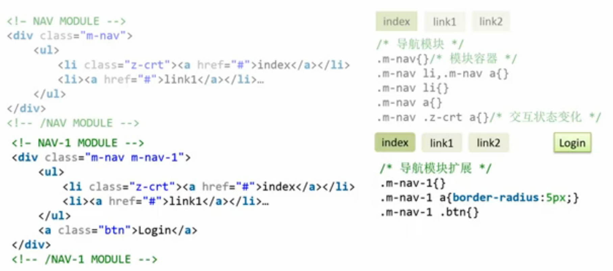
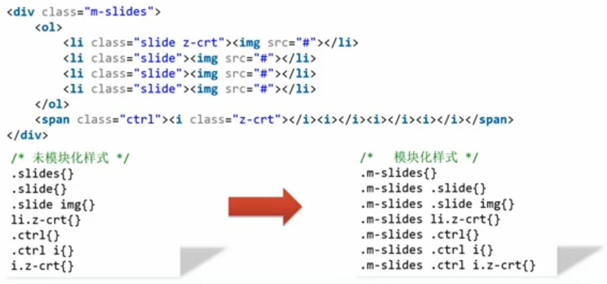

## 页面模块化

### 规范

在具体谈论规范的之前，可以下去查看下各大网络公司的前端开发规范（Developemnt Style Guide）例如谷歌，Facebook 或者 Dropbox。从而更好的理解开发规范在实际应用中和多人协作中的重要性。

不同开发者在开发过程中使用不同的代码风格会直接的提升在之后的开发和维护的成本和难度，对前端开发来说更是尤为突出。这时使用代码规范来约束开发者的编码风格就可以大体解决这些问题。规范的制订应从下面的几个方面来开始考虑：

- 文件规范
- 注释规范
- 命名规范
- 书写规范
- 其他规范

**文件规范**

文件规范又可以从三个方面入手，分类，引入，以及文本本身的内容。

- 分类（分类可分为*通用类*和*业务类*。通用类有第三方的库，团队开发的通用模块或者通用样式。业务类则有不同业务所对应的特定模块。）

- 引入
  - CSS （引入文件则需尽少的使用行内样式）
  - JavaScript （文件名的约束，以及编码设置通常使用 `utf-9`）

**注释规范**

注释可使用块状，单行注释和行内注释，需要统一缩进等细节要求。

**命名规范**

例如 CSS 选择器的命名规范

- 分类命名 （例如 `g-header` 来给布局类的样式设置命名空间来防止*样式污染*，`m-header` 来制定模块类的样式）
- 命名格式 （大小写的规定，建议使用小写并使用 `-` 分隔，也许控制选择器的长度避免过长的样式选择器名称但不可失去选择器语义）
- 语义化命名 （以内容的语义来给选择器命名）

**书写规范**

这里使用 CSS 的书写规范来做示例，可以参考下面的约束：

- 单行与多行（单行与多行的 CSS 书写格式，使用多行！）
- 空格与分号（使用空格进行缩进并保留最后一个属性的分号）
- 书写顺序（更具显示的重要性来安排可参照下表）
- Hack 方式（三思而后行）
- 值格式（例如颜色值的格式以及引用中是否使用引号）

**其他规范**

这里包括有 HTML 以及图片的规范：

- HTML
  - 文档声明
  - 闭合
  - 属性
  - 层级
  - 注释
  - 大小写
- 图片
  - 文件名称（语言以及长度的规范）
  - 保留源文件
  - 图片合并

### 模块化

模块化是一系列相关的结果组成的整体，这部分具备独立存在的意义不单纯只是表现。

在开发模块化是需要注意的一些步骤（以 CSS 模块化为例）：

- 为模块分类命名（`m-module-name`）
- 以一个主选择器作为开头（模块跟节点）
- 使用以主选择器开头的后代选择器（模块子节点）

模块化可以利于多人开发，便于扩展，当然也可以提高代码的可读性与可维护性。
