## 接口设计

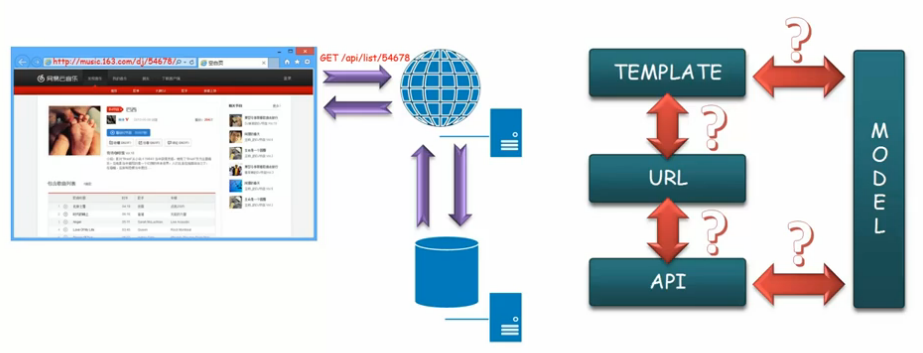

用户使用 Web 客户端访问 Web 系统，系统在收到请求后执行操作
（收集数据模型，选择数据经行组装），将结果返回给客户。

其中包括的元素和关系如下图所示：

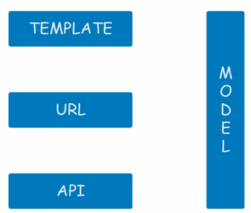

- Template，分离数据模型的页面结构，根据不同的数据模型展现不同的信息
- URL，页面访问地址、页面标示
- API，用于载入异步请求的接口
- Model，数据模型，页面模板组装模型和异步请求返回的数据模型

**约定**

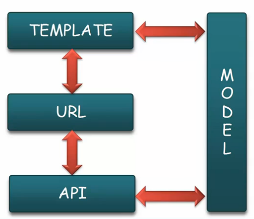

1. URL 与页面模板间的映射，和异步载入内容对应的接口
1. 视图模板和数据模型的对应（数据模型的格式和类型）
1. 异步接口输入输出信息的约定

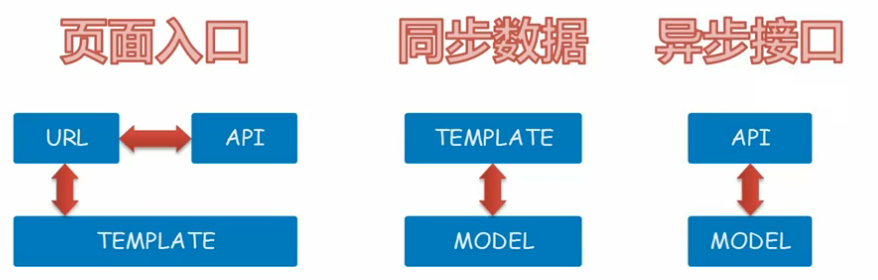

1. 页面入口规范，定义系统对外可访问入口和配置信息（URL、模板、接口）
1. 同步数据规范，定义系统对模板文件的预填信息（模板、数据模型）
1. 异步接口规范，定义前后端接口信息（接口、数据模型）

### 接口规范

每个规范也会对应若干规定若干规则约定来指导前后端工程师的具体实施。

#### 页面入口规范

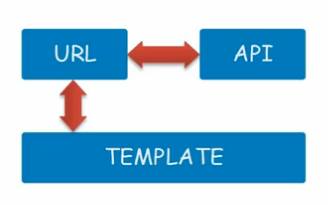

- 基本信息
- 输入参数
- 模板列表
- 接口列表（异步载入数据接口）

**页面入口规范（范例）**

|条目|详情|
|----|----|
|访问地址|`/dj/{id}`|
|页面描述|节目详情及推荐信息|
|输入参数|名称：ID；类型：Number；描述：节目标示|
|异常跳转|异常：500；跳转地址：`/500/`|
|模板列表|默认：`/template/dj/dj.ftl`|
||过期：`/template/dj/over.ftl`|
||未找到：`/template/dj/404.ftl`|
|接口列表|歌曲列表：`/api/dj/tracks/{id}/`|
||相关节目：`/api/dj/rec/{id}/`|
||收藏节目：`/api/dj/fav/{id}/`|
||评论节目：`/api/comments/{id}`|

- 页面基本信息，描述页面的主要功能
- 输入参数为访问地址时支持的参数说明
- 异常跳转，为系统全局异常处理
- 模板列表，列举当前页面的相关模板，包括异常（如下图）
- 页面需要的所有异步接口列表

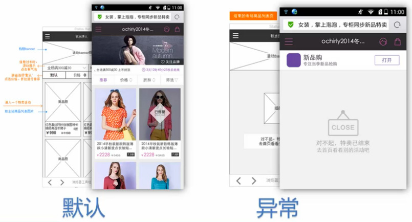

#### 同步数据规范

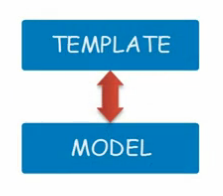

- 基本信息
- 预填数据
- 注入接口

**同步数据规范（范例）**

|条目|详情|
|----|----|
|模板文件|`/templates/dj/dj.ftl`|
|模板描述|节目详情及推荐信息模板文件|
|预填信息|`{"名称":"user", "类型":"User","描述":"登陆用户信息"}`|
||`{"名称":"dj", "类型":"Program","描述":"节目信息"}`|
||`{"名称":"other", "类型":"String","描述":"其他信息"}`|
|注入接口|jd.parser|
||`{"输入":[["String", "节目信息"], ["Boolean", "是否格式化"]]}`|
||`{"输出":["Program", "节目对象"]}`|
||dj.api|
||dj.api2|

- 模板的基本信息
- 预填数据包括全局和页面数据及其类型
- 注入的接口说明（输入输出信息），没有可以不填写

#### 异步接口数据规范

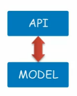

- 基本信息
- 输入信息
- 输出信息

**异步接口规范（范例）**

|条目|详情|
|----|----|
|请求方式|`GET` `POST`|
|接口地址|`api/dj/tracks/{id}/`|
|接口描述|获取指定节目的歌曲列表|
|输入数据|`{"名称":"id", "类型":"Number","描述":"节目标示"}`|
||`{"名称":"offset", "类型":"Number","描述":"节目起始位置"}`|
||`{"名称":"limit", "类型":"Number","描述":"列表数量"}`|
|输出结果|`{"名称":" code", "类型":"Number","描述":"请求结果标示"}`|
||`{"名称":"message", "类型":"String","描述":"请求异常信息"}`|
||`{"名称":"result", "类型":"Array","描述":"歌曲列表"}`|

- 接口基本信息，地址不带查询参数
- 输入数据，REST，查询数据（必须包含名称类型及描述）
- 输出结果，通用部分及结果集（复杂的信息需展开说明）

### 规范的应用

通过**模拟数据**的形成，将前端本地开发与后端独立出来，
这样前端工程师就可以独立的进行本地的开发工作。

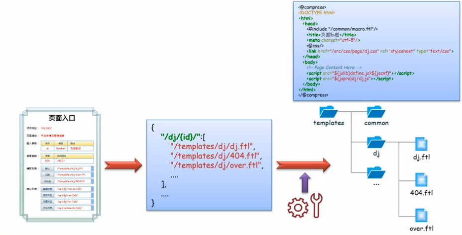

使用页面入口规范制定项目结构（配置信息，目录结构和模板结构），
此过程可以使用自动化工具自动完成。

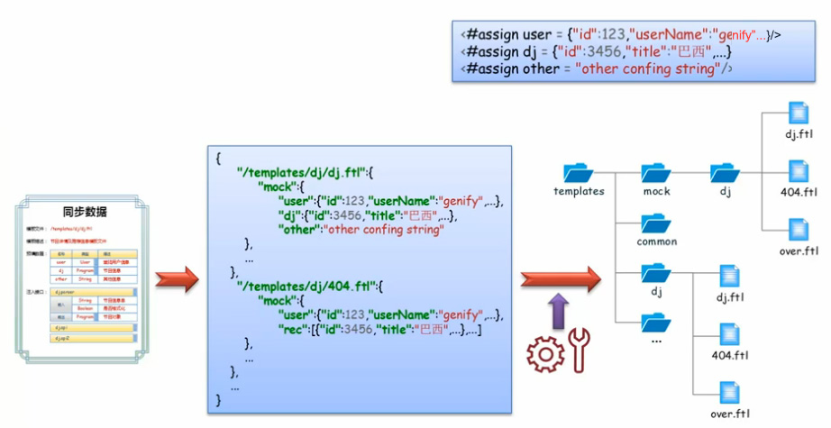

根据同步数据规范可生成模拟数据的配置文件。（此部分通用可以使用自动化工具来完成）

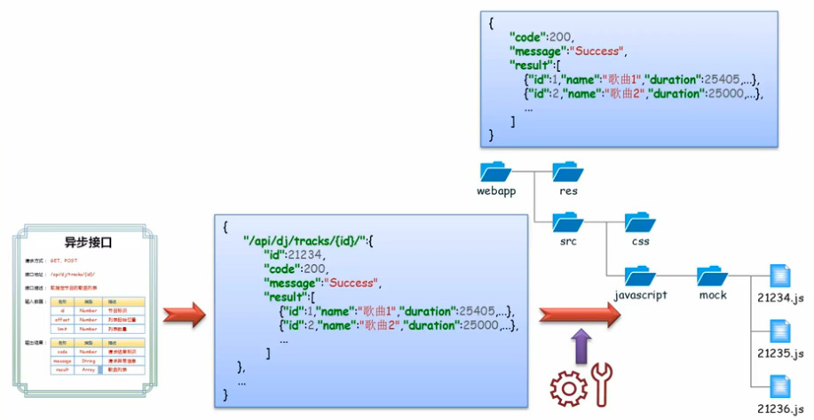

根据异步接口规范生成模拟异步数据。

### 本地开发

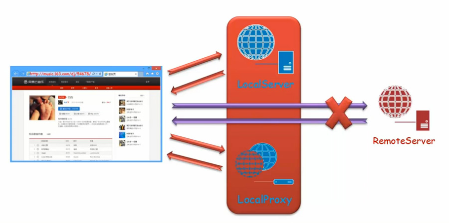

前端开发环境包含两个部分，**本地模拟服务器**和**本地代理**。

1. 客户端发送的请求，会被本地模拟服务器拦截并返回相应的模拟数据
1. 客户端发送的异步请求，会被本地代理拦截并返回对应的模拟数据

**Local Server**

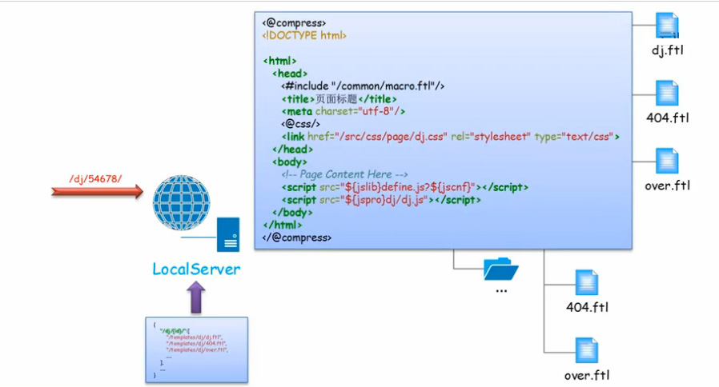

根据请求规则进行匹配，然后生成（整合模板和模拟数据）所请求的页面

**Local Proxy**

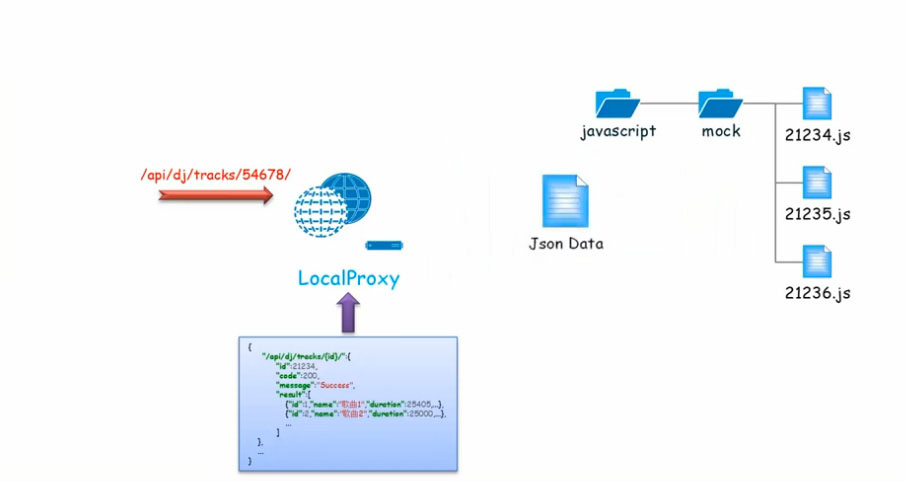

拦截异步请求后，根据请求的匹配规则返回所请求的数据（例如 JSON 或 XML）。

#### 联调

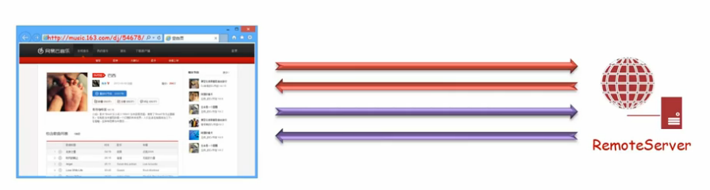

前后端联调需要去除本地环境，在实际开发中只需要对配置文件进行调整既可
（控制哪些请求需要被本地服务器或代理拦截，哪些需要使用远程服务器）。
