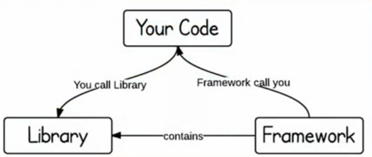
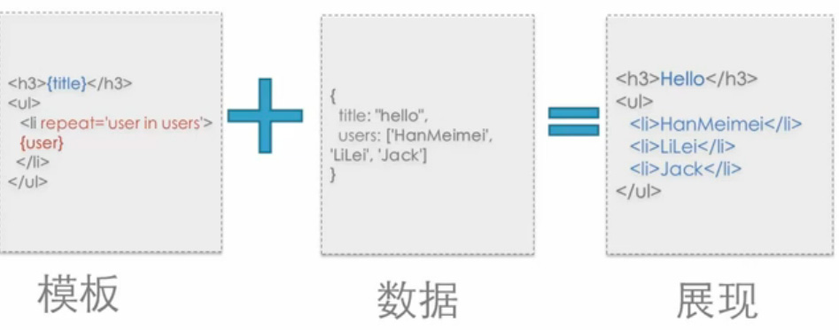
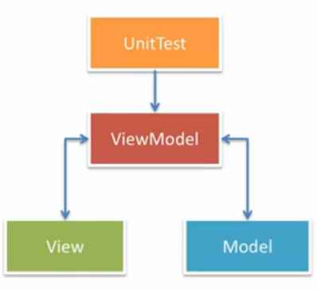

## 技术选择

### 模块化

NOTE：以下讨论都是基于 JavaScript 的模块组织（每个模块均以文件形式组织），而非工程的模块化。

> The secret to building large app is never build arge apps. Break your applications into small pieces. Then, assemble those testable, bite-sized pieces into your big application.
>
> Justin Meyer

**其他语言中的模块支持**

- Java - `import`
- C#   - `using`
- css  - `@import`

但在 JavaScript 中并不存在模块组织在并不支持，于是产生了很多，模块系统。

**模块的职责**

- 封装实现（将复杂的内容于外界个例）
- 暴露接口（外部可通过接口使用模块）
- 声明依赖（提供给模块系统使用）

#### 模块的使用

##### 反模式（Anti-Pattern）

反模式既没有使用任何设计模式。

math.js

```javascript
function add(a, b) {
  return a + b;
}
function sub(a, b) {
  return a - b;
}
```

上面的代码有下面的几个缺点：

- 无封装性
- 接口结构不明显

calculator.js

```javascript
var action = 'add';
function compute(a, b) {
  switch (action) {
    case 'add': return add(a, b);
    case 'sub': return sub(a, b);
  }
}
```

上面的代码也有几个缺点：

- 没有依赖声明
- 使用全局状态

##### 字面量（Object Literal）

math.js

```javascript
var math = {
  add: function(a, b) {
    return a + b;
  },
  sub: function(a, b) {
    return a - b;
  }
};
```

结构性好，但没有访问控制。

calculator.js

```javascript
var calculator = {
  action: 'add',
  compute: function(a, b) {
    switch (action) {
      case 'add': return add(a, b);
      case 'sub': return sub(a, b);
    }
  }
}
```

同样没有依赖声明

#####  IIFE（Immediately-invoked Function Expresion)

其为自执行函数。

**版本一**

calculator.js

```javascript
var calculator = (function(){
  var action = 'add';
  return {
    compute: function(a, b) {
      switch (action) {
        case 'add': return add(a, b);
        case 'sub': return sub(a, b);
      }
    }
  }
})();
```

上面的代码可以进行访问控制，但是不能进行依赖声明。

**版本二**

calculator.js

```javascript
var calculator = (function(m){
  var action = 'add';
  function compute(a, b) {
    switch (action) {
      case 'add': return m.add(a, b);
      case 'sub': return m.sub(a, b);
    }
  }
  return {
    compute: compute;
  }
})(math)
```

上面的代码虽然可以显示的声明依赖，但是仍然污染了全局变量，而且必须手动进行依赖管理。

#### 命名空间（Namespace）

命运空间可以解决全局变量的污染的问题。

math.js

```javascript
namespace('math', [], function(){
  function add(a, b) { return a + b; }
  function sub(a, b) { return a - b; }
  return {
    add: add,
    sub: sub
  }
})
```

calculator.js

```javascript
//                     依赖声明        依赖注入
//                         |               |
namespace('calculator', ['math'], function(m){
  var action = 'add';
  function compute(a,b) {
    return m[action](a, b);
  }
  return {
    compute: compute;
  }
})
```

#### 模块管理

复杂的模块管理，不能单纯的通过代码文件的排列顺序来进行管理。于是引入了模块系统，它有下面的职责：

- 依赖管理（加载、分析、注入、初始化—）
- 决定模块的写法

常用的模块系统有 `Common.JS`、`AMD`、语言基本的模块化。

##### CommonJS

CommonJS 是一个模块规范，通常适用于非浏览器环境（NodeJS）。

> A module spec for JavaScript outside the browser.

math.js

```javascript
function add(a, b) {
  return a + b;
}
function sub(a, b) {
  return a - b;
}
exports.add = add;
exports.sub = sub;
```

calculator.js

```javascript
// 依赖声明
var math = require('./math');

function Calculator(container) {
  // ...
}
Calculator.prototype.compute = function(){
  this.result.textContent = math.add(...);
}

// 接口暴露
exports.Calculator = Calculator;
```

**优点**

- 依赖管理成熟可靠
- 社区活跃且规范接受度高
- 运行时支持且模块化定义简单
- 文件级别的模块作用域隔离
- 可以处理循环依赖

**缺点**

- 不是标准组织规范
- 同步请求未考虑浏览器环境（可以使用 Browserify 来解决）

```bash
# browserify 为 npm 下命令行工具
# > 为 Linux/Unix 添加至命令
browserify file0.js > file1.js;
```

打包后的文件如下所示。

```javascript
(function e(t,n,r){function s(o,u){if(!n[o]){if(!t[o]){var a=typeof require=="function"&&require;if(!u&&a)return a(o,!0);if(i)return i(o,!0);var f=new Error("Cannot find module '"+o+"'");throw f.code="MODULE_NOT_FOUND",f}var l=n[o]={exports:{}};t[o][0].call(l.exports,function(e){var n=t[o][1][e];return s(n?n:e)},l,l.exports,e,t,n,r)}return n[o].exports}var i=typeof require=="function"&&require;for(var o=0;o<r.length;o++)s(r[o]);return s})({1:[function(require,module,exports){

},{}]},{},[1]);
```

##### AMD（Asynchronous Module Definition）

适合异步环境的依赖管理方案。

math.js

```javascript
//   依赖列表
//      |
define([], function(){
  function add(a, b) { return a + b; }
  function sub(a, b) { return a - b; }
// 接口暴露
  return {
    add: add,
    sub: sub
  }
})
```

calculator.js

```javascript
define(['./math'], function(math){
  function Calculator(container) {
    // ...
  }
  Calculator.prototype.compute = function(){
    this.result.textContent = math.add(...);
  };

  // 暴露接口
  return {
    Calculator: Calculator;
  }
})
```

**优点**

- 依赖管理成熟可靠
- 社区活跃且规范接受度高
- 转为异步环境制作，适合浏览器
- 支持 CommonJS 的书写方式
- 通过插件 API 可以加载非 JavaScript 资源
- 成熟的打包构建工具，并可结合插件一同使用

**缺点**

- 模块定义繁琐，需要额外嵌套
- 酷基本的支持，需要引入额外的库
- 无法处理循环依赖
- 无法实现条件加载

###### Simplified CommonJS Wrapping

使用同样的 CommonJS 的依赖管理书写方法，之后在使用正则表达式来提取依赖列表。

```javascript
define(function(require, exports){
  // 依赖声明
  var math = require('./math');

  function Calculator(container) {
    // ...
  }
  Calculator.prototype.compute = function(){
    this.result.textContent = math.add(...);
  }

  // 接口暴露
  exports.Calculator = Calculator;
})
```

##### Loader Plugins

允许调用处理脚本外的其他资源（例如 HTML 与 CSS 文件），这样就可以形成一个完整的组件。

```
完整组件 = 结构 + 逻辑 + 样式
```

##### ECMAScript 6 Module

ECMAScript 6 中的模块化管理。

math.js

```javascript
function add(a, b) {
  return a + b;
}
function sub(a, b) {
  return a- b;
}
// export 关键字暴漏接口
export {add, sub}
```

calculator.js

```javascript
import {add} from './math';


class Calculator {
  constructor(container) {}
  compute(){
    this.result.textContent = add(+this.left.value, +this.right.value);
  }
}
export{Calculator}
```

**优点**

- 真正的规范未来标准
- 语言基本支持
- 适用于所有的 JavaScript 允许环境
- 可用于处理循环依赖

**缺点**

- 规范未达到稳定级别
- 暂无浏览器支持

#### SystemJS

SystemJS 是一个动态模块加载器，下面是它的一下特性：

- 支持加载 AMD
- 支持加载 CommonJS
- 支持加载 ES6
- 支持加载 Transpiler 也可支持任意类型资源

#### 模块管理的对比

- IIFE，没有解决核心的依赖分析和注入的问题。
- AMD，可以直接使用，库基本的支持。
- CommonJS，可以直接使用，在运行时的支持。
- ES6，语言本身的支持。

使用插件工具，可以将后三种模块管理系统进行相互转换。

### 框架

NOTE：以下讨论都是基于 JavaScript 的框架。


#### 库（Library）与框架（Framework）的区别



**库** 为针对特定问题的解答具有专业性，不控制应用的流程且被动调用。**框架** 具有*控制翻转*，决定应用的生命周期，于是便集成了大量的库。

#### 解决方案

常见的解决方案针对的方面：

- DOM
- Communication
- Utility
- Templating
- Component
- Routing（单页系统中尤其重要）
- Architecture

**使用外部专业解决方案的原因** 可以提高开发效率，可靠性高（浏览器兼容，测试覆盖），也配备优良的配套（文档及工具）。如果外部框架的质量可可靠性无法保证或无法满足业务学期时则不应该选择外部的框架。

**实际项目中的使用**

- 开发式：基于外部模块系统自由组合
- 半开放：基于一个定制的模块系统，内部外部解决方案共存
- 封闭式：深度定制的模块系统不引入外部模块

##### DOM

与其相关的有 *Selector*、*Manipulation*、*Event（DOM）*、*Animation*。
它的主要职责则为为下面的这些：

- 提供便利的 DOM 查询、操作、移动等操作
- 提供事件绑定及事件代理支持
- 提供浏览器特性检测及 UserAgent 侦测
- 提供节点属性、样式、类名的操作
- 保证目标平台的跨浏览器支持

常用的 DOM 库有 **jQuery**（使用链式接口），**zepto.JS**，**MOOTOO.JS**（使用原生 DOM 对象，通过直接跨站了 DOM 原生对象）。

**基础领域**

|库名|大小|兼容性|优点|缺点|
|----|----|------|----|----|
|MOOTOO.JS|96KB|IE6+|概念清晰、无包装对象、接口设计优秀、源码清晰易懂、不局限于 DOM 与 AJAX|扩展原生对象（致命）、社区衰弱|
|jQuery|94KB|IE6+|社区强大普及率高、包装对象、专注于 DOM|包装对象（容易混淆）|
|zepto.JS|25KB|IE10+|小且启动快、接口与 jQuery 兼容、提供简单手势操作|无法与 jQuery 100% 对于、支持浏览器少、功能弱|

**专业领域**

|领域|库名|大小|描述|
|----|----|----|----|
|手势|Hammer.JS|12KB|常见手势封装（Tab、Hold、Transform、Swifp）并支持自定义|
|高级动画|Velocity.JS|12KB|复杂动画序列实现，不仅局限于 DOM|
|视频播放|Video.JS|101KB|类似原生 video 标签的使用方式，对低级浏览器使用 flash 播放器|
|局部滚动|isscroll.JS|13KB|移动端`position:fix` + `overflow:scroll`的救星|

##### Communication

与其相关的有 *XMLHttpRequest*、*Form*、*JSONP*、*Socket*。
它的主要职责则为为下面的这些：

- 处理与服务器的请求与相应
- 预处理请求数据与响应数据 Error/Success 的判断封装
- 多类型请求，统一接口（XMLHttpRequest1/2、JSONP、iFrame）
- 处理浏览器兼容性

|库名|大小|支持|
|----|----|----|
|Reqwest|3.4KB|JSONP支持、稳定 IE6+支持、CORS 跨域、Promise/A 支持|
|qwest|2.5KB|代码少、支持XMLHttpRequest2、CORS 跨域、支持高级数据类型（ArrayBuffer、Blob、FormData）|

**实时性要求高的需求**

|库名|支持|
|----|----|
|socket.io|实时性、支持二进制数据流、智能自动回退支持、支持多种后端语言（NodeJS 最为稳妥）|

##### Utility（Lang）

与其相关的有 *函数增强 & Shim（保证实现与规范一致）*、*Flow Control*。
它的主要职责则为为下面的这些：

- 提供 JavaScript 原生不提供的功能
- 方法门面包装使其便于使用
- 异步列队及流程控制

|库名|大小|描述|
|----|----|----|
|es5-shim|53KB|提供 ES3 环境下的 ES5 支持|
|es6-shim|38KB|
|underscore|16.5KB|兼容 IE6+ 的扩展功能函数|
|Lodash|50KB|其为 underscore 的高性能版本，方法多为 runtime 编译出来的|

##### Templating

与其相关的有 *String-based*、*DOM-based*、*Living Template*。

**基于字符串**的模板


之后的数据修改展现不会进行变化，如果重新绘制（性能低）页面则会去除已有的 DOM 事件。

**基于 DOM** 的模板



修改数据可以改变显示（性能更好）也会保留 DOM 中的已有事件，最终导致 DOM 树与数据模型相联系。

**Living-Template**


其拼接了字符串模板和 DOM 模板的技术（类似 Knockout.JS 注释的实现），最终导致 DOM 树与数据模型相联系。

| |String-based|DOM-based|Living-Template|
|-|------------|---------|---------------|
|好处|可以服务器端运行|||
|解决方案|dust.JS、hogan、dot.JS|Angular.JS、Vue.JS、Knockout|Regular.JS、Ractive.JS、htmlbar|
|初始化时间|☆☆☆|☆|☆☆|
|动态更新|无|☆☆☆|☆☆☆|
|DOM 无关|☆☆☆|无|☆☆|
|语法|☆☆☆|☆|☆☆|
|学习成本|☆|☆☆☆|☆☆|
|SVG 支持|无|☆☆|☆☆|
|安全性|☆|☆|☆☆☆|

##### Component

与其相关的有 *Modal*、*Slider*、*DatePicker*、*Tabs*、*Editor*（其为产品开发中最耗时也是最必要的一部分）。它的主要职责则为为下面的这些：

- 提供基础的 CSS 支持
- 提供常见的组件
- 提供声明式的调用方式（类似 Bootstrap）

|组件库名|版本|特定|支持|
|--------|----|----|----|
|Bootstrap|3.x|Mobile First 流式栅格，基于 LESS与 SASS 组织可定制 UI，提供大量组件|IE8+|
|Foundation|5.x|Mobile First 流式栅格，基于 SASS 组织，可定制 UI，提供大量组件|IE9+|

NOTE：有存在不使用 jQuery 版本的 Bootstrap 可供使用。

##### Router

与其相关的有 *Client Side*、*Server Side*。它的主要职责则为为下面的这些：

- 监听 URL 变化，并通知注册的模块
- 通过 JavaScript 进行主动跳转
- 历史管理
- 对目标浏览器的兼容性支持

|路由库名|大小|特定|支持|
|--------|----|----|----|
|page.JS|6.2KB|类似 Express.Router 的路由规则的前端路由库|IE8+|
|Director.JS|10KB|可以前后端使用同一套规则定义路由|IE6+|
|Stateman|10KB|处理深层复杂路由的独立路优库|IE6+|
|crossroad.JS|7.5KB|老牌路由库，API 功能较为繁琐|

##### Architecture（解耦）

与其相关的有 *MVC*、*MVVC*、*MV\**，解耦又可以通过很多方式来实现（例如事件、分层）。它的主要职责则为为下面的这些：

- 提供一种凡是帮助（强制）开发者进行模块解耦
- 视图与模型分离
- 容易进行单元测试
- 容易实现应用扩展

**下面以 MVVM**为例：



- Model 数据实体用于记录应用程序的数据
- View 友好的界面其为数据定制的反映，它包含样式结构定义以及 VM 享有的声明式数据以及数据绑定
- ViewModel 其为 View 与 Model 的粘合，它通过绑定事件与 View 交互并可以调用 Service 处理数据持久化，也可以通过数据绑定将 Model 的变动反映到 View 中

NOTE：MV* 不等同于 SPA，路由是 MV* 系统的课定位状态信息来源。
NOTE+：单页系统的普世法则为*可定位的*应用程序状态都应该统一由路由系统进入，以避免网状的信息流。
NOTE++：库与框架选择站点[microjs](http://microjs.com/#) [javascriptOO](http://www.javascriptoo.com/) [JavaScripting](https://www.javascripting.com/)
