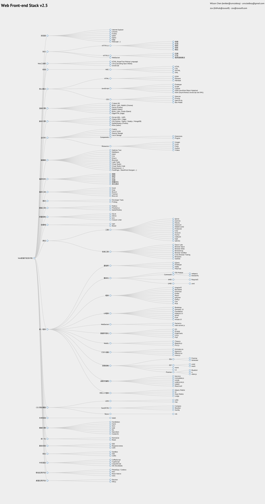

# 爆栈
系统开发技术栈、Web前端开发技术栈、数据库技术栈、.NET技术栈！
http://overflowstack.github.io

# 本地化
English:
https://github.com/unruledboy/WebFrontEndStack/

中文博客:
http://www.cnblogs.com/unruledboy/p/WebFrontEndStack.html

Español:
https://github.com/unruledboy/WebFrontEndStack/blob/master/README.es-es.md


# Web前端技术栈
比较全面的浏览器、平台、类库、框架、工具等。



# 自行生成预览图

## 准备环境
您应该安装Visual Studio 2010+。

1. 安装 [nodejs](https://nodejs.org).

2. 安装 [Phantomjs](http://phantomjs.org).

3. 安装 [Python 2.7](https://www.python.org/).

4. ``npm install``

如果出现错误，您可以检查 [phantomjs-node] 的依赖(https://github.com/sgentle/phantomjs-node/wiki), [node-gyp](https://github.com/TooTallNate/node-gyp#installation).

## 运行命令
``npm start`` 运行服务并直接打开主html文件。

``npm run build`` 生成预览图。


## 选项
```

  -h, --help                           Display this message.
  -p, --port number                    (Default: 3000) Set the port what express listening.
  -ues, --update_existed_stargazers    (Default: false) Update project's stargazers including existed.
  --phantomjs                          The task to generate the image.
  --readme                             The task to update readme.
  --updatestargazers                   The task to update the count of the stargazers.

```

# 为什么？
大家是否想过：
* Web前端开发究竟包含哪些技术呢？
* 我所掌握的技术这个子集，在Web前端技术大系这个超集里面占的比例是多少呢？
* 我究竟还没有掌握多少Web前端技术呢？
* 面试的时候会考哪些技术呢？


那么，Web前端开发是否也应该有这样的技术栈概览图呢？搜索了很久，没有找到一个符合我要求的“较为全面”地表述Web前端技术大系的图表。所以我们自行设计了这个Web前端技术栈。

这个图表里的分类未必准确，相关技术也难免会有遗漏，欢迎大家指点以便不断改进。

Web前端技术实在太繁多限于篇幅，，这里没有罗列一些技术。

您可以点击下面链接查看交互式预览图(用鼠标移动/缩放/点击节点打开相关网站)：

https://rawgit.com/unruledboy/WebFrontEndStack/master/ux/WebFrontEndStack.htm?locale=zh-cn 


# Web前端技术栈
<!--BUILD_START-->

- Web前端开发技术栈
	- 浏览器
		- [Internet Explorer](http://windows.microsoft.com/en-us/internet-explorer/download-ie)
		- [Chrome](http://www.google.com/chrome/)
		- [Firefox](https://www.mozilla.org/)
		- [Safari](http://www.apple.com/safari/)
		- [Opera](http://www.opera.com/)
		- [Edge](https://www.microsoft.com/en-us/windows/microsoft-edge)
		- [Netscape ;-)](https://en.wikipedia.org/wiki/Netscape)
	- 协议
		- [HTTP/1.1](https://www.ietf.org/rfc/rfc2616.txt)
			- 链接
			- 会话
			- 授权
			- 请求
			- 响应
		- [HTTP/2](https://en.wikipedia.org/wiki/HTTP/2)
			- 压缩
			- 打包
			- 服务器端推送
		- WebSocket
	- Web三剑客
		- HTML (HyperText Markup Language)
		- CSS (Cascading Style Sheets)
		- JavaScript
	- 标准
		- W3C
			- HTML
			- CSS
			- XHTML
			- XML
	- 核心概念
		- HTML
			- [DOM](https://developer.mozilla.org/en-US/docs/Web/API/Document_Object_Model)
			- [Element](https://developer.mozilla.org/en-US/docs/Web/API/Element)
			- Attribute
		- JavaScript
			- [Prototype](https://developer.mozilla.org/en-US/docs/Web/JavaScript/Reference/Global_Objects/Object/prototype)
			- [Scope](https://developer.mozilla.org/en-US/docs/Glossary/Scope)
			- [Closure](https://developer.mozilla.org/en-US/docs/Web/JavaScript/Closures)
			- [JSON (JavaSript Object Notation)](https://developer.mozilla.org/en-US/docs/Glossary/JSON)
			- [AJAX (Asynchronous JavaScript and XML)](https://developer.mozilla.org/en-US/docs/AJAX)
		- CSS
			- Selector
			- Priority
			- Specificity
			- Box Model
	- 渲染引擎
		- [Trident (IE)](https://en.wikipedia.org/wiki/Trident_(layout_engine))
		- [Blink / prev. WebKit (Chrome)](http://www.chromium.org/blink)
		- [Gecko (Firefox)](https://developer.mozilla.org/en-us/docs/Mozilla/Gecko)
		- [WebKit (Safari)](http://www.webkit.org/)
		- [Blink / prev. Presto (Opera)](http://www.chromium.org/blink)
		- [EdgeHTML (Edge)](https://en.wikipedia.org/wiki/EdgeHTML)
	- 脚本引擎
		- [JScript (IE8- / ASP)](https://en.wikipedia.org/wiki/JScript)
		- [Chakra (IE9+ / Edge)](https://en.wikipedia.org/wiki/Chakra_(JScript_engine))
		- [V8 (Chrome / Opera / Nodejs / MongoDB)](https://developers.google.com/v8/?hl=zh-CN) [[GitHub]](https://github.com/v8/v8/)
		- [SpiderMonkey (Firefox)]( https://developer.mozilla.org/en-us/docs/Mozilla/Projects/SpiderMonkey)
		- [Nitro (Safari)](https://en.wikipedia.org/wiki/WebKit#JavaScriptCore)
	- 运行时
		- Cookie
		- Local Cache
		- Session Storage
		- Local Storage
		- Components
			- Extensions
			- Plugins
		- Resources
			- Images
			- Icons
			- Fonts
			- Audios
			- Videos
	- 编辑器
		- [Sublime Text](http://www.sublimetext.com/)
		- [WebStorm](https://www.jetbrains.com/webstorm/)
		- [Atom](https://atom.io/) [[GitHub]](https://github.com/atom/atom/)
		- [Vim](http://www.vim.org/)
		- [Emacs](https://www.gnu.org/software/emacs/)
		- [Brackets](http://brackets.io/) [[GitHub]](https://github.com/adobe/brackets/)
		- [Light Table](http://lighttable.com/) [[GitHub]](https://github.com/LightTable/LightTable/)
		- [Visual Studio](https://www.visualstudio.com/)
		- [Visual Studio Code](https://code.visualstudio.com/) [[GitHub]](https://github.com/Microsoft/vscode)
		- Dreamweaver ;-)
		- FrontPage / SharePoint Designer ;-)
	- 编译任务
		- 精简
		- 编译
		- 合并
		- 混淆
		- 图像优化
		- 单元测试
	- 编译工具
		- [Grunt](http://www.gruntjs.com/) [[GitHub]](https://github.com/cowboy/jquery-tiny-pubsub/)
		- [Gulp](http://gulpjs.com/) [[GitHub]](https://github.com/gulpjs/gulp/)
		- [Brunch](http://brunch.io/) [[GitHub]](https://github.com/brunch/brunch/)
		- [Yeoman](http://yeoman.io/)
		- Broccoli [[GitHub]](https://github.com/broccolijs/broccoli/)
	- 调试
		- [Developer Tools](https://developer.chrome.com/devtools)
		- [Firebug](http://getfirebug.com/) [[GitHub]](https://github.com/firebug/firebug/)
	- 基础工具
		- [Node.js](https://nodejs.org/) [[GitHub]](https://github.com/joyent/node/)
		- [Phantom.js](http://phantomjs.org/) [[GitHub]](https://github.com/ariya/phantomjs/)
		- [SpiderMonkey](https://developer.mozilla.org/en-US/docs/Mozilla/Projects/SpiderMonkey)
	- 质量控制
		- [JSLint](http://www.jslint.com/) [[GitHub]](https://github.com/douglascrockford/JSLint/)
		- [JSHint](http://jshint.com/) [[GitHub]](https://github.com/jshint/jshint/)
		- [jscs](http://jscs.info/) [[GitHub]](https://github.com/jscs-dev/node-jscs)
		- [Closure Linter](https://developers.google.com/closure/utilities/)
	- 包管理
		- [npm](https://www.npmjs.com/) [[GitHub]](https://github.com/npm/npm/)
		- [Bower](http://bower.io/) [[GitHub]](https://github.com/bower/bower/)
	- 测试
		- 工具
			- [QUnit](https://qunitjs.com/) [[GitHub]](https://github.com/jquery/qunit/)
			- [Jasmine](http://jasmine.github.io/) [[GitHub]](https://github.com/jasmine/jasmine/)
			- [Mocha](https://mochajs.org/) [[GitHub]](https://github.com/mochajs/mocha/)
			- [Selenium](http://www.seleniumhq.org/) [[GitHub]](https://github.com/SeleniumHQ/selenium/)
			- [WebDriverIO](http://webdriver.io/) [[GitHub]](https://github.com/webdriverio/webdriverio/)
			- [Protractor](http://www.protractortest.org/)
			- [Chai](http://chaijs.com/) [[GitHub]](https://github.com/jfirebaugh/konacha/)
			- [Sinon.JS](http://sinonjs.org/) [[GitHub]](https://github.com/cjohansen/Sinon.JS/)
			- [Karma](http://karma-runner.github.io/) [[GitHub]](https://github.com/karma-runner/karma/)
			- nodeunit [[GitHub]](https://github.com/caolan/nodeunit/)
			- tape [[GitHub]](http://github.com/substack/tape)
			- [nightmare](http://nightmarejs.org/) [[GitHub]](https://github.com/segmentio/nightmare)
		- 在线工具
			- [Sauce Labs](https://saucelabs.com/)
			- [Browser Stack](https://www.browserstack.com/)
			- [Browser Shots](http://browsershots.org/)
			- [Browserling](https://www.browserling.com/)
			- [Browser Sandbox](https://spoon.net/browsers/)
			- [Cross Browser Testing](https://crossbrowsertesting.com/)
			- [Browsera](http://www.browsera.com/)
			- [SortSite](http://www.powermapper.com/products/sortsite/checks/browser-compatibility/)
	- 库 / 框架
		- 基础库
			- [jQuery](https://jquery.com/) [[GitHub]](https://github.com/jquery/jquery/)
			- [Prototype](http://prototypejs.org/) [[GitHub]](https://github.com/sstephenson/prototype/)
			- [Zepto](http://zeptojs.com/) [[GitHub]](https://github.com/madrobby/zepto/)
			- [MooTool](http://mootools.net/) [[GitHub]](https://github.com/mootools/mootools-core/)
		- 模块化
			- ES6 Module
			- CommonJS
				- [webpack](http://webpack.github.io/) [[GitHub]](https://github.com/webpack/webpack/)
				- [browserify](http://browserify.org/) [[GitHub]](https://github.com/substack/node-browserify/)
			- AMD
				- [RequireJS](http://requirejs.org/) [[GitHub]](https://github.com/jrburke/requirejs/)
			- UMD
				- umd [[GitHub]](https://github.com/umdjs/umd/)
		- 框架
			- [AngularJS](https://angularjs.org/) [[GitHub]](https://github.com/angular/angular.js/)
			- [Backbone](http://backbonejs.org/) [[GitHub]](https://github.com/jashkenas/backbone/)
			- [Knockout](http://knockoutjs.com/) [[GitHub]](https://github.com/SteveSanderson/knockout/)
			- [Ember](http://emberjs.com/) [[GitHub]](https://github.com/emberjs/ember.js/)
			- [React](http://facebook.github.io/react/) [[GitHub]](https://github.com/facebook/react/)
			- [polymer](https://www.polymer-project.org/) [[GitHub]](https://github.com/polymer/polymer/)
			- [Deft.js](http://deftjs.org/) [[GitHub]](https://github.com/deftjs/DeftJS/)
			- [Vue](http://vuejs.org/) [[GitHub]](https://github.com/yyx990803/vue/)
			- [Riot](http://riotjs.com/) [[GitHub]](https://github.com/riot/riot)
		- UI框架
			- [Bootstrap](http://getbootstrap.com/) [[GitHub]](https://github.com/twbs/bootstrap/)
			- [Semantic UI](http://semantic-ui.com/) [[GitHub]](https://github.com/Semantic-Org/Semantic-UI/)
			- [Foundation](http://foundation.zurb.com/) [[GitHub]](https://github.com/zurb/foundation/)
			- [Material UI](http://material-ui.com/) [[GitHub]](https://github.com/callemall/material-ui/)
			- [WinJS](https://dev.windows.com/en-us/develop/winjs) [[GitHub]](https://github.com/winjs/winjs)
			- [Pure](http://purecss.io/) [[GitHub]](https://github.com/yahoo/pure/)
			- [Amaze UI](http://amazeui.org/) [[GitHub]](https://github.com/allmobilize/amazeui)
		- WebSocket
			- [Socket.io](http://socket.io/) [[GitHub]](https://github.com/Automattic/socket.io/)
			- web-socket-js [[GitHub]](https://github.com/gimite/web-socket-js/)
		- 数据可视化
			- [D3](http://d3js.org/) [[GitHub]](https://github.com/mbostock/d3/wiki/Gallery/)
			- [Echarts](http://echarts.baidu.com) [[GitHub]](https://github.com/ecomfe/esl/)
			- [HighCharts](http://www.highcharts.com/) [[GitHub]](https://github.com/highslide-software/highcharts.com/)
			- [Vis.js](http://visjs.org/) [[GitHub]](https://github.com/almende/vis/)
			- [Flot](http://www.flotcharts.org/) [[GitHub]](https://github.com/flot/flot/)
		- WebGL
			- [Three.js](http://threejs.org/) [[GitHub]](https://github.com/mrdoob/three.js/)
			- [Babylon.js](http://www.babylonjs.com/) [[GitHub]](https://github.com/BabylonJS/Babylon.js/)
			- [Pixi.js](http://www.pixijs.com/) [[GitHub]](https://github.com/GoodBoyDigital/pixi.js/)
		- CSS3 动画
			- [Animate.css](https://daneden.github.io/animate.css/) [[GitHub]](https://github.com/daneden/animate.css/)
			- [bounce.js](http://bouncejs.com/) [[GitHub]](https://github.com/tictail/bounce.js/)
			- [Effeckt.css](https://h5bp.github.io/Effeckt.css/) [[GitHub]](https://github.com/h5bp/Effeckt.css/)
			- [move.js](https://visionmedia.github.io/move.js/) [[GitHub]](https://github.com/visionmedia/move.js/)
		- 流程控制
			- ES6
				- Promise
				- Generator
			- ES7
				- yield
				- await
			- async [[GitHub]](https://github.com/caolan/async/)
			- co [[GitHub]](https://github.com/tj/co/)
			- Promise
				- Bluebird [[GitHub]](https://github.com/petkaantonov/bluebird/)
				- q [[GitHub]](https://github.com/kriskowal/q/)
				- when.js [[GitHub]](https://github.com/cujojs/when/)
		- 函数式编程
			- [bacon.js](http://baconjs.github.io/) [[GitHub]](https://github.com/baconjs/bacon.js/)
			- [immutable.js](https://facebook.github.io/immutable-js/) [[GitHub]](https://github.com/facebook/immutable-js/)
			- [ramda](http://ramdajs.com/) [[GitHub]](http://github.com/ramda/ramda)
			- [underscore.js](http://underscorejs.org/) [[GitHub]](https://github.com/jashkenas/underscore)
			- [lodash](https://lodash.com/) [[GitHub]](https://github.com/lodash/lodash)
			- [ReactiveX](http://reactivex.io/) [[GitHub]](https://github.com/Reactive-Extensions/RxJS)
		- 手机 UI 框架
			- [jQuery Mobile](https://jquerymobile.com/) [[GitHub]](https://github.com/jquery/jquery-mobile/)
			- [Jo](http://joapp.com/) [[GitHub]](https://github.com/davebalmer/jo/)
			- [Dojo Mobile](https://dojotoolkit.org/reference-guide/1.10/dojox/mobile.html)
			- [Lungo](http://lungo.tapquo.com/) [[GitHub]](https://github.com/tapquo/Lungo.js/)
	- CSS 预处理器
		- LESS
			- [LESS](http://lesscss.org/) [[GitHub]](https://github.com/less/less.js/)
			- [Hat](http://lesshat.madebysource.com/) [[GitHub]](https://github.com/csshat/lesshat/)
		- Sass(SCSS)
			- [Compass](http://compass-style.org/) [[GitHub]](https://github.com/chriseppstein/compass/)
			- [Bourbon](http://bourbon.io/) [[GitHub]](https://github.com/thoughtbot/bourbon/)
			- [Gumby](http://www.gumbyframework.com/) [[GitHub]](https://github.com/GumbyFramework/Gumby/)
		- Stylus
			- nib [[GitHub]](https://github.com/tj/nib/)
	- 未来标准
		- [babel](https://babeljs.io/) [[GitHub]](https://github.com/babel/babel)
	- 模板引擎
		- [Handlebars](http://handlebarsjs.com/) [[GitHub]](https://github.com/wycats/handlebars.js/)
		- [Haml](http://haml.info/) [[GitHub]](https://github.com/haml/haml/)
		- [Slim](http://slim-lang.com/) [[GitHub]](https://github.com/slim-template/slim/)
		- [Jade](http://jade-lang.com/) [[GitHub]](https://github.com/jadejs/jade/)
		- [Ejs](http://www.embeddedjs.com/)
		- [Spacebars](http://meteorcapture.com/spacebars/)
		- [mustache](http://mustache.github.io/) [[GitHub]](https://github.com/janl/mustache.js/)
	- 统一化
		- [Normalize](http://necolas.github.io/normalize.css/) [[GitHub]](https://github.com/necolas/normalize.css/)
		- Reset
	- 最佳实践
		- [SEO](https://en.wikipedia.org/wiki/Search_engine_optimization)
		- Responsiveness
		- [CDN](https://en.wikipedia.org/wiki/Content_delivery_network)
	- 安全
		- Sandbox
		- [XSS](https://en.wikipedia.org/wiki/Cross-site_scripting)
		- [CORS](http://www.w3.org/TR/cors/)
	- 中间语言
		- [CoffeeScript](http://coffeescript.org/) [[GitHub]](https://github.com/jashkenas/coffeescript/)
		- [TypeScript](http://www.typescriptlang.org/) [[GitHub]](https://github.com/Microsoft/TypeScript/)
		- ClojureScript [[GitHub]](https://github.com/clojure/clojurescript/)
		- [JSX (Facebook)](http://facebook.github.io/react/docs/jsx-in-depth.html)
	- 移动应用开发
		- [PhoneGap / Cordova](https://cordova.apache.org/) [[GitHub]](https://github.com/apache/cordova-android/)
		- [MUI](http://dev.dcloud.net.cn/mui/) [[GitHub]](https://github.com/dcloudio/mui/)
		- [React Native](https://facebook.github.io/react-native/) [[GitHub]](https://github.com/facebook/react-native/)
		- [Ionic](http://ionicframework.com/) [[GitHub]](https://github.com/driftyco/ionic/)
	- 桌面应用开发
		- [Electron](http://electron.atom.io/) [[GitHub]](https://github.com/atom/electron)
		- [NW.js](http://nwjs.io/) [[GitHub]](https://github.com/nwjs/nw.js)

<!--BUILD_END-->
